# Guia do Usuário — OTC Tracker

**Brazil OTC Operations · JPMorgan Chase & Co.**

**Versão:** 2.0 · **Data:** 24/08/2026

---

> **Sobre as telas deste guia.** Todas as imagens foram capturadas do sistema real, porém com **dados fictícios**. Nenhum nome de cliente, CNPJ, conta, valor ou caminho de servidor real aparece nestas páginas.

---

## 1. Como usar este guia

O guia está organizado do jeito que o trabalho acontece, e não em ordem alfabética de tela.

- O **capítulo 3** cobre o que você faz uma vez: entrar, reconhecer a barra superior e achar as coisas no menu.
- O **capítulo 4** é o mais importante e o mais curto: ele explica o que se repete em **toda** tela do sistema — a barra de ferramentas, o filtro por coluna, o Export, a cópia de células, os campos de data. Os capítulos seguintes **não repetem** essas instruções; eles dizem apenas o que é próprio de cada tela.
- Os **capítulos 5 a 17** têm uma seção por tela, sempre no mesmo formato: a imagem da tela, *para que ela serve*, e o *passo a passo* de cada ação — que botão clicar, onde ele fica e o que acontece depois.
- O **capítulo 18** reúne os anexos: significado de cada status, glossário, o que ainda não está disponível e os problemas mais comuns.

**Convenções do texto**

| Como está escrito | O que significa |
|---|---|
| **Import** | Um botão ou um item de menu, escrito exatamente como aparece na tela |
| *Reference Date* | Um campo que você preenche |
| `Success` | Um valor de dado — um status, um código |
| Menu › Daily Settlement › NDF Summary | O caminho no menu lateral, da esquerda para a direita |

> A interface do sistema é em **inglês** e pode ser trocada para português ou espanhol pelo seletor **EN** da barra superior. Os nomes de botões neste guia estão em inglês, como aparecem por padrão.

---

## 2. Visão geral

O **OTC Tracker** cobre o ciclo de vida das operações de derivativos de balcão (OTC) da mesa Brasil — do momento em que o negócio é fechado até o documento de confirmação assinado, arquivado, e a liquidação instruída.

**A pergunta que o sistema existe para responder:** *toda operação fechada hoje foi registrada na B3, confirmada com a contraparte e instruída para liquidação?*

O trabalho se divide em seis blocos, e o menu lateral segue essa divisão:

| Bloco | O que faz | Capítulo |
|---|---|---|
| **New Deals** | Importa as operações do dia da Athena, valida, registra na B3 e gera a confirmação | 5 |
| **Daily Settlement** | Apura as liquidações do dia, emite os avisos e instrui os pagamentos | 6 |
| **Live Position** | Mostra a posição viva registrada na B3 (o que está em aberto) | 7 |
| **Reconciliations** | Bate as nossas bases contra as da B3 e as do cliente | 8 |
| **Documentation** | Acompanha a confirmação até o cliente devolver assinado, e o onboarding dos contratos | 9 e 10 |
| **Cadastros e ferramentas** | Reference Data, de-para, calendário, cotações, leiaute de arquivo | 13 e 14 |

### 2.1. Como o sistema se organiza na tela

Toda página tem o mesmo esqueleto: **menu lateral** à esquerda (escondido até você chamá-lo), **barra superior** com tema, notificações, idioma e perfil, e a **área de trabalho** no centro.

---

## 3. Primeiros passos

### 3.1. Requisitos de acesso

Antes do primeiro login, confirme os três pontos abaixo:

1. Estar na **rede JPMorgan** (VPN ou escritório). Fora da rede o login não funciona, porque o sistema consulta o phonebook interno e envia o código por e-mail pelo relay corporativo.
2. Ter um **SID** válido — uma letra seguida de seis dígitos, por exemplo `A123456`.
3. Ter as páginas liberadas no seu perfil. O acesso é concedido **por página**: se um administrador não liberou uma tela, ela não aparece no seu menu (ver 3.6).

### 3.2. Entrar no sistema

1. Abra o endereço do OTC Tracker no navegador.
2. Clique no campo **SID Number** — é o único campo da tela.
3. Digite o seu SID (uma letra + seis dígitos).
4. Clique no botão **Sign In**, logo abaixo do campo.
5. Se este já for o seu computador de costume, o sistema abre direto no painel inicial.
6. Se for uma máquina nova — ou se o seu IP mudou —, o sistema envia um **código de 6 dígitos** para o seu e-mail corporativo e leva você para a tela de verificação.

> **Não há senha.** A autenticação é pelo SID + o computador de onde você acessa. É por isso que a primeira entrada de cada máquina nova pede o código por e-mail.

### 3.3. Verificação em duas etapas

Quando a tela de verificação abrir:

1. Abra o seu e-mail corporativo e localize a mensagem do OTC Tracker.
2. Copie o código de **6 dígitos**.
3. Volte ao navegador, clique no campo do código e cole.
4. Confirme.

> **O código expira em 10 minutos.** Passado o prazo, volte à tela de login e refaça o Sign In para receber um código novo — reenviar o antigo não adianta.

### 3.4. A barra superior

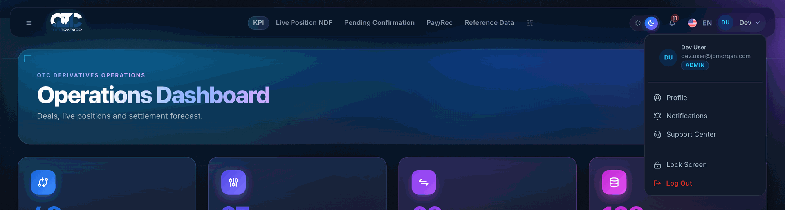

Da esquerda para a direita:

| Item | Onde fica | O que faz |
|---|---|---|
| **☰** | Extremo esquerdo | Abre o menu lateral (ver 3.5) |
| **Logo OTC Tracker** | Ao lado do ☰ | Clique para voltar ao painel inicial |
| **Atalhos** (KPI · Live Position NDF · Pending Confirmation · Pay/Rec · Reference Data) | Centro | Vão direto às telas mais usadas, sem passar pelo menu |
| **Ícone de ajustes** | Depois dos atalhos | Personaliza quais atalhos aparecem ali |
| **Sol / Lua** | À direita | Alterna entre tema claro e escuro |
| **Sino** com o número vermelho | À direita | Notificações do sistema — importações, mapeamentos, validações, envios |
| **Bandeira · EN** | À direita | Troca o idioma da interface entre **EN**, **BR** e **ES** |
| **Suas iniciais + nome** | Extremo direito | Abre o menu do usuário |

**Para abrir o menu do usuário:** clique nas suas iniciais (o círculo colorido) ou no seu nome, no canto superior direito. O menu traz:

- **Profile** — os seus dados e a sua função no sistema
- **Notifications** — a lista completa de avisos
- **Support Center** — abrir um chamado (capítulo 16)
- **Lock Screen** — tranca a tela sem encerrar a sessão
- **Log Out** — encerra a sessão

**Para ler uma notificação:** clique no **sino**. A lista abre logo abaixo. Clique no aviso e o sistema leva você direto à tela onde aquilo aconteceu.

### 3.5. O menu lateral

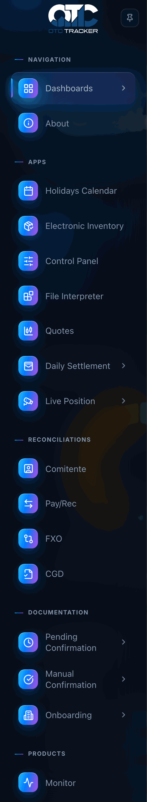

O menu fica **escondido** e aparece de duas formas:

- **Passe o mouse** pela borda esquerda da tela — ele desliza para dentro e some quando você sai.
- **Clique no ☰** da barra superior para abri-lo.
- Para deixá-lo **fixo**, clique no ícone de **alfinete** (*Pin / unpin menu*), no alto do próprio menu. Clique de novo para soltá-lo.

O menu é em **níveis**: um item com **›** à direita tem submenu. Clicar nele **não abre uma página** — ele desliza para dentro do submenu, e o caminho percorrido aparece no alto, como um rastro. Para voltar um nível, clique no item de volta (**‹**) ou no nome do nível anterior no rastro.

**O mapa completo do menu:**

| Grupo | Itens |
|---|---|
| **NAVIGATION** | Dashboards › Dashboard 1 · Dashboard 2 — About |
| **APPS** | Holidays Calendar · Electronic Inventory · Control Panel · File Interpreter · Quotes |
| **APPS › Daily Settlement › NDF** | NDF Summary · NDF Cockpit · Other Publisher |
| **APPS › Daily Settlement › Other Products** | Other Products Summary · OTM Settlements · Latam Desk Position · **Swap** (Settlement Advice · Athena · VCP · Events · Kapital Hybrids) · **NDF** (Settlement Advice) · **Option** (Settlement Advice · Cognos) |
| **APPS › Daily Settlement** | Operations B3 |
| **APPS › Live Position** | Live Position NDF · **Swap** (Characteristics · Cashflow · Premium) · Live Position Option |
| **RECONCILIATIONS** | Comitente · Pay/Rec · FXO · CGD |
| **DOCUMENTATION › Pending Confirmation** | Pending Confirmation · Metrics |
| **DOCUMENTATION › Manual Confirmation** | Confirmations Monitor · Track Confirmations |
| **DOCUMENTATION › Onboarding** | Overview · Tracking Docs |
| **PRODUCTS** | Monitor (New Deals Monitor) |
| **PRODUCTS › New Deals › NDF** | FWD Start · Other Publisher · Vanilla · Commodities |
| **PRODUCTS › New Deals › Options** | FXO · Commodities |
| **PRODUCTS › New Deals › DCE** | Deliverable Forward · NDF · Option · Swap *(em construção)* |
| **PRODUCTS › Unwinds** | Swap · NDF · Options · COE · DCE *(em construção)* |
| **PRODUCTS › Intrag** | NDF · Option · Swap |
| **PRODUCTS › Regulatory** | e-Financeira · WHT *(em construção)* |
| **PRODUCTS** | Accrual Swap · MtM Swap |
| **SETTINGS** | Reference Data · Index B3 · Mapping · Manage Roles · Page Access |
| **SUPPORT** | Tickets · Ticket Details |

> Os itens marcados **(em construção)** aparecem no menu mas ainda não têm tela: clicar neles devolve uma página de "não encontrado". A lista completa está no anexo 18.3.

### 3.6. Por que uma tela não aparece no seu menu

O acesso é **por página**. Um administrador monta a sua lista de páginas em *Page Access* (capítulo 15.2), e o menu mostra **só** o que está nessa lista.

- Se a sua lista nunca foi configurada, você vê **tudo**.
- Se ela foi configurada, você vê só o que está nela — e digitar o endereço direto no navegador também não passa: o sistema devolve você para uma página que você tem.
- **Profile** e **Page Access** são sempre acessíveis.

**Se falta uma tela que você precisa:** abra um chamado no Support Center (capítulo 16) dizendo qual é a tela e por quê.

### 3.7. O seu perfil

**Para abrir:** clique nas suas iniciais na barra superior › **Profile**.

A tela mostra o que o phonebook devolveu sobre você (nome, e-mail, cargo) e o **papel** que você tem no sistema — `ADMIN`, `BO` (Back Office), `MO` (Middle Office), `FO` (Front Office), `INSTITUTIONAL` ou `HUB`. O papel não se edita aqui: ele define o que você pode **assinar** (por exemplo, validar uma etapa da esteira de confirmação — capítulo 9.4) e é alterado em *Manage Roles* por um administrador.

---

## 4. O que se repete em toda tela

Este capítulo é a base. Quase toda tela do OTC Tracker é uma **tabela** com a mesma barra de ferramentas, os mesmos filtros e o mesmo Export. Aprenda aqui e os capítulos seguintes ficam curtos.

### 4.1. A anatomia de uma tela de tabela

De cima para baixo:

| Faixa | O que tem |
|---|---|
| **Título** | O nome da tela, e à direita a trilha de onde ela fica no menu |
| **Área de upload** *(só em algumas)* | O retângulo pontilhado "Drop files here or click to upload" |
| **Barra de busca** *(New Deals)* | O campo de fichas de filtro (ver 4.4) |
| **Barra de ferramentas** | Columns · Add Row · Export · Reference Date · Import · Clear Filters, e o *Show N entries* à direita |
| **Cabeçalho da tabela** | Os nomes das colunas — clique num nome para ordenar |
| **Linha de filtro** | A 2ª linha do cabeçalho, uma caixinha por coluna (ver 4.3) |
| **Linhas** | Os dados. A 1ª coluna costuma ser a caixa de seleção e a 2ª os botões de ação |
| **Rodapé** | *Showing 1 to N of M entries* à esquerda e a paginação à direita |

### 4.2. A barra de ferramentas

Os botões são sempre os mesmos, com as mesmas cores, em todas as telas que os têm:

| Botão | Cor | O que faz |
|---|---|---|
| **Columns** | Azul claro | Escolhe quais colunas ficam visíveis (4.5) |
| **Add Row** | Azul cheio | Abre o formulário para incluir uma linha à mão |
| **Export** | Azul-esverdeado | Baixa o que está na tela (4.6) |
| **Import** | Verde-azulado | Busca os dados na fonte (API, arquivo do share) |
| **Mapping / atualizar** | Verde | Reprocessa o de-para daquela tela |
| **Clear Filters** | Contorno cinza | Limpa **todos** os filtros de coluna de uma vez |
| **Show [N] entries** | À direita | Quantas linhas por página |

### 4.3. Filtrar por coluna

A linha de caixinhas logo abaixo do cabeçalho é o filtro. Cada caixinha filtra **a sua** coluna, e o texto dentro dela (cinza claro) diz qual é.

1. Clique na caixinha da coluna que você quer filtrar.
2. Digite o que procura — não precisa ser o valor inteiro, ele casa por **pedaço** do texto.
3. A tabela filtra enquanto você digita.
4. Para combinar critérios, preencha **mais de uma** caixinha: elas se somam (E, não OU).
5. Para desfazer tudo, clique em **Clear Filters** na barra de ferramentas.

> **Para achar o que está VAZIO, digite `blank`.** É o único jeito de procurar a ausência de um valor — a caixinha casa por conteúdo, e "nada" não se digita. A palavra só vale quando é a única coisa no campo; `blank trading` continua procurando o texto.

**Para ordenar:** clique no **nome** da coluna, no cabeçalho. Clique de novo para inverter. Números ordenam como número (`9,00` antes de `1.000,00`), não como texto.

### 4.4. A busca por fichas (New Deals e Pending Confirmation)

Algumas telas trazem, acima da tabela, um campo largo com o texto *"Type a letter for text fields, or a number / date for value fields…"*. Ele busca **no servidor**, e não só no que está carregado.

1. Clique no campo.
2. Comece a digitar. Uma lista aparece com as **colunas** que casam com o que você digitou.
3. Escolha a coluna na lista.
4. Digite o valor e pressione **Enter** — o filtro vira uma **ficha** cinza à esquerda do campo.
5. Repita para combinar critérios (por exemplo, *Trade Date* **e** *Status*).
6. Para tirar uma ficha, clique no **×** dela.
7. Clique em **Search** (o botão roxo à direita) para reexecutar a busca.

> Uma ficha pode ser de **igual** ou de **diferente**: a ficha `STATUS ≠ Success` que aparece por padrão nas telas de New Deals é o que esconde as operações já registradas e deixa na tela só o que ainda dá trabalho.

### 4.5. Escolher quais colunas aparecem

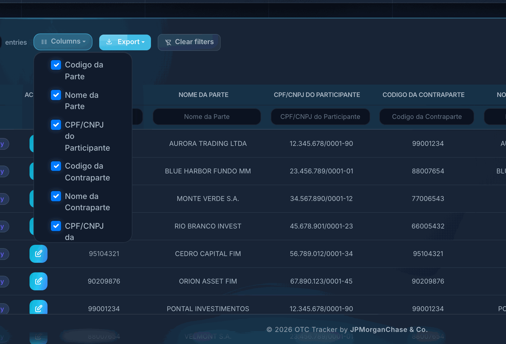

1. Clique em **Columns**, o primeiro botão da barra de ferramentas.
2. Um painel com uma caixa de seleção por coluna abre logo abaixo.
3. **Desmarque** a coluna para escondê-la; **marque** para trazê-la de volta.
4. Clique fora do painel para fechar.

> A escolha vale para a sessão daquela tela e **muda o que é exportado**: o Export leva só as colunas visíveis (4.6).

### 4.6. Exportar

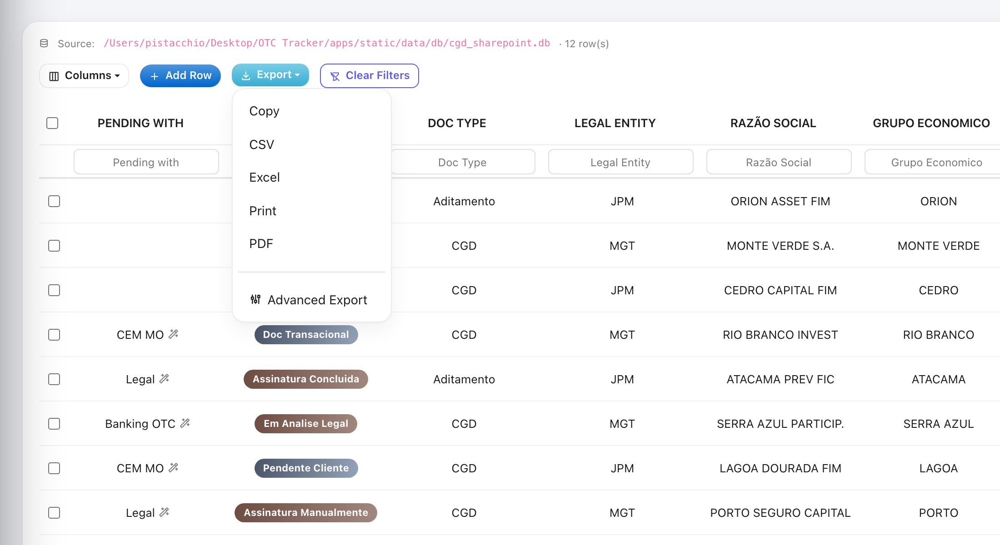

1. Clique em **Export**.
2. Escolha o formato:

| Item | O que faz |
|---|---|
| **Copy** | Copia a tabela para a área de transferência — cole direto no Excel ou no e-mail |
| **CSV** | Baixa um `.csv` com `;` de separador e acentuação preservada, que é o que o Excel em português abre certo |
| **Excel** | Baixa um `.xlsx` |
| **Print** | Abre a janela de impressão do navegador com a tabela formatada |
| **PDF** | Baixa um `.pdf` em paisagem |
| **Advanced Export** | Abre o exportador com filtros e intervalo de datas (4.7) |

> **O Export leva o que está NA TELA** — com os filtros aplicados, na ordenação escolhida e só com as colunas visíveis. Se o arquivo saiu com menos linhas do que você esperava, o motivo quase sempre é um filtro esquecido: clique em **Clear Filters** e exporte de novo.

### 4.7. Advanced Export

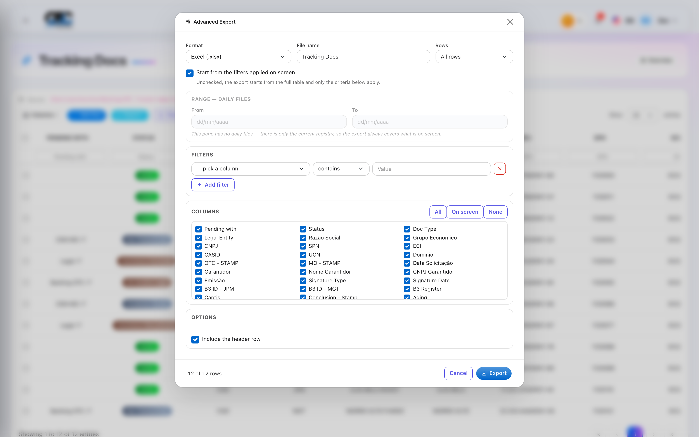

É o último item do menu **Export**. Serve para o que o export simples não faz: escolher o formato, renomear o arquivo, filtrar por critério e — nas telas que guardam um arquivo por dia — exportar **um intervalo de datas de uma vez**.

1. Clique em **Export** › **Advanced Export**.
2. **Format** — escolha entre Excel, CSV, PDF ou Copy.
3. **File name** — o nome sugerido é o título da tela; troque se quiser.
4. **Rows** — *All rows* (a tabela toda) ou só a página que está à vista.
5. **Start from the filters applied on screen** — deixe **marcado** para partir do que está filtrado na tela; desmarque para partir da tabela inteira e valer só os critérios que você montar abaixo.
6. **RANGE — DAILY FILES** — preencha *From* e *To* para exportar vários dias de uma vez. **Se a tela não guardar arquivo por dia**, esta seção nasce apagada com o motivo escrito nela — não é defeito.
7. **FILTERS** — clique em **+ Add filter**, escolha a coluna no primeiro campo, o critério (*contains*, *equals*…) no segundo e digite o valor no terceiro. Clique em **+ Add filter** de novo para somar critérios; no **×** vermelho para tirar um.
8. **COLUMNS** — marque as colunas que vão no arquivo. Os três botões no alto são atalhos: **All** (todas), **On screen** (as que estão visíveis) e **None** (desmarca tudo, para você escolher poucas).
9. **OPTIONS** — *Include the header row* deixa a linha de títulos no arquivo.
10. Confira a contagem no rodapé à esquerda (*"12 of 12 rows"*) e clique em **Export**.

> **No intervalo de datas, um dia sem arquivo é PULADO, não é erro.** No fim, o sistema diz quantos dias entraram e, para os que falharam, o motivo de cada um.

### 4.8. Copiar células para o Excel

Funciona em **toda** tabela do sistema, sem botão nenhum:

1. Clique numa célula — ela fica azul.
2. Para pegar um bloco, clique na primeira célula e **arraste** até a última; ou clique na primeira, segure **Shift** e clique na última.
3. Pressione **Ctrl+C** (**Cmd+C** no Mac). As células piscam em verde.
4. Cole no Excel: as colunas caem em colunas e as linhas em linhas.
5. **Esc** limpa a seleção.

> Cliques em caixas de seleção, botões e campos de edição **não** entram na seleção — dá para copiar dados de uma linha que está sendo editada sem atrapalhar a edição.

### 4.9. Editar uma linha

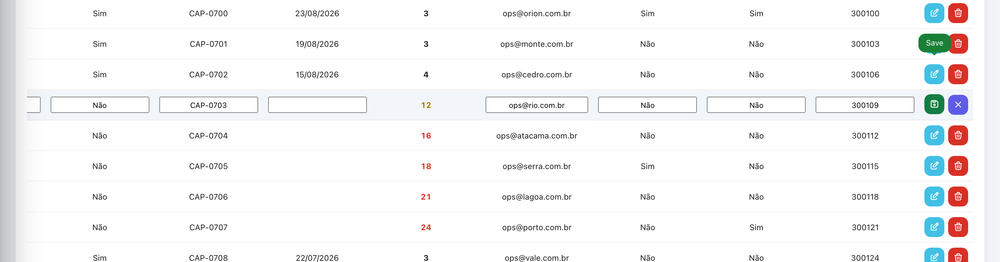

Nas telas que permitem edição, ela acontece **na própria linha**, não numa janela separada:

1. Clique no botão **Edit** (o quadrado azul-claro com o lápis) da linha.
2. As células viram campos de digitação. Os campos derivados pelo sistema — o *Aging*, por exemplo — continuam bloqueados de propósito.
3. Altere o que precisa. **Tab** anda para o campo seguinte.
4. Clique em **Save** (o quadrado verde com o disquete) para gravar, ou em **Cancel** (o quadrado cinza com o ×) para desistir.

### 4.10. Os botões de ação da linha

São quadrados coloridos de canto arredondado, sempre na mesma ordem e sempre com a mesma cor. Passe o mouse por cima para ver o nome de cada um.

| Botão | Cor | Ícone | O que faz |
|---|---|---|---|
| **Confirm** | Verde | ✓ | Aprova a linha e a manda para a etapa seguinte |
| **Edit** | Azul claro | lápis | Abre a linha para edição (4.9) |
| **Delete** | Vermelho | lixeira | Apaga a linha — pede confirmação antes |
| **Send** | Azul | avião de papel | Envia (arquivo, e-mail, registro) |
| **Save** | Verde | disquete | Grava a edição em curso |
| **Cancel** | Cinza | × | Descarta a edição em curso |

### 4.11. Datas

**Toda data na tela é `dd/mm/aaaa`** — dia, mês e ano, nesta ordem, sempre.

1. Clique no campo de data. Um calendário abre logo abaixo.
2. Navegue pelos meses com as setas do calendário, ou digite a data direto no campo.
3. Clique no dia. O calendário fecha e o campo fica preenchido.

> Isso vale inclusive no Windows com o sistema em inglês: o sistema **não** usa o calendário nativo do navegador justamente para que `03/04` nunca seja lido como 3 de abril de um lado e 4 de março do outro.

### 4.12. O campo *Reference Date*

Nas telas que trabalham por dia (New Deals, Daily Settlement, as recons), o campo **Reference Date** — ou *Position date*, ou *Settlement date*, conforme a tela — **comanda tudo**: é a data que o sistema usa para buscar os dados e é a data com que ele grava o resultado.

1. Confira a data **antes** de clicar em Import ou Run. Por padrão vem a data de hoje (ou o último dia útil, nas telas de posição).
2. Para trabalhar um dia anterior, troque a data e a tela recarrega sozinha.
3. Se você importar com a data errada, o dado entra no dia errado — corrija a data e importe de novo.

### 4.13. As notificações

O **sino** da barra superior mostra em vermelho quantos avisos você tem. O sistema avisa quando uma importação termina, quando falta um cadastro, quando uma confirmação cai na sua mesa, quando um envio saiu.

1. Clique no sino.
2. Clique no aviso: o sistema abre a tela onde aquilo aconteceu.
3. Os avisos são endereçados por **papel** — o Back Office recebe os da esteira de confirmação, o Middle os dele, e assim por diante.

---

## 5. New Deals — o trabalho do dia

**Menu › PRODUCTS › New Deals**

É aqui que a operação fechada pela mesa entra no sistema, é conferida e vai para registro na B3. São seis telas de produto, e **as seis funcionam do mesmo jeito** — muda o produto e as colunas, não o fluxo:

| Tela | Produto |
|---|---|
| NDF › **Vanilla** | Termo de moeda comum |
| NDF › **Other Publisher** | Termo de moeda com fonte de cotação que não a PTAX |
| NDF › **FWD Start** | Termo com início futuro (a taxa só se conhece no fixing) |
| NDF › **Commodities** | Termo de mercadoria |
| Options › **FXO** | Opção de câmbio |
| Options › **Commodities** | Opção de mercadoria |

### 5.1. New Deals Monitor — por onde começar o dia

**Menu › PRODUCTS › Monitor**

**Para que serve:** é o painel do dia. Ele responde, num relance, quanto já foi registrado na B3, quanto já virou confirmação e quanto falta — por produto.

A tela tem três seções, cada uma com um cartão por produto e um anel de progresso:

| Seção | O que ela conta |
|---|---|
| **B3 Registration** | Quantas operações do dia já têm B3 ID |
| **Confirmations** | Quantas já têm o documento de confirmação gerado e validado pelo OTC |
| **Intrag** | Quantas já foram enviadas à Intrag |

**Passo a passo:**

1. Confira a **data** no alto da tela — por padrão é hoje. Troque para olhar um dia anterior.
2. Percorra os cartões. O número grande é a contagem; o anel colorido é a proporção do que está pronto.
3. **Clique no cartão do produto** para abrir a tela dele já filtrada por aquele dia.
4. No cartão de **Confirmations**, o botão que aparece depende do estado: **Generate** enquanto não há PDF na pasta da confirmação, e **Validate** depois que há. Ver o capítulo 9.3.

> **O cartão de Confirmations acompanha UM ciclo só, e ele termina no OTC.** Validada a etapa do OTC, a confirmação conta como 100% aqui. O que vem depois (Middle e Front Office) é acompanhado no **Confirmations Monitor** (capítulo 9.3).

### 5.2. A tela de produto

A tela tem quatro faixas, de cima para baixo:

| Faixa | Para que serve |
|---|---|
| **Área de upload** | Arrastar uma planilha de operações, quando o produto aceita importação por arquivo |
| **Barra de busca por fichas** | Filtrar por qualquer coluna, buscando no servidor (4.4) |
| **Show entries** | Quantas linhas por página e, nas telas de opção e mercadoria, os botões **Premium** e **Econ. Affirmation** |
| **Barra de ferramentas** | Columns · Add Row + · Export · *Reference Date* · Import · Mapping B3 ID · Clear Filters |

**O que cada status significa:**

| Status | Significa | O que fazer |
|---|---|---|
| `New` | Acabou de chegar da API; ninguém revisou | Conferir e aprovar |
| `Amend` | Já existia e a API mudou um dado **econômico** | Revisar a célula destacada e aprovar |
| `Pending` | Alguém editou e submeteu para aprovação | Outra pessoa precisa aprovar |
| `Approved` | Aprovado, pronto para registro | Enviar (Send) |
| `Sent` | Arquivo gerado e enviado para registro na B3 | Esperar o retorno |
| `Success` | Registrado na B3, com o B3 ID preenchido | Nada — o ciclo daqui fechou |
| `Error` | Voltou com erro da B3 | Corrigir e enviar de novo |

#### As seis telas, lado a lado

O fluxo é o mesmo nas seis; o que muda são as colunas e os botões próprios de cada produto.

**NDF › FWD Start** — termo com início futuro. Traz *Strike Set Date* e *Strike Set Offset*, que é o que a B3 registra: a taxa em si só se conhece no fixing.

**NDF › Other Publisher** — termo de moeda com fonte de cotação que não a PTAX. A coluna *Publisher* diz qual é.

**NDF › Commodities** — termo de mercadoria. Traz *Market*, *Commodities*, *Contract*, *Strike Currency* e as datas de fixing. Tem o botão **Econ. Affirmation**.

**Options › FXO** — opção de câmbio. Traz *Premium*, *PremiumPerUnit*, *PremiumCCY* e *SpotDate*. Tem os botões **Premium** e **Econ. Affirmation**.

**Options › Commodities** — opção de mercadoria. Junta as colunas das duas anteriores: mercado e contrato de um lado, prêmio do outro. Tem **Premium** e **Econ. Affirmation**.

### 5.3. Importar as operações do dia

1. Confira o campo **Reference Date**, na barra de ferramentas. Ele comanda tudo (4.12).
2. Clique em **Import**.
3. O sistema busca as operações na API da Athena e carrega a tabela.
4. O **sino** de notificações informa quantas operações entraram e quantas foram atualizadas.

> **Você não precisa clicar em Import o tempo todo.** O sistema importa sozinho: **NDF a cada 20 minutos**, **opções de hora em hora** e a varredura do box de mercadorias a cada 30 minutos — os três **só entre 08:00 e 20:00** (horário de Brasília). O botão serve para adiantar a importação ou para reimportar uma data passada.

**Para importar por planilha** (nos produtos que aceitam):

1. Arraste o arquivo para o retângulo pontilhado no alto da tela, ou clique em **Browse** e escolha o arquivo.
2. O sistema lê a planilha e acrescenta as operações à tabela com status `New`.

### 5.4. Conferir e corrigir uma operação

1. Localize a linha — pela busca por fichas (4.4) ou pelos filtros de coluna (4.3).
2. **Dê um duplo clique na linha** para ver todos os campos daquela operação numa janela, com os nomes que a B3 usa no arquivo de registro. É a forma mais rápida de conferir sem rolar a tabela para o lado.
3. Para corrigir, clique no botão **Edit** (o lápis) da linha, altere o que precisa e clique em **Save** (4.9).
4. Salvando uma edição, o status vai para `Pending` — a alteração precisa da aprovação de outra pessoa.

**Células destacadas.** Numa linha `Amend`, as células que a API mudou ficam realçadas. Confira **essas** — é o que mudou desde a última vez.

**O selo *Missing Counterparty*.** Se a contraparte da operação não foi encontrada no Reference Data, a linha vem com as colunas de cliente vazias e esse selo. Não invente o cliente: cadastre a contraparte no **Reference Data** (capítulo 13.1) e clique em **Mapping B3 ID** para o sistema resolver de novo.

### 5.5. Aprovar

**Uma linha por vez:**

1. Clique no botão **Confirm** (o quadrado verde com o ✓) da linha.
2. O que acontece depende do status:
   - `New` → vai direto para **`Approved`**. Não houve edição nenhuma, então não há o que revisar.
   - `Amend` → vai para **`Pending`**. A API mudou dado econômico e alguém precisa olhar; a aprovação acontece num segundo clique.
3. Aprovando um `New`, o sistema faz **duas conferências** antes de deixar passar e recusa com um aviso se:
   - a **contraparte** não estiver cadastrada no Reference Data;
   - o **ativo subjacente** não estiver cadastrado no **Index B3**.

   Nos dois casos, faça o cadastro na tela indicada e volte.

**Várias linhas de uma vez (edição em massa):**

1. Marque a **caixa de seleção** das linhas — ou a caixa do cabeçalho para marcar a página inteira.
2. Uma barra extra aparece na barra de ferramentas, com um seletor de coluna, um campo de valor e três botões.
3. Para **aplicar o mesmo valor** a todas as selecionadas: escolha a coluna em **Select Column to Apply**, digite o valor no campo ao lado e clique em **Confirm**.
4. Para **enviar** todas: clique em **Send**.
5. Para **apagar** todas: clique em **Delete** (pede confirmação).

### 5.6. Enviar para registro na B3

1. A linha precisa estar em **`Approved`** (ou em `Error`, para reenviar). Em qualquer outro status o sistema recusa e diz o que falta.
2. Clique no botão **Send** (o quadrado azul com o avião de papel) da linha.
3. Confirme na janela que abre.
4. O status vira **`Sent`** e o arquivo segue para a B3 pelo Conecta.
5. Quando o retorno chega, o status vira **`Success`** e o **B3 ID** aparece na coluna.

> **Quem importou ou editou não pode enviar.** O sistema recusa o Send feito pela mesma pessoa que consta como *Maker* da linha — o envio precisa de um segundo par de olhos. Se aparecer *"You cannot send a deal you imported or last edited"*, peça a um colega para enviar.

### 5.7. Trazer o B3 ID de volta

Depois que a B3 devolve o arquivo de retorno:

1. Confira a **Reference Date**.
2. Clique no botão **verde de atualizar** (*Mapping B3 ID*), à direita do Import.
3. O sistema lê o arquivo de retorno do dia e preenche o **B3 ID** das operações que casaram, mudando o status para `Success`.

> Este botão trabalha a partir do **arquivo do dia inteiro**, e não do que está na tela: operações que você não filtrou também são atualizadas.

### 5.8. Os botões próprios de cada produto

**Premium** *(FXO e Options Commodities)* — gera o e-mail de cobrança do prêmio das opções cuja data de pagamento é hoje.

1. Clique em **Premium**, ao lado do *Show entries*.
2. O sistema monta os rascunhos e **baixa o arquivo** de e-mail.
3. Abra o arquivo baixado: ele abre no seu Outlook, já preenchido, para você revisar e enviar.
4. Se não houver prêmio a pagar hoje, o sistema avisa em vez de gerar arquivo vazio.

**Econ. Affirmation** *(NDF Commodities, FXO e Options Commodities)* — gera o e-mail de afirmação econômica das operações com instituição financeira fechadas hoje. Mesmo passo a passo do Premium.

### 5.9. Gerar a confirmação

**A geração e a validação da confirmação acontecem no Confirmations Monitor**, e não aqui. As telas de New Deals não têm mais botão de confirmação: o ciclo inteiro do documento mora num lugar só. Ver o capítulo 9.3.

---

## 6. Daily Settlement — a liquidação do dia

**Menu › APPS › Daily Settlement**

Este bloco apura o que liquida hoje, emite o aviso para o cliente e pede a transferência do dinheiro. Ele se divide por família de produto: **NDF** (termo de moeda), **Other Products** (swap, opção e termo de mercadoria) e **Operations B3** (a posição bruta que vem da B3).

### 6.1. NDF Summary

**Menu › Daily Settlement › NDF › NDF Summary**

**Para que serve:** é a folha de liquidação dos termos de moeda do dia. Ela responde quanto se paga e quanto se recebe, por contraparte, e é dela que saem os avisos e os pedidos de TED.

A tela tem, de cima para baixo: as **abas de produto** (Vanilla · Other Publisher · T+0 · Total) com a contagem de cada uma, e dois cartões — **Settlement Summary** (uma linha por contraparte) e **Trade Level** (uma linha por operação).

**Passo a passo:**

1. Confira a **data** no alto. Por padrão vem hoje.
2. Clique na **aba** do produto que quer olhar, ou em **Total** para ver tudo junto.
3. Confira o **Settlement Summary**: cada linha é uma contraparte, com *Receive*, *Pay*, *Settlement Net* e a *Direction*.
4. Se um valor estiver errado, clique em **Edit** na linha, corrija e salve; ou use **Add row** para incluir uma liquidação que não veio automaticamente.
5. Role até o **Trade Level** para ver de que operações aquele total é feito.

**Para emitir os avisos de liquidação:**

1. Marque as contrapartes que devem receber o aviso (a caixa de seleção de cada linha do Settlement Summary). A **caixa do cabeçalho marca todas** — todas as linhas do filtro atual, em **todas as páginas da tabela**, não só a que está na tela; desmarcar uma linha depois desfaz o "todas". É preciso ao menos uma marcada.
2. Clique em **Print Advice**, no alto do cartão.
3. O sistema monta os avisos e **baixa o arquivo**: até dois avisos vêm como arquivos de e-mail soltos; três ou mais vêm num `.zip`.
4. Abra o arquivo baixado — cada aviso abre no seu Outlook, já endereçado e formatado, para você revisar e enviar.
5. As linhas passam para o status **`Generated`**.
6. Depois de enviar, clique no botão **Confirm** (o ✓ verde) da linha para marcá-la como **`Sent`**. O status fica gravado e sobrevive a um recarregamento da tela.

**Para pedir as TEDs:**

1. Clique em **TEDs**, ao lado do Print Advice.
2. O sistema monta o pedido de liberação com as instruções de pagamento (SSI) anexadas por contraparte e envia para OTC Ops e Settlements.
3. Uma janela confirma quantas TEDs foram pedidas e quantos anexos foram. **Se faltar a SSI de alguma contraparte, o aviso diz de quem** — providencie e rode de novo.

> **Operação intragrupo não gera aviso nem TED.** Não se manda documento nem se transfere dinheiro para a própria casa. A linha continua no Trade Level e no Settlement Summary — a liquidação existe e o total tem de fechar —, mas fica de fora do documento e do pedido de transferência.

### 6.2. NDF Cockpit

**Menu › Daily Settlement › NDF › NDF Cockpit**

**Para que serve:** é a base bruta de liquidação de NDF, do jeito que ela chega — uma linha por operação, com notional, strike, taxa forward, publisher e a conta de liquidação. Os quatro números do alto (COUNTERPARTIES · NOTIONAL (LC) · SETTLEMENT · TOTAL) resumem o dia.

**Passo a passo:**

1. Confira a **data**.
2. Clique em **Import settlement** para trazer o arquivo do dia.
3. Use os filtros de coluna para achar a operação (4.3).
4. Para corrigir uma linha, clique em **Edit**, altere e salve.

### 6.3. Other Publisher

**Menu › Daily Settlement › NDF › Other Publisher**

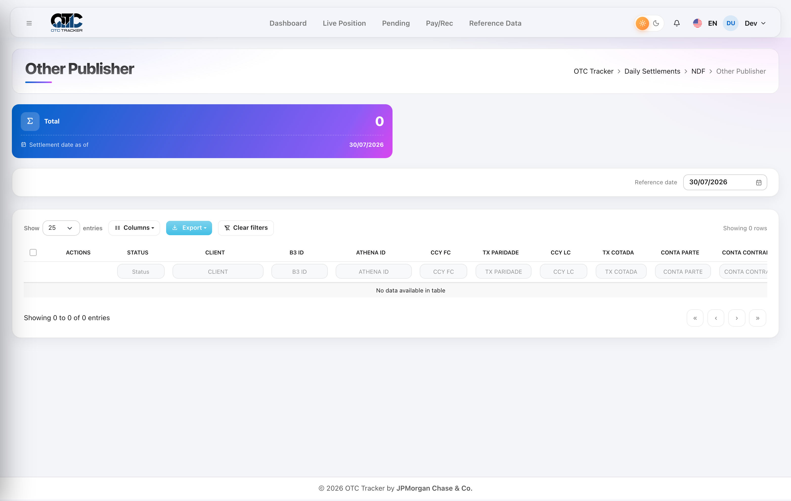

**Para que serve:** a mesma visão do Cockpit, restrita aos termos cuja fonte de cotação não é a PTAX. É uma tela de **consulta** — não há Import nem edição aqui.

### 6.4. Other Products Summary

**Menu › Daily Settlement › Other Products › Other Products Summary**

**Para que serve:** é o gêmeo do NDF Summary para swap, opção, termo de mercadoria e COE. As abas do alto são **Swap · Option · NDF Commodities · COE · Total**, e os dois cartões são os mesmos — **Settlement Summary** e **Trade Level**.

**Passo a passo:** idêntico ao 6.1 — abas, conferência, **Print Advice**, **TEDs**, e o **Confirm** da linha para marcar como enviado.

Duas coisas próprias desta tela:

- **O Trade Level abre agrupado por Produto → LOB → Contraparte**, nessa ordem, que é a ordem da conferência. Sem isso, swap, termo e opção do mesmo cliente ficariam intercalados.
- **Uma linha que neta zero mostra `0,00` no Receive**, e não duas células vazias: o zero é o resultado — a operação liquida por valores que se anulam —, enquanto vazio se leria como "não deu para calcular".

### 6.5. OTM Settlements

**Menu › Daily Settlement › Other Products › OTM Settlements**

**Para que serve:** os fluxos de caixa vindos do OTM, por trade — moeda, valor, data de valor, direção e a contraparte pelo SPN. Os quatro números do alto separam RATES, EQUITIES e COMMODITIES.

**Passo a passo:**

1. Confira a **data**.
2. Clique em **Import cashflows** para carregar o arquivo do dia.
3. Filtre e confira. Para corrigir, **Edit** na linha.

> **O nome da contraparte aqui sai do SPN, nunca do texto do arquivo.** O arquivo traz o nome como a mesa digitou (`S T E S A L`); o sistema troca pelo nome do cadastro. Se um nome parecer estranho, o que falta é cadastro de SPN, não correção na linha.

### 6.6. Latam Desk Position

**Menu › Daily Settlement › Other Products › Latam Desk Position**

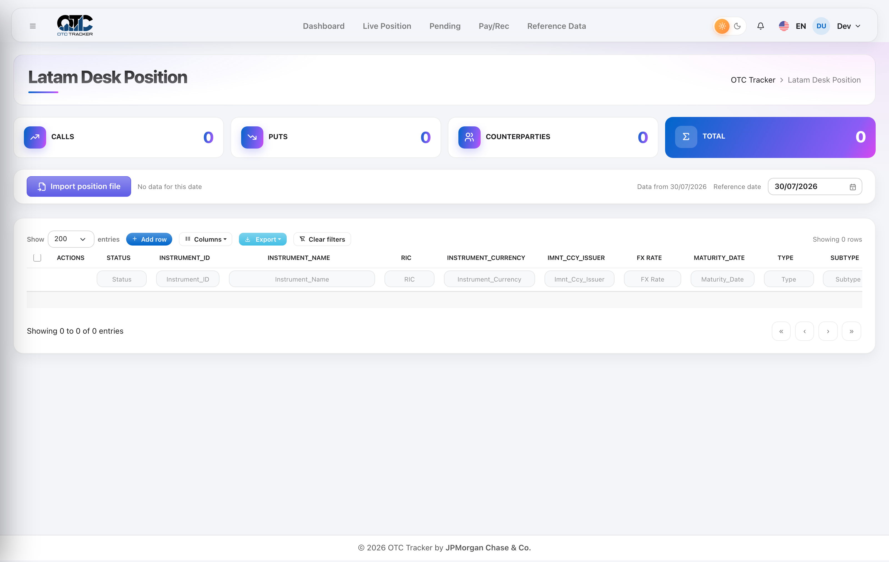

**Para que serve:** a posição da mesa como o relatório Latam a entrega — é a fonte que liga o trade de equity ao registro da B3.

**Passo a passo:**

1. Confira a **data**.
2. Clique em **Import position file**.
3. Se a pasta tiver **mais de um relatório do mesmo dia** (acontece quando ele é reemitido), o sistema usa o **mais recente** e diz, na janela de resultado, quais foram ignorados. Os ignorados **não são apagados** do disco.

### 6.7. Swap — Settlement Advice

**Menu › Daily Settlement › Other Products › Swap › Settlement Advice**

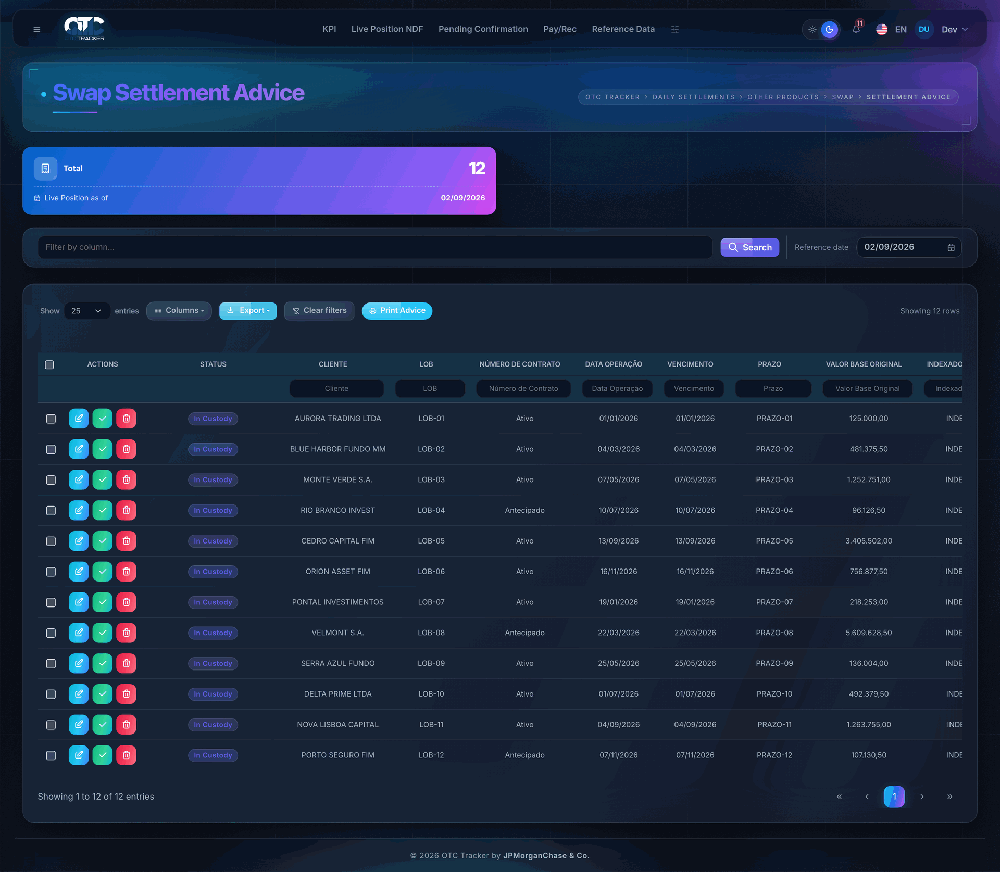

**Para que serve:** é o aviso de liquidação do swap, linha a linha — cliente, contrato, prazo, curva do banco, curva do cliente, resultado bruto, alíquota e valor do IR e o valor líquido.

**Passo a passo:**

1. Confira a **data**.
2. Confira as linhas. O campo **Filter by column…** filtra qualquer coluna.
3. Clique em **Print Advice** para gerar o documento das linhas exibidas.

### 6.8. Swap — Athena · VCP · Events · Kapital Hybrids

São quatro telas de **consulta**, cada uma mostrando uma fonte do swap. Nenhuma tem Import nem edição: você escolhe a data, filtra e exporta.

**Swap Athena** — a liquidação como a Athena calculou: CETIP ID, Kapital ID, as duas curvas e o valor líquido em reais.

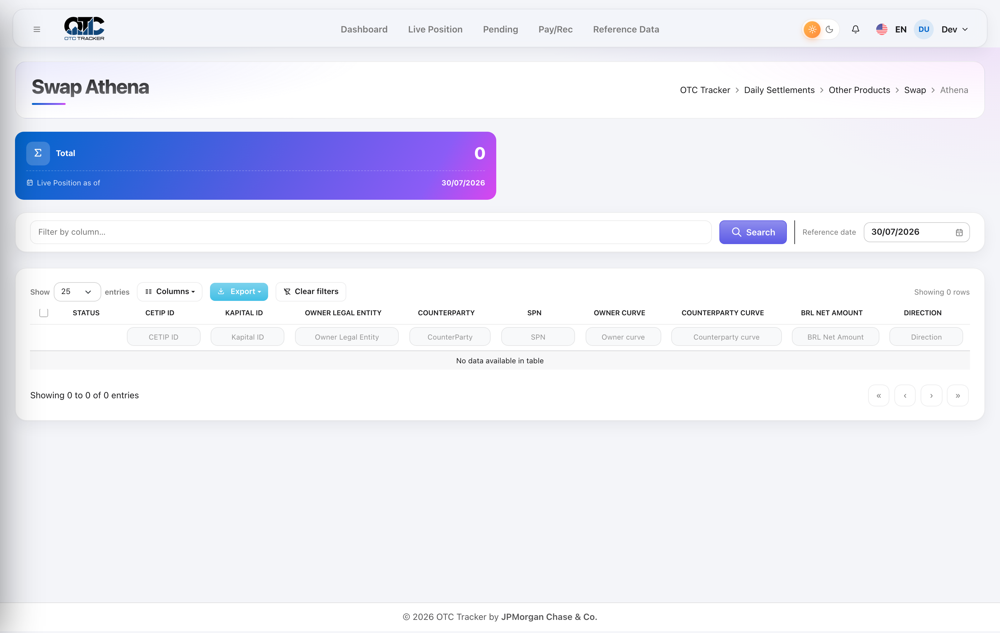

**Swap VCP** — as pernas de VCP do contrato: conta, indexador e fator de cada lado.

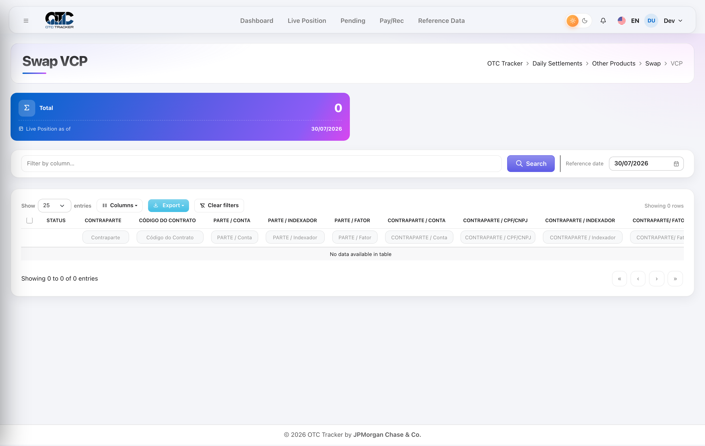

**Swap Events** — o arquivo de eventos da B3: registro, aditamentos, amortizações, valor base e as duas pernas.

**Swap Kapital Hybrids** — os híbridos vindos do Kapital: notional do stream, cupom, DCF e o líquido em reais.

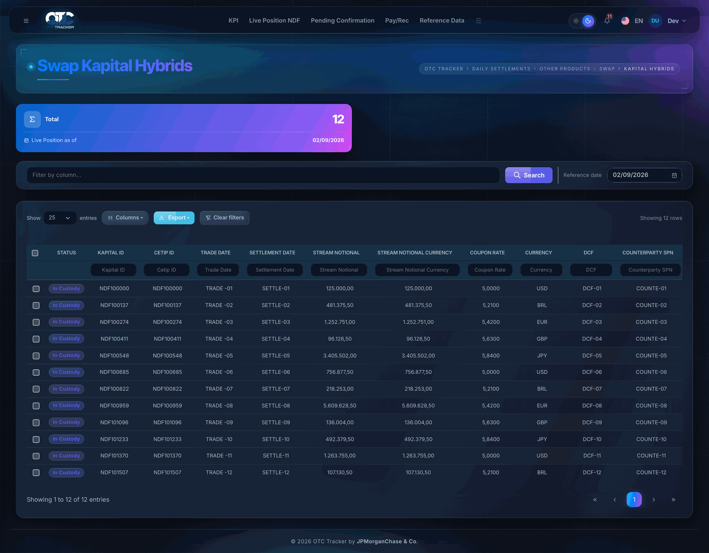

### 6.9. NDF Commodities — Settlement Advice

**Menu › Daily Settlement › Other Products › NDF › Settlement Advice**

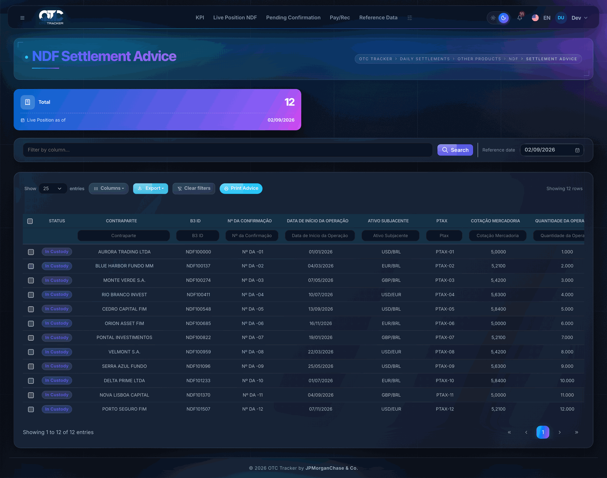

**Para que serve:** o aviso de liquidação do termo de mercadoria — contraparte, B3 ID, ativo subjacente, PTAX, cotação da mercadoria, quantidade, resultado apurado, o IR de 0,005% e o líquido.

**Passo a passo:** confira a data, confira as linhas e clique em **Print Advice**.

### 6.10. Option — Settlement Advice

**Menu › Daily Settlement › Other Products › Option › Settlement Advice**

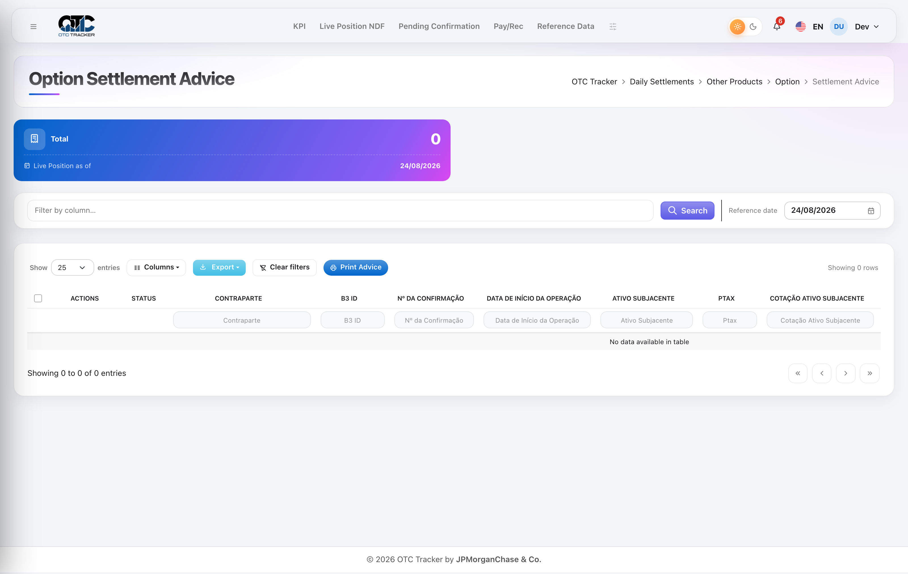

**Para que serve:** o mesmo aviso, para a opção — de câmbio, de mercadoria e de ação.

> **No aviso de pagamento de prêmio, o IR não sai por linha.** O imposto de 0,005% incide sobre o **líquido** do dia por contraparte, e só quando o banco paga; quando o banco recebe, é zero. Por isso o documento traz o IR uma vez só, no resumo do rodapé, e não uma coluna por operação.

### 6.11. Cognos

**Menu › Daily Settlement › Other Products › Option › Cognos**

**Para que serve:** o detalhe das opções de câmbio como o Cognos entrega — call/put, moedas, montantes, strike, prêmio e as datas.

**Passo a passo:** confira a data e clique em **Import FXO Detail** para carregar o arquivo do dia. Para corrigir uma linha, **Edit**.

### 6.12. Operations B3

**Menu › Daily Settlement › Operations B3**

**Para que serve:** é a lista bruta de operações da B3 do dia — conta, tipo de operação, compra/venda, título, valor, modalidade e status na B3. É dela que sai o que entra na apuração de liquidação.

**Passo a passo:**

1. Confira a **data**.
2. Clique em **Import operations** para carregar o arquivo da B3.
3. Filtre e confira. Os números do alto resumem por *Tipo Operação*, *Tipo Título* e *Modalidade Liquidação*.

**Para disparar a mensageria:**

1. Clique em **Mensageria**, ao lado do Import.
2. Um painel abre com um cartão por time destinatário, cada um com os campos de **TO** e **CC**. Preencha ou ajuste os endereços — eles ficam gravados para as próximas vezes.
3. Confirme o envio.

> **A liquidação intragrupo chega pelos dois arquivos, espelhada.** Para a mensagem não cobrar duas vezes o mesmo pagamento, o sistema envia por **uma** ponta só: quais contas geram mensagem é decidido no cadastro `b3-accounts` (capítulo 13.3), na coluna *Messaging*.

---

## 7. Live Position — o que está em aberto

**Menu › APPS › Live Position**

São cinco telas de **consulta** da posição viva registrada na B3. Nenhuma tem Import nem edição: você escolhe a data, filtra, confere e exporta. Todas trazem o campo **Filter by column…** acima da tabela, além da linha de filtro por coluna.

| Tela | O que mostra |
|---|---|
| **Live Position NDF** | Todos os termos em aberto — partes, contrato, datas, valor base, taxa forward, taxa de câmbio e a situação do contrato |
| **Swap › Characteristics** | As características de cada swap em aberto — tipo, contrato, partes, valor base, saldo, funcionalidade, indexadores e curvas |
| **Swap › Cashflow** | As agendas de pagamento de juros e amortização de cada contrato |
| **Swap › Premium** | Os eventos de prêmio dos swaps |
| **Live Position Option** | As opções em aberto — tipo, combinação de operações, partes, strike, barreiras, quantidades e a situação |

### 7.1. Live Position NDF

1. Confira a **data** no alto — por padrão, o último dia útil com arquivo.
2. Os números do alto (VANILLA · OTHER PUBLISHER · T+0 · COMMODITIES · TOTAL) contam a posição por tipo. **Clique num deles para filtrar a tabela** por aquele tipo.
3. Filtre pelas caixinhas do cabeçalho ou pelo **Filter by column…**.
4. Exporte com **Export** (4.6).

> **A coluna de CPF/CNPJ da contraparte mostra o NOME do cliente**, não o documento — o sistema resolve o documento no Reference Data. Quando o documento **não** está cadastrado, a célula mostra o número mascarado em vez de ficar vazia: é assim que se vê quem falta cadastrar. A coluna da **Parte** não muda — aquela é a nossa perna.

### 7.2. Live Position Option

Mesmo uso da anterior. A coluna **Combinação de operações** é a chave que liga a opção ao resultado apurado na liquidação e à reconciliação de FXO.

### 7.3. Swap — Characteristics, Cashflow e Premium

**Swap Characteristics**

**Swap Cashflow**

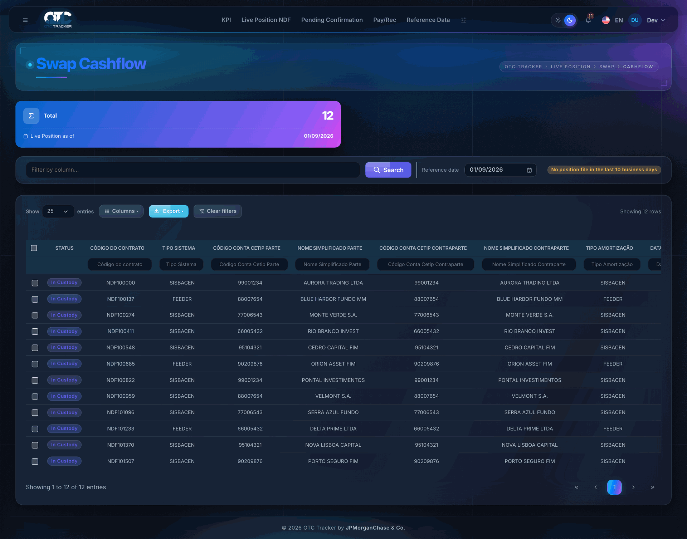

**Swap Premium**

Nas três: escolha a data, filtre, confira, exporte. Os números do alto da *Characteristics* resumem a posição por *Contract Type*, *LOB*, *Indexers* e *Features* — clique num deles para filtrar.

---

## 8. Reconciliations — bater as bases

**Menu › RECONCILIATIONS**

São quatro batimentos, cada um comparando duas fontes que deveriam dizer a mesma coisa.

### 8.1. Comitente

**Menu › Reconciliations › Comitente**

**Para que serve:** compara o cadastro de comitentes da B3 com o nosso — nome, endereço, telefone, e-mail, CNAE, natureza tributária. Cada campo recebe uma **nota de semelhança**, e a coluna *Avg Score* é a média.

**Passo a passo:**

1. Escolha a **data** no campo do alto.
2. Clique em **Run Reconciliation** (botão azul) para rodar com os arquivos que o sistema encontra na pasta de sempre.
3. Se os arquivos não estiverem lá, clique em **Manual Upload**. A janela pede **três** arquivos:
   - **1. Base B3 & CGD Consolidada** (`.xlsx`)
   - **2. DCADCOMITENTES B3** (`.txt`)
   - **3. Party Central Report** (`.xlsx`)

   Clique em cada retângulo (ou arraste o arquivo para dentro dele), confira que o nome apareceu, e clique em **Processar**.
4. Clique em **Load DB** para carregar um batimento já rodado, sem refazê-lo.
5. Ordene por **Avg Score** crescente para ver primeiro os cadastros mais divergentes.

### 8.2. Pay/Rec

**Menu › Reconciliations › Pay/Rec**

**Para que serve:** confere, por contraparte, se a quantidade e o valor que **nós** vamos pagar/receber batem com os que o **cliente** informou. As colunas *Check Qty* e *Check Value* são o veredito de cada lado.

**Passo a passo:**

1. Escolha a **data**.
2. Clique em **Run** (botão azul).
3. Confira as linhas: o que não bate aparece com a diferença calculada.
4. Escreva a explicação na coluna **Comment** da linha que divergiu.
5. Quando tudo estiver resolvido ou justificado, clique em **End process** (botão verde) — ele só habilita depois de o Run rodar, e é ele que fecha e comunica o resultado.

### 8.3. FXO

**Menu › Reconciliations › FXO**

**Para que serve:** bate a posição de opções de câmbio registrada na B3 contra o relatório de fim de dia da Athena, campo a campo — direção, put/call, contraparte, montante, prêmio, strike, datas e estilo. Cada par tem a sua coluna de *Status*.

**Os quatro estados da primeira coluna**, na ordem da gravidade (que é a ordem em que a tabela abre):

| Status | Significa | O que fazer |
|---|---|---|
| `Unmatched B3` | Está na B3 e não achou par na Athena | Falta bookar |
| `Unmatched Athena` | Está na Athena e não achou par na B3 | Falta registrar |
| `Partial - <campos>` | Casou, e os campos listados divergem | Conferir os campos citados |
| `Matched` | Fechou | Nada |
| `Justified` | Um `Unmatched` ou `Partial` com justificativa escrita | Nada |

**Passo a passo:**

1. Escolha a **data** no campo do alto.
2. Clique em **Run Reconciliation**.
3. Se a rede ou o relatório da Athena não responderem, clique em **Manual Upload** e suba os dois arquivos — a **posição B3** (`73760_AAMMDD_DPOSICAO.OPC`) e o **EOD da Athena** (`brazil_fxo_trades.csv`). A ordem não importa: o sistema reconhece cada um pelo conteúdo. Depois clique em **Run Reconciliation** dentro da janela.
4. Percorra o que não fechou.
5. Para justificar uma quebra, clique na célula **Comentário** da linha e escreva a explicação. A linha passa a `Justified`.

> **A justificativa é do TRADE, não da execução.** Ela fica gravada pela *Combinação de operações* e vale para trás: um comentário escrito hoje aparece na recon de ontem que já estava fechada. Apagando o comentário, a linha volta a exibir o status original — `Partial - Cntpy`, por exemplo —, e não fica `Justified` para sempre.
>
> **Casar por MatchingDealID faz a operação aparecer duas vezes** — uma `Matched` naquela chave e uma `Unmatched Athena` na chave própria, que a B3 não tem. É esperado.

### 8.4. CGD

**Menu › Reconciliations › CGD**

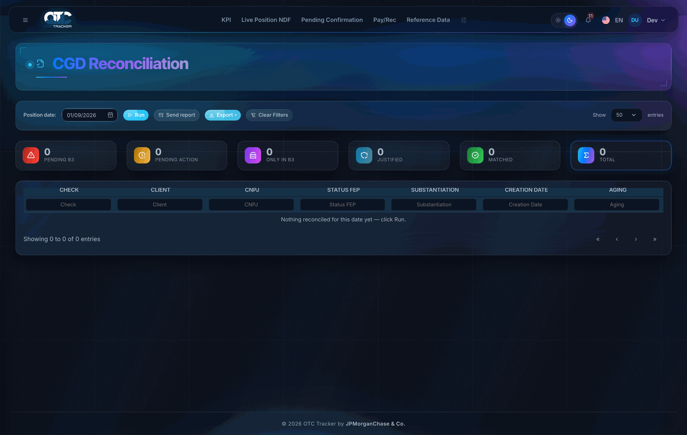

**Para que serve:** confere se todo cliente com Contrato Global de Derivativos (CGD) assinado está incluído na B3, e se todo cliente que aparece na posição da B3 tem CGD. Ela compara a **lista do FEP** com a **posição da B3 do último dia útil**.

**De onde sai cada lado:**

| Lado | Fonte |
|---|---|
| **Lista do FEP** | O `.xlsx` anexado ao e-mail mais recente da pasta **Inbox › Automatico › FEPWEB-CGD-ContratoGlobalDerivativos - SEM FILTRO DATAS**, na caixa compartilhada. Você não precisa salvar o arquivo em lugar nenhum: o sistema lê o anexo direto |
| **Posição da B3** | O arquivo `CETIP21_AAMMDD_DPOSICAO-NET.txt` do último dia útil, na pasta em que a rotina **Save CETIP Files** o grava — e não na pasta de download bruto da B3 |

> **Confira sempre de que dia é a lista.** Depois do Run, o painel diz o **assunto e a data** do e-mail que alimentou o batimento. Como a pasta acumula os relatórios, é isso que distingue "a recon está limpa" de "a recon rodou com a lista da semana passada".

**Os cinco cartões do alto** são as cinco respostas possíveis. **Clique num cartão para filtrar a tabela** por aquele grupo:

| Cartão | Significa |
|---|---|
| **PENDING B3** (vermelho) | O CGD está assinado e o cliente ainda não foi incluído na B3 |
| **PENDING ACTION** (âmbar) | Está nos dois lados, mas o CGD ainda não fechou |
| **ONLY IN B3** (roxo) | Aparece na posição da B3 e não está na lista do FEP |
| **JUSTIFIED** (azul) | Garantidor de outro cliente, ou conta encerrada — está cadastrado como exceção |
| **MATCHED** (verde) | Fechou |

**Passo a passo:**

1. Confira a **Position date** — por padrão, o **último dia útil**, porque é a posição da B3 desse dia que entra no batimento.
2. Clique em **Run** (botão verde).
3. Confira os cartões e clique naquele que quer detalhar.
4. Use a coluna **Aging** para priorizar: ela conta em dias úteis desde a criação, e fica **âmbar a partir de 5** e **vermelha a partir de 15** dias.
5. Para mandar o relatório por e-mail, clique em **Send report** (botão azul). O e-mail sai com uma seção por grupo, nas mesmas contagens da tela.
6. **Export** baixa o que está na tela (4.6).

> **Este batimento depende de quatro cadastros** editáveis na tela **Mapping** (capítulo 13.3): `cgd-stage`, `cgd-b3-participante`, `cgd-garantidor` e `cgd-conta-encerrada`. Se um deles estiver vazio, a tela **avisa** em vez de deixar linhas entrarem ou saírem em silêncio — por exemplo, a linha da B3 que vem sem CNPJ é resolvida pelo `cgd-b3-participante`, e a recon diz quantas saíram por falta de cadastro.

---

## 9. Confirmations — do documento até o cliente devolver assinado

**Menu › DOCUMENTATION**

Este bloco acompanha a confirmação depois que a operação já está registrada: gerar o documento, validá-lo mesa por mesa, mandar ao cliente e cobrar a devolução assinada.

### 9.1. Pending Confirmation

**Menu › Documentation › Pending Confirmation › Pending Confirmation**

**Para que serve:** é a lista de tudo que está pendente de confirmação com o cliente, com a idade de cada pendência. Os cartões do alto agrupam por faixa de atraso — *< 10 dias*, *10 a 20*, *20 a 30*, *30 a 60*, *60 a 90*, *> 90* e o *Total*.

**Passo a passo:**

1. **Clique num cartão** de faixa para filtrar a tabela por aquele grupo — comece pelos mais velhos.
2. Localize a linha com a busca por fichas (4.4) ou com os filtros de coluna.
3. Para escrever o que está travando, clique em **Edit** na linha e preencha **Break Reason** e **Comments**.
4. Quando o cliente devolver assinado, marque a linha e clique em **Mark Concluded** — ela sai da fila de pendências.
5. **Add Row +** inclui à mão uma pendência que não veio automaticamente.

**A coluna *Pending Status*** diz o que está faltando, e ela é preenchida pelo sistema — não se digita à toa:

| Valor | Significa |
|---|---|
| `Pending Original` | Espera o documento original assinado |
| `Pending Digital Signature` | Espera a assinatura digital |
| `Exception FepWeb` / `Exception Digital Fep Web` | Trata-se pelo FepWeb |
| `Pending OTC` · `Pending MO` · `Pending FO` · `Pending FepWeb` | A confirmação está na esteira de validação (9.3) |

> **Operação vencida sai da fila sozinha.** Quando a data de vencimento chega, o sistema marca a linha como `Exception FepWeb` / `Ok` e ela deixa de envelhecer: não faz sentido cobrar a confirmação de uma operação que já liquidou.

### 9.2. Metrics — Pending Confirmation

**Menu › Documentation › Pending Confirmation › Metrics**

**Para que serve:** é a visão gerencial da fila — a evolução das pendências no tempo e quem são os maiores ofensores.

**Passo a passo:**

1. Use o seletor **> 30 days / All** para escolher se o painel conta só o que está atrasado ou tudo.
2. Use o segundo seletor (*Current Year* · *Last 24 Months* · *Daily (current month)*) para mudar o eixo do gráfico de história.
3. Percorra os quadros **Top 5 Offenders**, **Top 5 Bankers**, **Top 5 Clients** e **Top 5 Economic Groups**.

### 9.3. Confirmations Monitor

**Menu › Documentation › Manual Confirmation › Confirmations Monitor**

**Para que serve:** é a fila de trabalho da esteira de confirmação. Cada **cartão** é uma etapa, e dentro dele há um item por confirmação, ordenado do mais atrasado para o menos.

**As cinco etapas, na ordem em que a confirmação anda:**

| Cartão | O que significa | Quem age |
|---|---|---|
| **Pending Legal** | Retenção manual — o Legal segurou a confirmação | OTC Ops solta |
| **Pending OTC** | O documento precisa ser gerado e conferido | Back Office (OTC Ops) |
| **Pending MO** | Conferência do Middle Office | Middle Office |
| **Pending FO** | Conferência do Front Office | Front Office |
| **Pending FepWeb** | Validado; falta enviar ao cliente | OTC Ops |
| *(fim)* | `Ok` — a confirmação saiu da fila | — |

> **MO e FO correm em paralelo**, não em fila: os dois contam o prazo a partir da mesma data da operação.

**O que cada item mostra:** o cliente, o produto, quantas operações o documento cobre, os chips dos PDFs e do e-mail de recap encontrados na pasta, e as marcas de prazo:

| Marca | Significa |
|---|---|
| `faltam Nd` / `{n}d left` | Dentro do prazo |
| `vence amanhã` / `vence hoje` | Véspera ou o próprio dia |
| `Nd de atraso` | Prazo estourado — a marca fica vermelha |
| `no callback` | Falta a conferência por telefone com o cliente (só no cartão *Pending FepWeb*) |

**Os prazos**, contados em **dias úteis a partir da data da operação** (e não da data em que o documento foi gerado): **OTC D+3**, **MO D+4**, **FO D+6**. Eles são cadastráveis na tela Mapping (`manual-conf-sla`).

**Passo a passo — gerar a confirmação:**

1. No cartão **Pending OTC**, localize o item. Se ainda não existe PDF na pasta, o botão do item é **Generate**.
2. Clique em **Generate**. O editor do documento abre numa aba nova, já com os dados da operação.
3. Revise o texto do documento.
4. Clique em **Salvar Word + PDF no Inventory** — é o único botão do editor. O documento é gravado no Electronic Inventory.
5. Como você abriu pelo Monitor, o sistema leva você direto para a **tela de validação da esteira**: você está com o papel na frente e pode assinar pela mesa de OTC.
6. Se preferir não validar agora, feche a aba. A confirmação continua em `Pending OTC`, agora com o PDF na pasta, e o botão do item passa a ser **Validate**.

**Passo a passo — validar:**

1. Clique em **Validate** (o botão verde do item). A tela de validação abre numa aba nova.
2. Se aparecer **View** (contorno cinza) em vez de Validate, é porque aquela etapa é de **outra mesa**: você pode abrir e ler, mas não assinar.
3. Ver 9.4.

**Passo a passo — soltar do Legal:**

1. No cartão **Pending Legal**, clique em **Release to OTC**.
2. Confirme na janela: ela diz o cliente e quantas operações vão sair da retenção.
3. A confirmação entra na fila do OTC, aqui e no Pending Confirmation.

**Passo a passo — marcar como enviada ao cliente:**

1. No cartão **Pending FepWeb**, clique em **Mark as sent**.
2. Confirme na janela.
3. O sistema carimba a data de *Enviado p/ cliente*, a confirmação vira **`Ok`** e a linha do Pending Confirmation passa a *Pending Digital Signature* ou *Pending Original*, conforme o tipo de assinatura do cliente no Reference Data.

### 9.4. A tela de validação

**Como se chega:** pelo botão **Validate** (ou **View**) de um item do Confirmations Monitor. Ela abre com o **PDF do documento de um lado** e o **checklist da etapa do outro**.

**Passo a passo:**

1. **Leia o PDF** no painel da esquerda. Se não houver PDF, a tela diz isso — gere o documento antes.
2. No painel da direita, confira o cabeçalho: contraparte, produto, data da operação, quantas operações, a etapa e a marca de prazo.
3. **Marque cada item do checklist.** O botão **Validate** só habilita quando todos estiverem marcados:

| Etapa | Itens do checklist |
|---|---|
| **OTC** | Contraparte e Tax ID batem com o Reference Data · Data do CGD bate com o contrato registrado · Operações da Tabela de Referência batem (deal, valor, taxa, direção) · Datas batem (operação, fixings, PTAX e vencimento) |
| **MO** e **FO** | Só os dois econômicos: operações da Tabela de Referência · datas |

4. Clique em **Validate**. A confirmação segue para a etapa seguinte e o Monitor se atualiza.
5. **Se o prazo já venceu**, o sistema pede a justificativa: um campo *"Reason for the delay"* aparece e a validação só passa com ele preenchido. A justificativa fica na coluna daquela mesa (`OTC Comments`, `MO Comments`, `FO Comments`).

**Para devolver ao OTC (rejeitar):**

1. Clique em **↩ Send back to OTC**, abaixo do botão verde.
2. Escreva **o que está errado no documento** — o campo é obrigatório, e o texto que você escrever **é o corpo do aviso** que a mesa de OTC recebe.
3. Clique em **Reject and notify**.

> **Rejeitar é só das mesas seguintes.** O OTC monta o documento e não tem a quem devolvê-lo, então no OTC o botão não aparece.
>
> **Cada etapa é assinada pela sua mesa.** Quem não é da mesa vê a tela sem os botões de assinar — e, se tentar pelo endereço direto, o sistema recusa. Administrar acessos não dá esse direito: ser `ADMIN` não é passe livre para assinar por uma mesa.

### 9.5. Track Confirmations

**Menu › Documentation › Manual Confirmation › Track Confirmations**

**Para que serve:** é a esteira inteira em forma de tabela — uma linha por operação, com todas as datas e carimbos de cada mesa. É onde se corrige um dado da esteira e onde se enxerga o histórico completo.

**As colunas que importam:**

| Coluna | O que é |
|---|---|
| **Pending** | Em que etapa a operação está |
| **Aging** | Há quantos dias úteis ela espera |
| **E-mail Subject** | O assunto do e-mail de recap interno — **preenchido pelo sistema** a partir do arquivo na pasta, não digitado |
| **Callback Date** | A conferência por telefone com o cliente |
| **Validated by OTC / MO / FO** + **Time Stamp** | Quem assinou cada etapa e quando |
| **OTC / MO / FO Comments** | A justificativa de atraso daquela mesa |
| **Sent to Client (FepWeb Released)** | A data do envio ao cliente |

**Passo a passo:**

1. Filtre pela coluna **Pending** para ver só uma etapa, ou por **Counterparty** / **Trade ID** para achar uma operação.
2. Para corrigir, clique em **Edit** na linha, altere e salve.
3. Para alterar a mesma coluna em várias linhas: marque as linhas, escolha a coluna em **Select Column to Apply**, digite o valor e confirme.

> **Preencher uma coluna de validação aqui É validar.** Escrever a data em *VALIDADO p/ MO* passa pelas mesmas três regras da tela de validação: carimba quem assinou, exige a mesa certa e pede justificativa se o prazo já venceu. Se você só quer ajustar um cadastro, não use as colunas de validação.
>
> **Apagar a data apaga o carimbo** — é assim que se desfaz uma validação feita por engano.

---

## 10. Onboarding — os contratos globais (CGD)

**Menu › DOCUMENTATION › Onboarding**

Acompanha a emissão dos **Contratos Globais de Derivativos**, desde a solicitação até o contrato ativo e registrado na B3. A fonte é a lista do SharePoint, importada para dentro do sistema.

### 10.1. Overview

**Menu › Documentation › Onboarding › Overview**

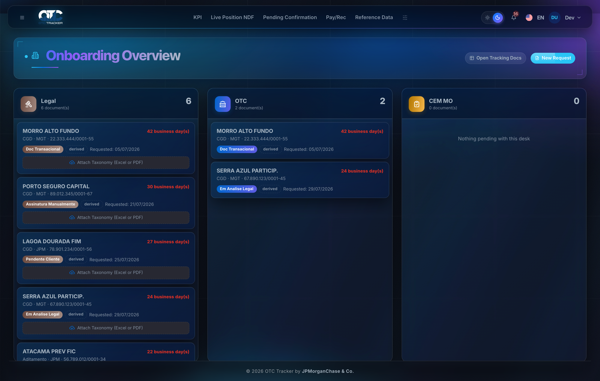

**Para que serve:** responde *quantos contratos estão em aberto e em que mesa cada um está parado*. É o painel de trabalho do onboarding.

A faixa do alto traz quatro números e um link **Open Tracking Docs**:

| Número | O que conta |
|---|---|
| **Documents** | O total do banco |
| **Pending** | O que está em alguma das três filas |
| **Active** | O que já está pronto (`Status` = Active) |
| **Closed** | O que foi encerrado sem concluir — `Inactive` e `Cancelado` |

Os quatro fecham: **Documents = Pending + Active + Closed**.

Abaixo, **quatro cartões verticais**, um por mesa da esteira, na ordem em que o documento passa por elas:

| Cartão | O que está esperando ali |
|---|---|
| **Banking** | A solicitação está sendo aberta — falta preencher um dos campos obrigatórios do formulário |
| **Legal** | Falta a emissão / a assinatura do contrato |
| **OTC** | Assinado; falta o carimbo do OTC |
| **CEM MO** | Falta o carimbo do Middle Office |

**Para abrir uma solicitação:**

1. Clique em **New Request**, no canto direito da faixa de números (o mesmo botão existe na barra do Tracking Docs).
2. Preencha o formulário. Os campos com **\*** são obrigatórios; o sistema recusa a gravação e marca em vermelho os que faltam.
3. A **CGD - Solicitação** vem com a data de hoje e **não se edita** — é o dia em que o pedido está sendo aberto, e é dela que o aging conta.
4. **Razão Social** e **CNPJ** aceitam **todas as entidades do grupo** — são campos de várias linhas.
5. **CGD - Tipo de Assinatura** é uma lista: *FepWeb*, *DocuSign* ou *Manual* (a assinatura física).
6. Em **CGD - Domínio cliente**, se o cliente não tiver domínio, escreva `NA`.
7. Em **Contatos**, os e-mails que devem entrar na solicitação de SSI.
8. **Garantidor** já vem em *No*; troque para *Yes* se o cliente tiver um, e preencha **Informações do garantidor** com a razão social e o CNPJ dele (o campo vem com `N/A`).
9. Em **Apêndice**, anexe o **template para emissão do CGD**.
10. Clique no botão **verde** do rodapé para gravar. A solicitação entra na lista e aparece na fila da mesa correspondente.

> **O apêndice vai para o Electronic Inventory**, na pasta **Transactional** da contraparte, com o nome `CGD TEMPLATE - <cliente> - <ddmmaaaa>` — é onde os documentos por cliente já vivem e onde a mesa os procura. A contraparte é a **primeira entidade** da *Razão Social*: o campo pede todas as do grupo, uma por linha, e a pasta do inventário é de um cliente só.
>
> **O arquivo é gravado ANTES da solicitação.** O anexo é a parte que depende do servidor de arquivos e é a que falha; gravando a linha primeiro, um servidor fora do ar deixaria a solicitação criada **sem** o template e nada na tela diria que faltou. Se o anexo falhar, a tela mostra o motivo e **nada é criado** — corrija e tente de novo.

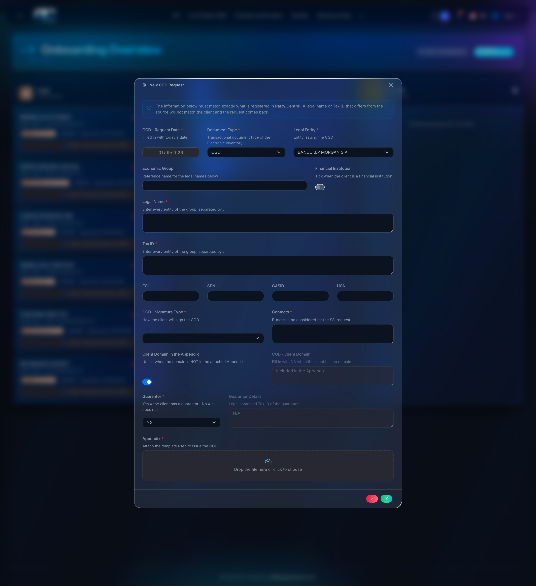

**Os campos obrigatórios da solicitação** — enquanto um deles estiver em branco, o documento fica no Banking:

| Campo do formulário | Coluna da lista |
|---|---|
| **CGD - Solicitação** | `Data Solicitação` |
| **Razão Social** | `Razão Social` |
| **CNPJ** | `CNPJ` |
| **CGD - Tipo de Assinatura** | `Signature Type` |
| **Contatos** | `Contacts` |
| **Garantidor** | `Garantidor` |

*Grupo*, *CGD - Domínio cliente* e *Informações do garantidor* não entram: são opcionais no formulário (o domínio se preenche com `NA` quando o cliente não tem, e as informações do garantidor com `N/A` quando não há garantidor), e cobrá-los deixaria na fila uma solicitação que já pode seguir.

**Passo a passo:**

1. Percorra os cartões. Dentro de cada um, os documentos aparecem **do mais antigo para o mais novo** — quem espera há mais tempo vem primeiro.
2. Cada item mostra o cliente, o tipo de documento, a entidade, o CNPJ, o status, a data da solicitação e o **aging em dias úteis**, que fica âmbar a partir de 5 e vermelho a partir de 15.
3. A etiqueta **derived** ao lado do status significa que a mesa foi **deduzida** pelo primeiro carimbo que falta, e não lida de um cadastro. Para fixar a mesa de um status, cadastre-o em **Mapping › `cgd-stage`** (13.3).
4. Clique em **Open Tracking Docs** para ir à tabela completa.

> **Só entra nos cartões o documento que ainda está em andamento.** O que está `Active` terminou e conta em *Active*; o que está `Inactive` ou `Cancelado` foi encerrado e conta em *Closed*. Nenhum dos dois é pendência de ninguém, e por isso nenhum aparece nas filas — antes, o encerrado caía na fila do **Legal** (a primeira etapa sem carimbo em quem nunca começou) e ficava lá envelhecendo no topo da lista.
>
> **Documento com todos os carimbos e ainda não `Active` fica na ÚLTIMA mesa** — devolvê-lo sem etapa o faria sumir das três filas, e um pendente que some é pior do que um pendente na fila errada.

### 10.2. Tracking Docs

**Menu › Documentation › Onboarding › Tracking Docs**

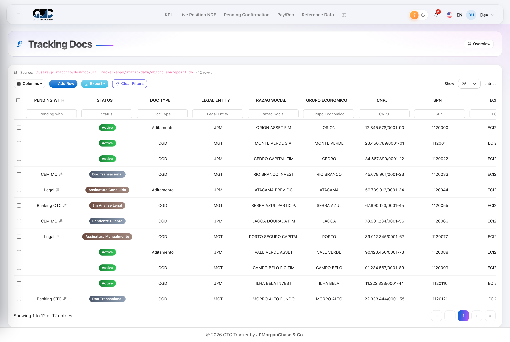

**Para que serve:** é a lista completa de CGDs, com as trinta colunas da planilha do SharePoint mais duas do sistema.

**A faixa cinza acima da barra de ferramentas** mostra **de onde os dados vieram** — o caminho do banco e quantas linhas ele tem. Se o banco ainda não foi criado, essa faixa fica **vermelha** dizendo isso e o comando que resolve.

**As duas colunas que o sistema calcula:**

| Coluna | O que é |
|---|---|
| **Actions** (a 1ª depois da caixa de seleção) | Editar e excluir a linha |
| **Pending with** | Em que mesa o documento está parado. O ícone de varinha ao lado significa *deduzido* |
| **Aging** | Dias **úteis** desde a *Data Solicitação*, recalculados a cada abertura da tela |
| **Signature Type** | Como o cliente vai assinar. Na edição é uma **lista fechada**: *FepWeb*, *DocuSign* ou *Manual* (a assinatura física) |

> **O Aging da planilha é ignorado de propósito.** Quem exportou ontem exportou o aging de ontem; aqui ele é refeito toda vez. E ele **para** quando o CGD conclui: o prazo de quem terminou deixou de correr. Sem *Data Solicitação*, a célula fica **vazia** — nunca zero, que se leria como "entrou hoje".

**Passo a passo:**

1. Filtre pelas caixinhas do cabeçalho — por **Status**, por **Razão Social**, por **Pending with**.
2. Para corrigir um dado, clique em **Edit** na linha, altere e salve (4.9). O *Aging* não é editável: ele é calculado.
3. **New Request** abre o formulário de abertura de solicitação (o mesmo do Overview — ver 10.1).
4. **Delete** apaga uma linha.
5. **Overview**, no canto superior direito, volta ao painel.

**Para alterar várias linhas de uma vez:**

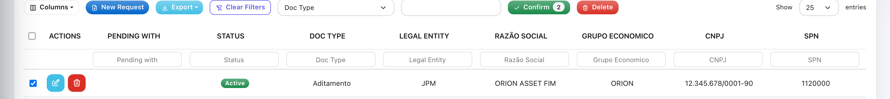

1. Marque a **caixa de seleção** das linhas — ou a do cabeçalho para marcar a página inteira.
2. Os botões **Confirm** e **Delete** aparecem na barra de ferramentas, com o número de linhas selecionadas.
3. Escolha a coluna em **Select Column to Apply**. O campo de valor ao lado se adapta: lista fechada no *Signature Type*, calendário nas colunas de data, texto no resto.
4. Digite o valor e clique em **Confirm**. O sistema pergunta antes — a ação alcança linhas que o filtro escondeu, sobrescreve o que já estava gravado e **não tem desfazer**.
5. **Delete** apaga todas as selecionadas, também com confirmação.

> O **Aging** não aparece na lista de colunas: ele é recalculado a cada leitura, e um valor digitado ali seria desfeito na abertura seguinte da tela.

> **A importação REESCREVE a tabela inteira.** Quando a lista do SharePoint é reimportada, o que você editou aqui é substituído pelo que está lá — a lista é a fonte, e o app é a leitura dela. Correção que precisa durar tem de ser feita no SharePoint.

---

## 11. Intrag

**Menu › PRODUCTS › Intrag**

Três telas — **NDF**, **Option** e **Swap** — com as operações no leiaute que a Intrag recebe. Todas funcionam igual: busca por fichas, filtros por coluna, **Columns**, **Export**, **Add Row +** e **Clear Filters**.

**Intrag — NDF**

**Intrag — Option**

**Intrag — Swap**

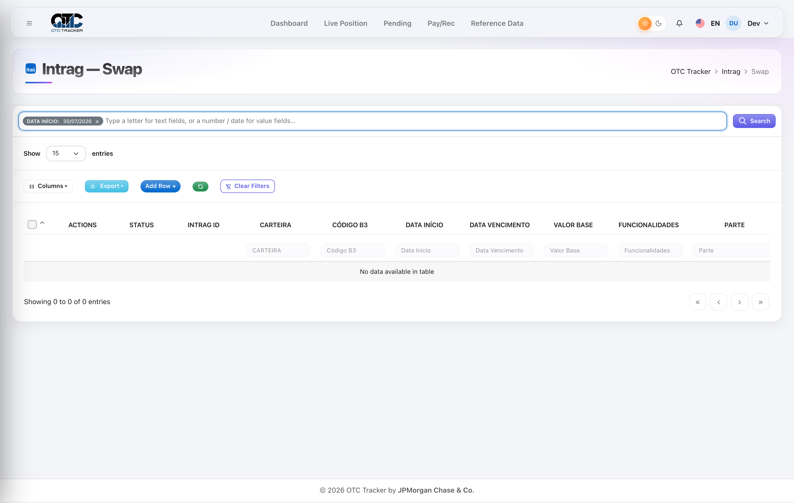

**Passo a passo:**

1. Localize a operação pela busca ou pelos filtros.
2. Confira as colunas do leiaute — elas são o contrato com a Intrag e a ordem importa.
3. **Add Row +** inclui uma operação à mão.
4. **Export** baixa o conjunto para conferência.

**O ciclo da linha (NDF e Option):** a operação chega como **`New`**, o **Send** gera o arquivo e a marca **`Sent`**, e o que fecha o ciclo é o **Intrag ID** — com ele preenchido, a linha fica **`Success`**. Há dois jeitos de preenchê-lo:

- **Mapping Intrag ID** (o botão verde da barra): lê o CSV de retorno na pasta de export, casa pelo **B3 ID** e preenche a coluna das linhas casadas — cada uma vai a `Success`.
- **Na edição da linha**: o modal do **Edit** traz o campo **Intrag ID** como primeiro campo. Digitado um Intrag ID novo, a linha vai a **`Success`** ao salvar — é o mesmo desfecho do Mapping, para o retorno que chegou por outra via.

**Editar sem mexer no Intrag ID é outra coisa:** a edição de dado leva a linha a **`Pending`**, e um **segundo usuário** precisa aprovar (o ✓ da linha) — quem editou não aprova a própria edição. Apagar o Intrag ID no modal também devolve a linha a `Pending`.

> A coluna **Information Source** sai sempre legível — `PTAX BRR PTAX`, com espaços. Os separadores do texto de origem (`|`, colchete, chave) são trocados por espaço na chegada, e as linhas antigas já aparecem corrigidas na tela.

> Nestas três tabelas a seleção de célula usa a extensão nativa da tabela: clique numa célula, arraste para pegar um bloco e **Ctrl+C** para copiar (4.8).

---

## 12. Accrual e MtM de Swap

**Menu › PRODUCTS › Accrual Swap** e **MtM Swap**

**Para que serve:** são as duas rotinas de fim de mês do swap — a apuração do **accrual** (juros acumulados) e a do **MtM** (marcação a mercado). As duas telas têm o mesmo desenho: um cartão de tabela por LOB (**CEM · EDG · Hybrids · Commodities**, e **COE** também no MtM).

**Passo a passo:**

1. Escolha a **data** no campo *Date*, no alto à esquerda.
2. Clique em **Load** para carregar o que já foi processado naquela data.
3. Clique em **Import from folder** para trazer os arquivos novos da pasta.
4. Percorra os cartões. As linhas em **Check** são as que divergiram.
5. **Escreva o comentário** na coluna *Comments* de cada linha em Check — explicando a divergência.
6. Clique em **Validation** para gerar os arquivos de lote por LOB e disparar o e-mail de validação. O sistema pede confirmação antes.
7. Clique em **Recon** para o batimento contra o registrado.
8. Dentro de um cartão, **Send batch** envia o lote daquela LOB.
9. Clique em **End Process** para fechar o mês. **Ele só passa se toda linha em Check tiver comentário** — se faltar alguma, o sistema lista LOB, Código IF e ID das que faltam. Fechando, sai o e-mail de status final para OTC Ops.

No **MtM** há ainda o botão **New Mapping**, para cadastrar um de-para novo sem sair da tela.

---

## 13. Cadastros e ferramentas

**Menu › SETTINGS** e **Menu › APPS**

### 13.1. Reference Data

**Menu › Settings › Reference Data**

**Para que serve:** é o cadastro de contrapartes — a lista de clientes com quem a mesa opera. Quase toda outra tela consulta esta: é daqui que sai o nome do cliente a partir do CNPJ, o SPN, o tipo de assinatura e as contas.

**As colunas:** Counterparty · Economic Group · Banker · Signature Type · Tax ID · ECI · SPN · CASID · UCN · B3 Account · Commodities Acronym · FX Cash Acronym.

**Passo a passo — cadastrar uma contraparte:**

1. Clique em **Add Row +**.
2. Preencha os campos. Os que mais importam para o resto do sistema são o **Tax ID** (é a chave de resolução do cliente), o **SPN**, os dois **acronyms** e o **Signature Type**.
3. Salve. A linha nasce com status pendente de aprovação.
4. Marque as linhas a aprovar e clique em **Approve Selected**.

**Passo a passo — corrigir um cadastro:** filtre pela coluna *Counterparty* ou *Tax ID*, clique em **Edit** na linha, altere e salve.

> **O `Signature Type` decide o rótulo da pendência de confirmação** — `Digital` leva a *Pending Digital Signature*, `Manual` e **não cadastrado** levam a *Pending Original*. Deixar em branco não é neutro: é o mesmo que dizer Manual.

### 13.2. Index B3

**Menu › Settings › Index B3**

**Para que serve:** consulta e cadastro dos ativos subjacentes registrados na B3. É aqui que se resolve o aviso *"Asset Not Registered"* que aparece ao aprovar uma operação em New Deals.

**Passo a passo — procurar um ativo:**

1. No cartão **Search Filters**, escolha a **Class** (AÇÕES · AÇÕES INTERNACIONAIS · CESTA · COMMODITIES · INDICES · INDICES INTERNACIONAIS · JUROS).
2. Refine com os demais seletores: *Underlying Asset Code*, *Exchange*, *Appreciation Index*, *Commodity*, *Instrument Type (IF)* (COE · OPC · SWAP · TER), *Currency*, *Quotation Type*, *Expiry Month* e *Calculated*.
3. Os dois campos de texto aceitam o ano (*e.g. 2025*) e o nome do índice (*e.g. IBOV*).
4. Clique em **Search**.
5. **Clear Fields** limpa todos os filtros de uma vez.
6. O resultado aparece na tabela abaixo, com a barra de ferramentas de sempre.

### 13.3. Mapping — os de-para

**Menu › Settings › Mapping**

**Para que serve:** é onde moram **todos os de-para do sistema** — as tabelas de tradução que dizem, por exemplo, que o código de curva `C00` é o índice `VCP`, ou qual conta B3 pertence a qual entidade nossa. São mais de quarenta cadastros.

> **Nenhum de-para fica escrito no código.** Se um valor novo precisa ser traduzido, ele se cadastra aqui — e vale **no próximo request**, sem esperar reinício do sistema. É a diferença mais útil desta tela: mudança de cadastro é imediata.

**Passo a passo:**

1. Escolha o cadastro na **lista de tipos**, à esquerda (o primeiro é *Currency Base*).
2. A tabela do cadastro escolhido aparece à direita, com as colunas próprias dele.
3. Para **incluir**: clique em **Add**, preencha os campos da janela e salve.
4. Para **corrigir**: clique em **Edit** na linha, altere e salve.
5. Para **apagar**: clique em **Delete** na linha.
6. **Export** e **Clear filters** funcionam como em qualquer tabela.
7. Ordene clicando no nome da coluna.

**Os cadastros que mais dão trabalho quando estão errados:**

| Cadastro | O que ele decide |
|---|---|
| `commodities-b3` | O código B3 de cada mercadoria, por tipo de trade (Vanilla / Asian) |
| `api-links` | O endereço da API da Athena, por uso e produto |
| `opb3-events` | Quais linhas do Operations B3 entram numa apuração de liquidação |
| `b3-accounts` | As contas B3 das nossas entidades — quem é o participante, e por qual conta sai a mensageria |
| `manual-conf-validation` | Quem valida a confirmação de cada produto (OTC / MO / FO) |
| `manual-conf-sla` | Os prazos de cada mesa da esteira |
| `bankers-email` | O e-mail de cada banker, para o Cc da coleta de assinatura |
| `cgd-stage`, `cgd-b3-participante`, `cgd-garantidor`, `cgd-conta-encerrada` | O batimento de CGD (8.4) e a esteira do Onboarding (10.1) |

> **Alguns campos aceitam um PADRÃO, e não um valor literal.** Em `commodities-b3` e em `quotes-commodity`, `"MY"` entre aspas significa *letra do mês + ano do contrato* e `_` significa *espaço*: `CO"MY"` casa `COZ6`, `COK7` e todos os demais vencimentos daquela mercadoria com uma linha só.
>
> **Os valores não são aparados.** O espaço no fim de códigos B3 como `'C '` faz parte do código — não o apague achando que é sobra.

### 13.4. Quotes

**Menu › Apps › Quotes**

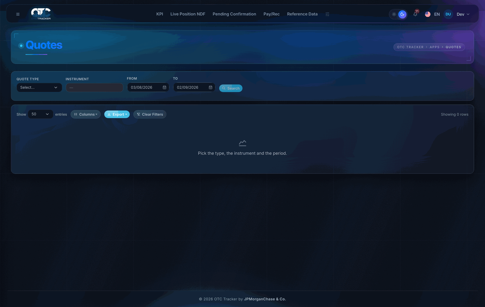

**Para que serve:** consulta a cotação histórica de uma moeda, ação ou mercadoria — PTAX pelo Banco Central, ações e commodities pelo mercado.

**Passo a passo:**

1. Escolha o **Quote Type**: *PTAX*, *Equities* ou *Commodities*.
2. O campo **Instrument** só habilita depois disso. Comece a digitar e escolha o instrumento na lista que abre logo abaixo do campo — a lista acompanha a largura do campo e rola.
3. Preencha **From** e **To** com o período.
4. Clique em **Search**.
5. A tabela abaixo traz a série. **Export** baixa (4.6).

> **Se o sistema responder que o código não está cadastrado**, é porque falta a tradução do código B3 para o símbolo de mercado. Cadastre em **Mapping › `quotes-equity`** ou **`quotes-commodity`** — o sistema nunca tenta o código como ticker às cegas, justamente para não devolver um erro obscuro da fonte no lugar de "falta cadastrar".

### 13.5. Holidays Calendar

**Menu › Apps › Holidays Calendar**

**Para que serve:** os calendários de feriados que o sistema usa para contar dias úteis — o ANBIMA e os das praças de cada mercadoria.

**Passo a passo — ver os feriados:**

1. As **pastilhas** da barra lateral são os calendários. Clique numa para acender/apagar aquele calendário no quadro.
2. Navegue com **‹** e **›**; **Today** volta ao mês corrente.
3. Troque a visão em **Year · Month · Week · Day · List**.
4. Clique num feriado para ver a que calendário ele pertence.

**Passo a passo — incluir um feriado:**

1. Clique em **Create New Holiday**.
2. Escolha o **calendário** na lista, a **data** e a **descrição**.
3. Salve.

**Passo a passo — criar um calendário novo:**

1. Clique em **Create New Calendar**.
2. Envie uma **planilha** com uma aba: **coluna A** a data e **coluna B** a descrição. A terceira coluna, se houver, é ignorada.
3. O cabeçalho é descartado por **não ser data** — não precisa tirá-lo.
4. O calendário nasce com uma cor sorteada e já aparece nas pastilhas.

### 13.6. File Interpreter

**Menu › Apps › File Interpreter**

**Para que serve:** é o cadastro dos **leiautes de arquivo** — campo a campo, com posição, formato e origem do valor. É por ele que se muda o que sai num arquivo de registro da B3 sem mexer no código.

Cada leiaute é um **template**, e a tabela mostra uma linha por campo: **SEQ · FIELD · FORMAT · POSITION · REQUIRED · CONTENT · DESCRIPTION · SOURCE · SOURCE FIELD / VALUE**.

**Passo a passo:**

1. Escolha o template na biblioteca à esquerda.
2. **Versions**, no cartão do template, escolhe a **variante** — a mesma família de arquivo pode ter versões por par de entidades ou por produto.
3. Clique em **Edit Sources** para dizer de onde vem o valor de cada campo.
4. Clique em **Edit Template** para alterar a estrutura, **Add Template** para criar uma variante e **Create New Template** para um leiaute novo.
5. **Link Pages** amarra o template às páginas que o usam.
6. Dê um **duplo clique** numa linha para ver a prévia do valor.

**A coluna *Source*** diz quem manda o valor:

| Source | Significa |
|---|---|
| **Page** | O gerador manda o valor; o detalhe ao lado é documentação |
| **Fixed** | O valor está escrito ali — e **com o campo vazio é assim que se cadastra "campo em branco"** |
| *fórmula* | Um cálculo: `FIELD`, `DATE`, `BIZDIFF`, `ADDBIZ`, `LOOKUP(...)`, `CASE(...)` |

> **"Campo em branco" cadastra-se como Source `Fixed` com o valor VAZIO** — nunca como Page com o detalhe apagado. `Page` significa *"o gerador manda o valor"*, então limpar o detalhe não esvazia nada, em silêncio.
>
> O template é **relido a cada abertura da prévia**: editou, o próximo duplo clique já mostra o resultado novo, sem recarregar a página.

### 13.7. Electronic Inventory

**Menu › Apps › Electronic Inventory**

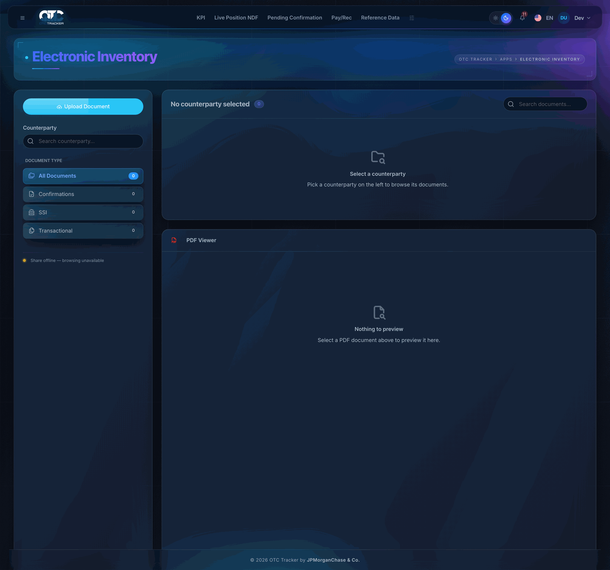

**Para que serve:** é o arquivo digital dos documentos por contraparte — confirmações, SSI e documentos transacionais. É onde o PDF gerado pela esteira fica guardado, e é de onde o Monitor o lê.

**Passo a passo — achar um documento:**

1. Digite o nome no campo **Search counterparty…**, à esquerda, e clique na contraparte.
2. Os documentos dela aparecem à direita. Refine com **Search documents…**.
3. Clique no documento para abri-lo.

**Passo a passo — subir um documento:**

1. Selecione a **contraparte** na lista da esquerda (o campo do formulário é preenchido a partir dela e não é editável).
2. Clique em **Upload Document**.
3. Escolha o **Document Type**: *Confirmations*, *SSI* ou *Transactional*.
4. Conforme o tipo, um segundo seletor aparece — o **produto** da confirmação, ou o **tipo transacional**. Escolha.
5. Preencha a **Date** (dd/mm/aaaa).
6. Arraste o arquivo para o retângulo, ou clique nele para escolher.
7. Confirme. As pastas são criadas automaticamente se não existirem.

> **Suba a confirmação com o produto certo.** A pasta é o próprio código do produto, e é onde o Confirmations Monitor procura o PDF: um documento gravado na pasta errada fica invisível para a esteira, com o arquivo intacto no servidor.

---

## 14. Control Panel — as rotinas automáticas

**Menu › Apps › Control Panel**

**Para que serve:** é onde moram as rotinas que o sistema roda sozinho — salvar arquivos, mandar e-mails de cobrança, gerar planilhas de métrica. Cada rotina é um **cartão**, e cada cartão tem duas coisas: os **destinatários** e um botão para rodar **agora**, sem esperar o horário.

Os cartões estão em **cinco seções**, e o que agrupa não é o que a rotina faz, e sim **quando** ela acontece:

| Seção | Cartões |
|---|---|
| **Intraday Routines** (ao longo do pregão) | Save CETIP Files · Deals Monitor — Pending Action · Confirmations Escalation |
| **Settlement Reporting** | Save Daily Settlement Files · Settlement Forecast |
| **Pending Confirmation Routines** | Daily Metric — Outstanding Confirmation Brazil OTC · Pending Confirmations Spreadsheet Metrics · Pending Confirmation — Weekly Escalation (CEM/EDG) · Pending Signature Confirmations — Collection |
| **Economic Affirmation Routines** | Manual Deals EA · BACC EA Metrics · MT300 |
| **Reference Data Routines** | Update Contacts |

### 14.1. Como usar um cartão

1. Localize o cartão pela seção.
2. **Para mudar quem recebe:** clique no campo de destinatários e escreva os endereços **separados por `;`** — o campo mostra o formato esperado (`email1@jpmorgan.com; email2@jpmorgan.com`). Alguns cartões têm um segundo campo, opcional, para cópia.
3. **Para rodar agora:** clique no botão do cartão. O nome muda conforme a rotina — **Run**, **Run all**, **Save files**, **Generate drafts**, **Save + OTC e-mail**, **Send to other areas**, **Run Other Publisher**, **Run FWD Start**.
4. Uma janela informa o resultado: quantas linhas, quantos e-mails, o que faltou.

> **Você só vê os cartões que lhe foram liberados.** O acesso ao Control Panel é concedido **por cartão** (capítulo 15.2), então dois usuários podem ver esta tela com conteúdos diferentes — não é defeito.

### 14.2. Os cartões, um a um

| Cartão | O que faz | Quando roda sozinho |
|---|---|---|
| **Save CETIP Files** | Salva os arquivos da CETIP na pasta do dia e manda o e-mail para o OTC | Ao longo do pregão |
| **Deals Monitor — Pending Action** | Manda o e-mail do que está parado no New Deals Monitor | 19:00 e 19:30 (horário de Brasília) |
| **Confirmations Escalation** | Cobra por e-mail o que está parado na esteira de confirmação — sete listas, uma por destinatário | Segundas e quintas; feriado **rola** para o próximo dia útil |
| **Save Daily Settlement Files** | Salva os arquivos de liquidação do dia | Fim do dia |
| **Settlement Forecast** | Monta e envia a projeção de liquidações | Diário |
| **Daily Metric — Outstanding Confirmation Brazil OTC** | A métrica diária de confirmações em aberto | Diário |
| **Pending Confirmations Spreadsheet Metrics** | Grava a planilha `PENDING - Outstanding Confirmation OTC.xlsx` que o time global lê | 10:45 |
| **Pending Confirmation — Weekly Escalation (CEM/EDG)** | A escalação semanal das pendências | Semanal |
| **Pending Signature Confirmations — Collection** | O e-mail de coleta de assinatura, com o banker em cópia | Diário |
| **Manual Deals EA** | A afirmação econômica das operações manuais | Diário |
| **BACC EA Metrics** | A planilha das operações manuais sem callback, para o time de métricas | Todo dia útil, **16:00** |
| **MT300** | Gera as mensagens MT300 | Diário |
| **Update Contacts** | Atualiza os contatos das contrapartes a partir de um arquivo | Sob demanda |

### 14.3. O cartão *Pending Confirmations Spreadsheet Metrics*

Este merece um passo a passo próprio, porque tem uma opção que os outros não têm:

1. O campo **Reference date** vem com **hoje**, que é a rotina de sempre — a situação viva das pendências.
2. Para gerar a planilha de um **dia anterior**, troque a data. O sistema monta a planilha a partir da **foto** daquele dia.
3. Clique em **Run**.
4. A planilha é gravada **sempre no mesmo caminho e com o mesmo nome**, porque o time global de métricas lê esse caminho e só ele.
5. Uma **linha âmbar** no cartão passa a dizer *de que dia* é a foto que está lá agora. Assim que a rotina rodar de novo com a data de hoje, ela some.

> Datas **futuras** são recusadas. E se não existir foto do dia pedido, o sistema devolve erro em vez de gerar a planilha com os dados de hoje — como o nome do arquivo é o mesmo, nada distinguiria a planilha certa da errada.

---

## 15. Administração

### 15.1. Manage Roles

**Menu › Settings › Manage Roles**

**Para que serve:** é o cadastro de usuários e do papel de cada um. O papel decide o que a pessoa pode **assinar** — validar uma etapa da esteira, por exemplo — e quais avisos ela recebe.

**Os papéis:** `ADMIN` · `BO` (Back Office) · `MO` (Middle Office) · `FO` (Front Office) · `INSTITUTIONAL` · `HUB`.

**Passo a passo — incluir um usuário:**

1. Clique em **Add New Role**.
2. Informe o **SID**. O sistema busca nome, e-mail e cargo no phonebook.
3. Escolha o **Role** na lista.
4. Salve.

**Passo a passo — alterar:** procure a pessoa em **Search users...**, ou filtre pelos seletores de **Role** e **Status** (Active · Inactive · Pending). Clique em **Edit** na linha, altere e salve. **Remove** apaga o cadastro; **View** só abre.

> **`ADMIN` administra acesso; ele não substitui a mesa.** Ser administrador **não** dá o direito de validar uma etapa da esteira pela mesa de outra pessoa.

### 15.2. Page Access

**Menu › Settings › Page Access**

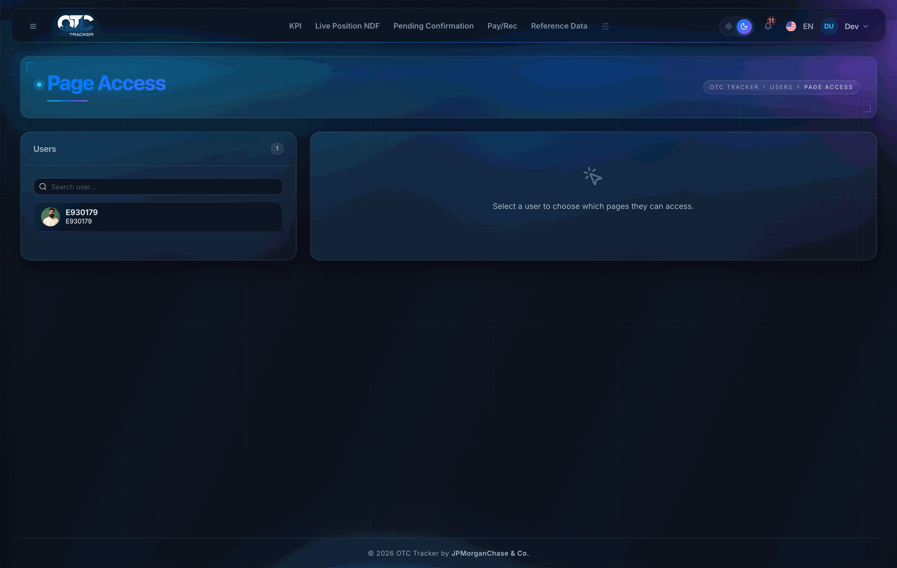

**Para que serve:** define, usuário por usuário, quais páginas aparecem no menu dele.

**Passo a passo:**

1. Procure a pessoa em **Search user…**, na coluna da esquerda, e clique nela.
2. À direita abre a **lista de páginas**, agrupada igual ao menu lateral.
3. **Marque** as páginas que a pessoa pode ver; **desmarque** as que não.
4. O **Control Panel** aparece como uma seção à parte, **explodida em cartões**: dá para liberar só uma rotina, e não a tela inteira.
5. Salve.

> **Lista vazia = acesso total.** Enquanto ninguém configurar a lista de uma pessoa, ela vê tudo. A partir do primeiro salvamento, ela vê **só** o que está marcado.
>
> **Profile** e **Page Access** nunca são bloqueados — é o que impede alguém de ficar sem nenhuma tela.

---

## 16. Support Center — chamados

**Menu › SUPPORT › Tickets**

**Para que serve:** é onde se pede ajuda, se reporta um defeito ou se solicita um acesso.

**Passo a passo — abrir um chamado:**

1. Clique em **New Ticket**.
2. Preencha o **assunto**, a **descrição** e a **prioridade** (*Low* · *Medium* · *High* · *Urgent*).
3. Salve. O chamado nasce com status `New`.

**Passo a passo — acompanhar:**

1. Filtre por **Status** (New · In Progress · Pending · Resolved · Closed) ou por **Priority**.
2. Procure em **Search tickets...**.
3. Clique no chamado para abrir os detalhes, onde ficam o histórico e os comentários.

> **Você vê os chamados da sua MESA, não só os seus.** Quem é do Back Office vê os abertos pelo Back Office; quem é do Middle, os do Middle — a fila de uma mesa é assunto da mesa. Mas **ver não é poder**: editar, comentar e apagar continuam sendo de quem abriu o chamado, e o do colega abre em leitura.

---

## 17. Painéis

### 17.1. Dashboard

**Menu › Navigation › Dashboards**

**Para que serve:** é a visão do dia em números — quantos negócios entraram por produto, a distribuição, o ranking dos cinco maiores clientes, produtos e ativos subjacentes, a posição viva e a projeção de liquidações.

**Passo a passo:**

1. Use os seletores do alto (**Current Year** · **15 days** · **All**) e o campo de data para mudar o recorte.
2. Clique num cartão de KPI para ir à tela que o alimenta.

### 17.2. About

**Menu › Navigation › About**

Descreve o sistema, os módulos e a quem pertence cada um. É um bom ponto de partida para quem chega à mesa.

---

## 18. Anexos

### 18.1. Os status, por tela

**New Deals**

| Status | Significa |
|---|---|
| `New` · `Amend` · `Pending` · `Approved` · `Sent` · `Success` · `Error` | Ver a tabela do capítulo 5.2 |

**Avisos de liquidação** (NDF Summary e Other Products Summary)

| Status | Significa |
|---|---|
| `New` | O aviso ainda não foi gerado |
| `Generated` | O aviso foi gerado e baixado |
| `Sent` | Você marcou como enviado ao cliente |

**Esteira de confirmação** (Confirmations Monitor e Track Confirmations)

| Status | Significa |
|---|---|
| `Pending Legal` | Retenção manual do Legal |
| `Pending OTC` | Falta gerar/conferir o documento |
| `Pending MO` · `Pending FO` · `Pending MO/FO` | Falta a conferência daquela mesa (as duas correm em paralelo) |
| `Pending FepWeb` | Validado; falta enviar ao cliente |
| `Ok` | Enviado — saiu da fila |

**Reconciliação de FXO**

| Status | Significa |
|---|---|
| `Unmatched B3` · `Unmatched Athena` · `Partial - <campos>` · `Matched` · `Justified` | Ver a tabela do capítulo 8.3 |

**Reconciliação de CGD**

| Status | Significa |
|---|---|
| `Pending B3` · `Pending Action` · `Only in B3` · `Justified` · `Matched` | Ver a tabela do capítulo 8.4 |

### 18.2. Glossário

| Termo | O que é |
|---|---|
| **Accronym** | O apelido curto da contraparte no Reference Data. Há um para mercadoria e outro para câmbio |
| **Aging** | Há quantos **dias úteis** algo espera. Sempre calculado, nunca digitado |
| **B3 ID** | O número do registro da operação na B3. Sua presença é o que prova que a operação foi registrada |
| **Callback** | A conferência da operação por telefone com o cliente |
| **CGD** | Contrato Global de Derivativos — o contrato-quadro que precisa existir antes de operar |
| **Deal / Athena ID** | O identificador da operação no sistema da mesa |
| **EA** (Economic Affirmation) | A afirmação dos termos econômicos da operação com a contraparte |
| **FEP / FepWeb** | A plataforma pela qual a confirmação chega ao cliente |
| **LE** (Legal Entity) | A entidade nossa que bookou a operação — JPM, MGT, LAWTON |
| **LOB** (Line of Business) | A mesa de negócio — CEM, EDG, Commodities |
| **Maker / Checker** | Quem criou/editou a operação e quem a enviou. O sistema **exige que sejam pessoas diferentes** |
| **Perna interna / intragrupo** | Operação entre entidades nossas. Liquida, mas não gera aviso nem TED |
| **PTAX** | A taxa de câmbio oficial publicada pelo Banco Central |
| **SID** | O seu identificador de funcionário — uma letra e seis dígitos |
| **SPN** | O identificador do cliente nos sistemas do banco |
| **SSI** | As instruções de liquidação (para onde o dinheiro vai) |
| **SLA** | O prazo de cada mesa, em dias úteis, contado **da data da operação** |
| **TED** | A transferência do valor liquidado |

### 18.3. O que ainda não está disponível

Estes itens aparecem no menu, mas a tela ainda não existe — clicar neles devolve "página não encontrada". Não é defeito do seu acesso:

- **New Deals › DCE** — Deliverable Forward · NDF · Option · Swap
- **Unwinds** — Swap (CEM · EDG) · NDF (FX · Commodities) · Options (FXO · Commodities · EDG) · COE · DCE (todos)
- **Regulatory › e-Financeira** — Kapital · Athena NDF · Athena FXO · Pyramid
- **Regulatory › WHT**

### 18.4. Problemas comuns

| O que acontece | Por quê | O que fazer |
|---|---|---|
| **A tela não aparece no meu menu** | A sua lista de páginas não a inclui | Peça o acesso pelo Support Center (capítulo 16) |
| **A tabela está vazia e eu sei que há dados** | Quase sempre é um filtro esquecido, ou a *Reference Date* está no dia errado | Clique em **Clear Filters** e confira a data |
| **O Export saiu com menos linhas** | Ele leva o que está na tela, com filtros aplicados | Limpe os filtros e exporte de novo (4.6) |
| **Faltam colunas no arquivo exportado** | Ele leva só as colunas **visíveis** | Reative-as em **Columns** (4.5) |
| **"You cannot send a deal you imported or last edited"** | A mesma pessoa não pode importar/editar e enviar | Peça a um colega para enviar (5.6) |
| **"Asset Not Registered" ao aprovar** | O ativo subjacente não está no Index B3 | Cadastre em **Index B3** e volte (13.2) |
| **Selo *Missing Counterparty* na linha** | A contraparte não foi achada no Reference Data | Cadastre e clique em **Mapping B3 ID** (5.4) |
| **O aviso de liquidação não saiu para uma contraparte** | Pode ser perna intragrupo — ela liquida, mas não recebe documento | Confira se é entidade nossa (6.1) |
| **O TED avisou "SSI not found"** | Falta a instrução de pagamento daquela contraparte | Suba a SSI no Electronic Inventory (13.7) |
| **Um valor não é traduzido (código aparece cru)** | Falta uma linha no de-para | Cadastre em **Mapping** — vale no request seguinte (13.3) |
| **A cotação responde "não cadastrado"** | Falta o de-para do código para o símbolo de mercado | Cadastre em **Mapping › `quotes-equity`** ou **`quotes-commodity`** (13.4) |
| **O Tracking Docs abre sem linhas** | O banco da lista do SharePoint ainda não foi importado | A própria tela diz isso, em vermelho, com o caminho e o comando (10.2) |
| **Mudei algo e não surtiu efeito** | Cadastro do **Mapping** vale no request seguinte; mudança no *código* exige reinício do sistema | Recarregue a página; se persistir, abra um chamado |

### 18.5. Índice das telas

| Tela | Menu | Capítulo |
|---|---|---|
| Dashboard | Navigation › Dashboards | 17.1 |
| About | Navigation › About | 17.2 |
| Holidays Calendar | Apps | 13.5 |
| Electronic Inventory | Apps | 13.7 |
| Control Panel | Apps | 14 |
| File Interpreter | Apps | 13.6 |
| Quotes | Apps | 13.4 |
| NDF Summary | Daily Settlement › NDF | 6.1 |
| NDF Cockpit | Daily Settlement › NDF | 6.2 |
| Other Publisher | Daily Settlement › NDF | 6.3 |
| Other Products Summary | Daily Settlement › Other Products | 6.4 |
| OTM Settlements | Daily Settlement › Other Products | 6.5 |
| Latam Desk Position | Daily Settlement › Other Products | 6.6 |
| Swap Settlement Advice | Daily Settlement › Other Products › Swap | 6.7 |
| Swap Athena · VCP · Events · Kapital Hybrids | Daily Settlement › Other Products › Swap | 6.8 |
| NDF Settlement Advice | Daily Settlement › Other Products › NDF | 6.9 |
| Option Settlement Advice | Daily Settlement › Other Products › Option | 6.10 |
| Cognos | Daily Settlement › Other Products › Option | 6.11 |
| Operations B3 | Daily Settlement | 6.12 |
| Live Position NDF | Live Position | 7.1 |
| Live Position Option | Live Position | 7.2 |
| Swap Characteristics · Cashflow · Premium | Live Position › Swap | 7.3 |
| Comitente | Reconciliations | 8.1 |
| Pay/Rec | Reconciliations | 8.2 |
| FXO | Reconciliations | 8.3 |
| CGD | Reconciliations | 8.4 |
| Pending Confirmation | Documentation › Pending Confirmation | 9.1 |
| Metrics | Documentation › Pending Confirmation | 9.2 |
| Confirmations Monitor | Documentation › Manual Confirmation | 9.3 |
| Tela de validação | (aberta pelo Monitor) | 9.4 |
| Track Confirmations | Documentation › Manual Confirmation | 9.5 |
| Onboarding Overview | Documentation › Onboarding | 10.1 |
| Tracking Docs | Documentation › Onboarding | 10.2 |
| New Deals Monitor | Products › Monitor | 5.1 |
| New Deals (6 telas de produto) | Products › New Deals | 5.2 |
| Intrag NDF · Option · Swap | Products › Intrag | 11 |
| Accrual Swap · MtM Swap | Products | 12 |
| Reference Data | Settings | 13.1 |
| Index B3 | Settings | 13.2 |
| Mapping | Settings | 13.3 |
| Manage Roles | Settings | 15.1 |
| Page Access | Settings | 15.2 |
| Tickets · Ticket Details | Support | 16 |

---

*OTC Tracker · Brazil OTC Operations · JPMorgan Chase & Co. · Guia do Usuário v2.0 — 24/08/2026*
