# Guia do Usuário — OTC Tracker

**Brazil OTC Operations · JPMorgan Chase & Co.**

**Versão:** 1.0 · **Data:** 30/07/2026

---

> **Sobre as telas deste guia.** Todas as imagens foram capturadas do sistema real, porém com **dados fictícios**. Nenhum nome de cliente, CNPJ, conta ou valor real aparece nestas páginas.

---

## 1. Visão Geral

O **OTC Tracker** centraliza o ciclo de vida das operações de derivativos de balcão (OTC) da mesa Brasil — do momento em que o negócio é fechado até o arquivo de confirmação assinado e arquivado.

**Objetivo principal:** garantir que toda operação fechada no dia seja **registrada na B3**, **confirmada com a contraparte** e **instruída para liquidação**, sem que nenhuma se perca no caminho.

O sistema cobre quatro grandes blocos de trabalho:

| Bloco | O que faz |
|---|---|
| New Deals | Importa as operações do dia, valida os dados e registra na B3 |
| Confirmations | Gera os documentos de confirmação (Word, PDF e XML) e envia à contraparte |
| Daily Settlement | Calcula e instrui as liquidações do dia |
| Reconciliations | Concilia posição, comitente e pagamentos/recebimentos |

### 1.1. Como o sistema se organiza

Toda página segue o mesmo esqueleto: menu lateral à esquerda, barra superior com notificações e perfil, e a área de trabalho no centro.

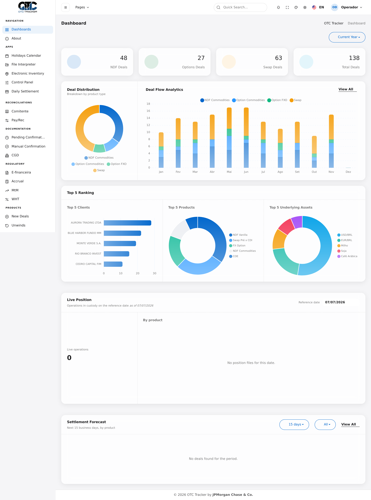

---

## 2. Primeiros Passos

### 2.1. Requisitos de acesso

Antes do primeiro login, confirme os três pontos abaixo:

1. Estar na **rede JPMorgan** (VPN ou escritório). Fora da rede o login não funciona, porque o sistema consulta o phonebook interno e envia e-mail pelo relay corporativo.
2. Ter um **SID** válido — uma letra seguida de seis dígitos, por exemplo `A123456`.
3. Ter as páginas liberadas no seu perfil. O acesso é concedido **por página**: se um administrador não liberou uma tela, ela não aparece no seu menu.

### 2.2. Entrar no sistema

1. Abra o endereço do OTC Tracker no navegador.
2. Digite o seu **SID** no campo **SID Number**.
3. Clique em **Sign In**.
4. Se este já for o seu computador de costume, você entra direto.
5. Se for uma máquina nova, o sistema envia um **código de 6 dígitos** para o seu e-mail corporativo.

### 2.3. Verificação em duas etapas

Quando o código for solicitado:

1. Abra o seu e-mail corporativo e copie o código de **6 dígitos**.
2. Digite o código na tela de verificação e confirme.

> **O código expira em 10 minutos.** Passado esse prazo, volte à tela de login e faça uma nova tentativa para receber outro código.

### 2.4. Ajustes da sua sessão

Na barra superior, à direita, você encontra:

- **Sol / Lua** — alterna entre tema claro e escuro.
- **Sino** — notificações do sistema (importações, mapeamentos, envios).
- **EN** — idioma da interface.
- **Seu nome** — perfil e sair.

---

## 3. Passo a Passo Principal

### 3.1. New Deals — a tela de trabalho do dia

Todas as páginas de **New Deals** funcionam da mesma forma. Muda o produto, não o fluxo.

A tela tem quatro áreas, de cima para baixo:

| Área | Para que serve |
|---|---|
| Área de upload | Arrastar uma planilha de operações (quando o produto aceita importação por arquivo) |
| Barra de busca | Filtrar por qualquer coluna |
| Show entries | Quantas linhas por página e, em alguns produtos, os botões de documento e e-mail |
| Barra de ferramentas | Columns, Add Row, Export, Reference Date, Import, Mapping B3 e Clear Filters |

#### O que cada status significa

| Status | Significa |
|---|---|
| New | Acabou de chegar da API; ninguém revisou ainda |
| Amend | Já existia, mas a API alterou um dado econômico — precisa de revisão |
| Pending | Alguém editou e submeteu para aprovação |
| Approved | Aprovado, pronto para seguir |
| Sent | Arquivo gerado e enviado para registro |
| Success | Registrado na B3, com o número do B3 ID preenchido |
| Error | Voltou com erro da B3 |

---

### 3.2. Importar as operações do dia

1. Confira o campo **Reference Date**. Ele comanda tudo — é a data usada para puxar e para gravar. Por padrão vem a data de hoje.
2. Clique em **Import**.
3. O sistema busca as operações na API Athena e carrega a tabela.
4. O sino de notificações mostra quantas operações entraram.

> **Você não precisa clicar em Import o tempo todo.** O sistema importa sozinho a cada **20 minutos** (NDF) e a cada **hora** (Opções). O botão serve para adiantar a importação ou para reimportar uma data passada.

---

### 3.3. Encontrar uma operação

1. Clique na barra de busca e escolha a **coluna** na lista que aparece.
2. Digite o valor e pressione **Enter** para criar a ficha do filtro.
3. Repita o processo para combinar filtros — por exemplo, data **e** status.
4. Clique em **Search**.
5. Para limpar tudo de uma vez, use **Clear Filters**.

> **Atenção.** Depois de uma busca, a tabela mostra apenas o resultado. Os botões de documento e e-mail trabalham com o que está carregado na tela — se você filtrou, filtrou para eles também. A única exceção é o **Mapping B3**, que sempre lê o dia inteiro.

---

### 3.4. Corrigir uma linha

Cada linha tem quatro botões na coluna **Actions**, nesta ordem:

| Botão | Cor | O que faz |
|---|---|---|
| Confirm | Verde | Aprova a operação |
| Edit | Azul | Abre o formulário de edição |
| Delete | Vermelho | Remove a linha |
| Send | Azul-escuro | Envia para registro na B3 |

**Para corrigir um dado:**

1. Clique em **Edit** na linha desejada.
2. Ajuste os campos no formulário.
3. Salve. O status passa a **Pending** e a operação precisa da aprovação de **outro usuário**.

**Para editar várias linhas de uma vez:**

1. Marque as caixas de seleção das linhas.
2. Use a ação em massa que aparece na barra.

---

### 3.5. Aprovar uma operação

1. Clique em **Confirm** (botão verde) na linha.
2. Operação com status **New** vai **direto para Approved** — como você não editou nada, não há o que submeter à revisão.
3. Operação com status **Amend** vai para **Pending**, porque a API alterou um dado econômico e alguém precisa conferir.
4. Operação com status **Pending** vai para **Approved**, mas **somente se for outro usuário**. Quem editou não aprova a própria alteração.

> **Duas travas antes de aprovar.** Se a contraparte não estiver cadastrada (badge vermelho **Missing Counterparty**) ou o ativo não estiver no **Index B3**, o sistema bloqueia a aprovação e avisa. Aprovar sem esses cadastros enviaria dado errado para a B3.

---

### 3.6. Enviar para registro na B3

Vale para **NDF FWD Start**, **NDF Other Publisher**, **NDF Commodities**, **Opção FXO** e **Opção Commodities**.

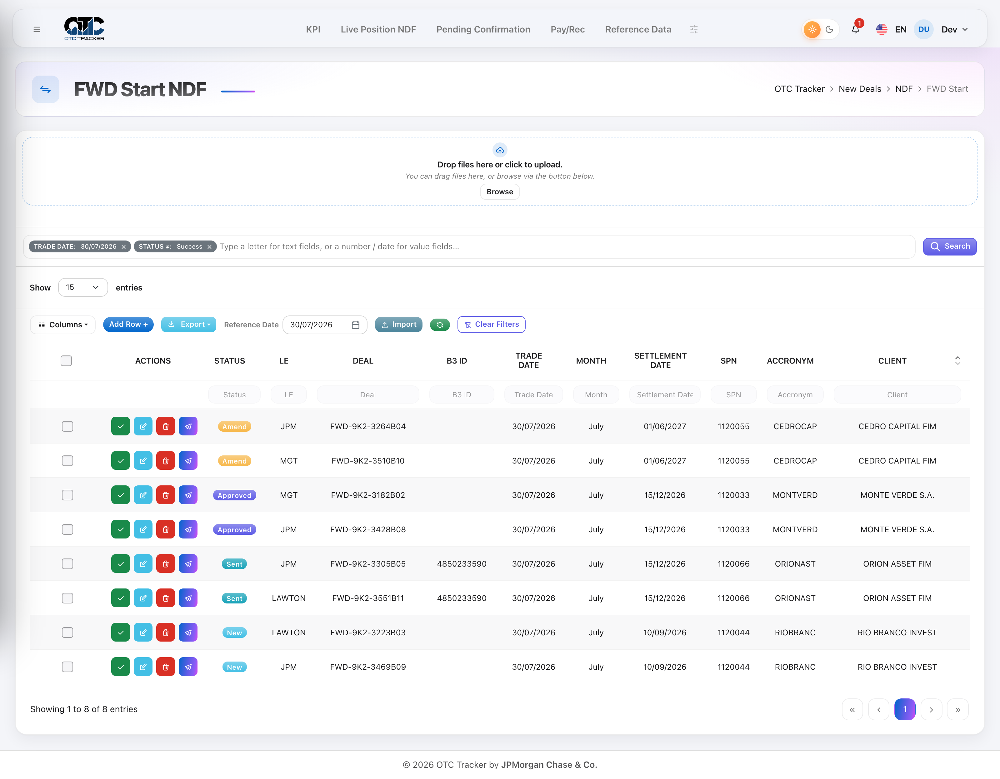

1. Com a linha em **Approved**, clique em **Send**.
2. O sistema gera o arquivo **Conecta** e grava na pasta de envio.
3. O status passa a **Sent** e você se torna o **Checker** da operação.

> **Na página NDF Vanilla este passo não existe.** O registro na B3 é feito por outra ferramenta, então a operação segue direto para o mapeamento do retorno.

---

### 3.7. Mapear o retorno da B3

Depois de processar o arquivo, a B3 devolve um arquivo de retorno com o **B3 ID** de cada operação aceita.

1. Confira o campo **Reference Date**.
2. Clique no **botão verde de atualizar**, ao lado do **Import**.
3. O sistema lê os arquivos da pasta de retorno e preenche a coluna **B3 ID**.
4. Uma janela informa quantas operações foram mapeadas e quantas voltaram com erro.

O que acontece com cada operação:

| Situação | Resultado |
|---|---|
| Encontrada no arquivo de retorno | Vira **Success** com o B3 ID preenchido |
| Não encontrada, e esperava retorno (New, Sent ou Error) | Vira **Error** |
| Não encontrada, mas ainda não foi registrada (Approved ou Pending) | Permanece como está |
| Já era **Success** com B3 ID | Não é alterada |

> **O mapeamento lê o dia inteiro**, inclusive o que não está visível na tela. Não é preciso limpar os filtros antes.

---

### 3.8. Gerar confirmações e e-mails

Disponível em **Opção FXO**, **Opção Commodities** e **NDF Commodities**. Os botões ficam ao lado do **Show entries**.

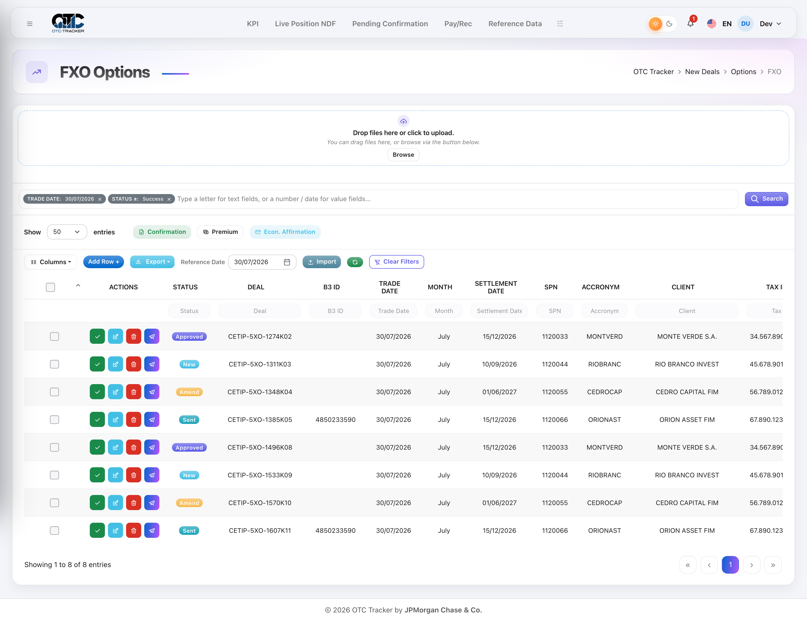

> **A confirmação da contraparte não é mais gerada aqui.** O botão *Confirmation* saiu das telas de
> New Deals: gerar e validar viraram o mesmo trabalho, no mesmo lugar — o **Confirmations Monitor**
> (item 3.11). Na prática você não perde nada: a confirmação continua nascendo só depois do registro
> na B3, e o documento é o mesmo. O que mudou é por onde se começa.

**Premium — aviso de pagamento de prêmio (D0)**

1. Clique em **Premium**.
2. O sistema seleciona as operações cuja **Spot Date** (data de pagamento do prêmio) é o dia corrente.
3. Gera um e-mail por contraparte, já com os contatos de liquidação preenchidos.

**Econ. Affirmation — afirmação econômica**

1. Clique em **Econ. Affirmation**.
2. Aplica-se às operações do dia contra **instituições financeiras**.

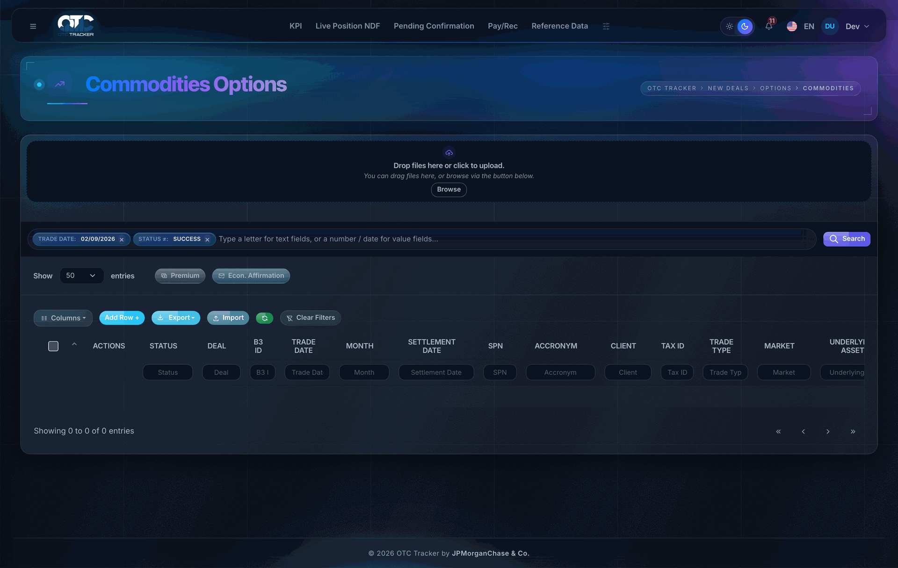

---

### 3.9. Monitor — conferir se ficou algo pendente

Caminho no menu: **Products → Monitor**.

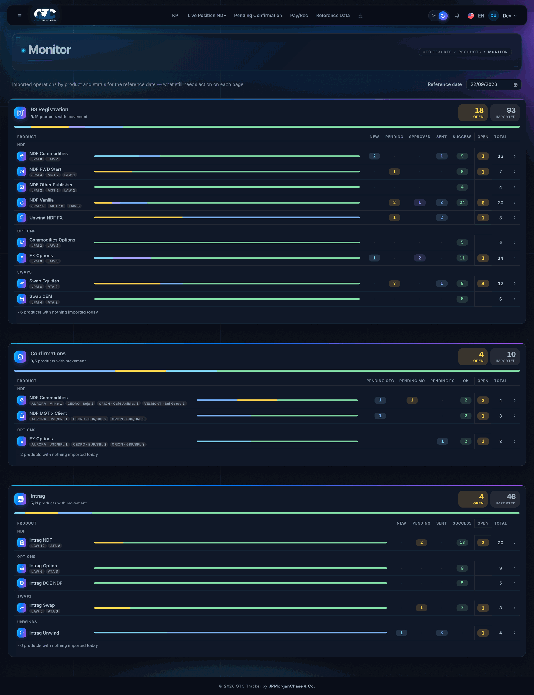

Como ler a tela:

1. Cada **coluna** é uma etapa do processo: registro na B3, confirmação e Intrag.
2. Cada **card** é um produto, com o total de operações da data de referência.
3. A **cor do card** indica o progresso: vermelho quando nada foi resolvido, âmbar no meio do caminho e verde quando tudo está **Success**.
4. As etiquetas mostram a quebra por status e por entidade legal.
5. Clique em **Open page** para ir direto à tela do produto.

> **Todo dia, às 19h00 e às 19h30**, o sistema envia um e-mail para a caixa de operações com a lista do que ainda está pendente. Quando não há nada pendente, o e-mail não é enviado.

---

### 3.10. Pending Confirmation — acompanhar as confirmações

Caminho no menu: **Documentation → Pending Confirmation**.

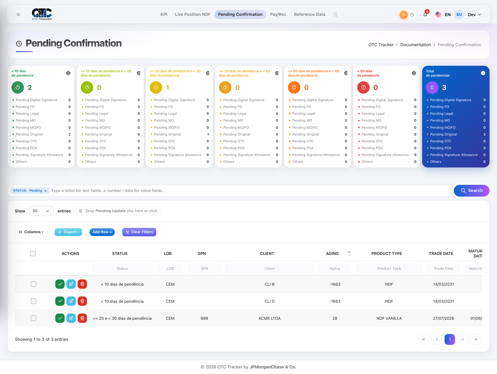

1. A tela lista as confirmações geradas e o estágio de cada uma.
2. Use os filtros por coluna para localizar uma contraparte ou um período.
3. As métricas de acompanhamento ficam em **Metrics**.

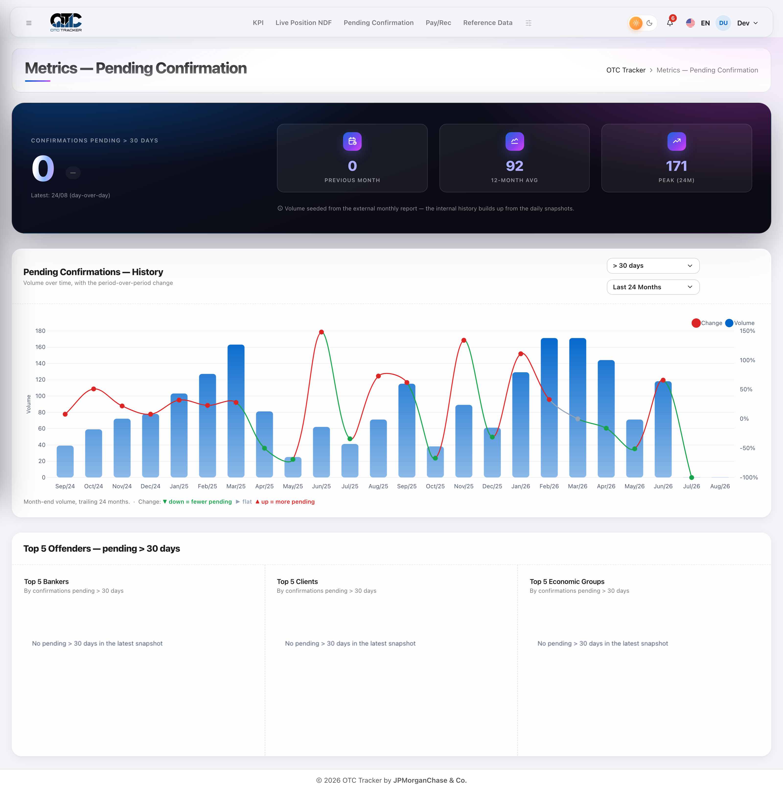

---

### 3.11. Manual Confirmation — validar antes de enviar ao cliente

Caminho no menu: **Documentation → Manual Confirmation → Confirmations Monitor** (e **Track Confirmations**).

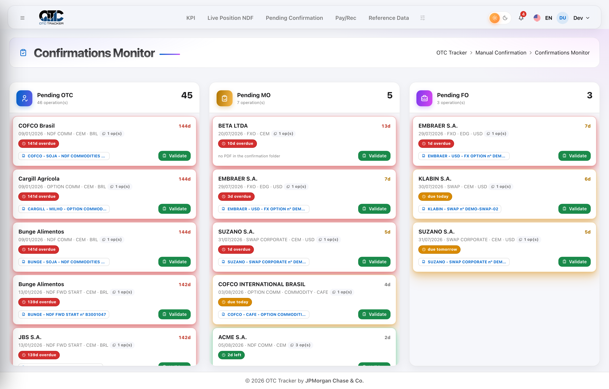

A confirmação passa por uma esteira antes de sair: **(Pending Legal) → Pending OTC → Pending MO e/ou FO → Pending FepWeb → Ok**. Quem valida cada produto está cadastrado em **Mapping → Manual Confirmations — Validation Trail** (Produto × LOB); MO e FO validam em paralelo, não em fila.

1. O **Confirmations Monitor** tem **cinco cards**, um por etapa, com a fila de cada uma.
2. Cada item da fila é **uma confirmação**, não uma operação: o documento cobre todas as operações da mesma contraparte, produto, LOB e data de negociação, e o item diz quantas são.
3. **Abrir** mostra o PDF que está gravado no Electronic Inventory — o papel que vai ao cliente.
4. **Validar** carimba a etapa com a data, a hora e o SPN de quem validou, e a confirmação passa para a etapa seguinte.
5. **Rejeitar** (MO e FO) pede um comentário, avisa o Brazil OTC Ops por e-mail e devolve a confirmação para o OTC. As validações já dadas são apagadas: o documento vai ser refeito.

**Gerar a confirmação — no card de Pending OTC**

Enquanto o documento ainda não foi gerado, o botão do item aparece como **Generate** em vez de
*Validate* (o sistema sabe disso porque não há PDF na pasta da contraparte). O ciclo inteiro acontece
a partir daí:

1. Clique em **Generate**. Abre uma aba nova com a confirmação já preenchida.
2. Revise o documento. O único botão é **💾 Salvar Word + PDF no Inventory** — ele grava o Word, o
   PDF e o XML na pasta da contraparte.
3. Gravado, a **tela de validação abre na sequência**, com o PDF de um lado e o checklist do outro.
   Validando ali, a confirmação segue para MO e/ou FO normalmente.
4. Se você fechar sem validar, nada se perde: a confirmação **continua em Pending OTC**, agora com o
   documento na pasta, e o botão do card volta a ser **Validate**.

> **Só o OTC gera.** Nos cards de MO e FO, uma confirmação sem documento na pasta continua com o
> botão riscado — essas mesas conferem o papel, não o produzem.
>
> Se o Generate abrir uma tela de erro, ela diz **qual** é o problema: o produto não tem tela de
> geração no sistema, a linha está sem *Trade Date*, ou a operação não está no arquivo do dia
> daquela data. Os três pedem ações diferentes.

As duas pontas da esteira não são de validação:

- **Pending Legal** é um **hold manual**: enquanto a confirmação estiver nele, ela não anda, mesmo com as validações em dia. O card tem o botão de **soltar**, que devolve a confirmação para a fila do OTC.
- **Pending FepWeb** é **derivado**, nunca digitado: as validações estão feitas e falta **enviar ao cliente**. A confirmação só chega a **Ok** com a coluna *Enviado p/ cliente* preenchida — é o que o botão desse card faz.
- Escrever **Pending OTC** à mão no Track Confirmations **reabre a esteira**: é o que se faz quando a confirmação foi **regerada** depois de validada. O sistema apaga as três validações e o envio ao cliente (os comentários ficam), e as três mesas conferem o documento novo. Como isso desfaz validação alheia, a gravação exige a mesa de **OTC Ops**.

> A esteira é espelhada na página **Pending Confirmation** a cada gravação, então as duas telas contam a mesma coisa.

> **Cada etapa é assinada pela mesa dela.** Pending OTC é do **Back Office**, Pending MO do **MO** e Pending FO do **FO** — o papel vem do seu cadastro em *Users & Roles*. Quem não é da mesa continua abrindo a confirmação e lendo o documento, mas o botão do card aparece como **View** e a tela de validação não mostra o *Validar* nem o *Devolver ao OTC*.

**O prazo de cada mesa** (dias úteis contados da data da operação) é cadastrável em **Mapping → Manual Confirmations — SLA**: OTC D+3, MO D+4 e FO D+6 de fábrica. Os prazos não se somam — MO e FO correm em paralelo, os dois contados da mesma data de operação. Validar depois do prazo exige uma justificativa, que fica gravada na coluna daquela mesa.

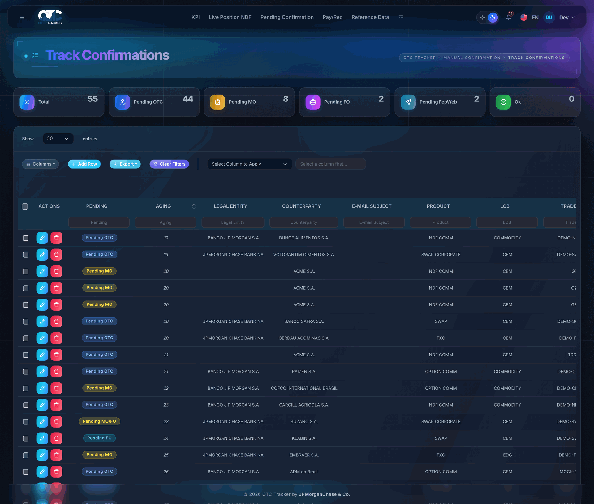

A tela **Track Confirmations** é a base inteira: filtro por coluna, atualização em massa por coluna, exportação do que estiver na tela (com o filtro e a ordenação aplicados) e os cards do topo funcionando como filtro por etapa. Ela abre ordenada pelo **Aging**, do menor para o maior.

- **Os títulos das colunas estão em inglês** e acompanham o idioma escolhido no topo da página, como
  o resto do sistema: *Settlement Date*, *Trade Date*, *Underlying Asset*, *Notional/Qty*,
  *Counterparty*, *Aging*.
- **`Notional Amount CCY`** (ao lado de *Notional/Qty*) mostra a **moeda** do notional junto com o
  valor — `USD 1.500.000,00`. Ela é preenchida sozinha quando a operação é mapeada, e é diferente do
  *Underlying Asset* ao lado: em mercadoria, aquele traz a commodity (OLEO, PLATTS), que não é moeda.
  Operações mapeadas antes desta coluna existir aparecem em branco.
- **Digite `blank` num campo de filtro** para listar as linhas em que aquela coluna está **vazia** —
  é assim que se acha, por exemplo, tudo que ainda está sem *Callback Date*. A palavra só vale
  sozinha no campo; escrevendo mais que isso, o filtro procura o texto normalmente.

> As operações de **NDF Commodities, Opção de Commodities, FXO e NDF FWD Start** entram nesta esteira sozinhas, assim que são mapeadas no New Deals — antes mesmo de o documento existir. É por isso que elas aparecem no card de *Pending OTC* já com o botão **Generate**.

> **A fila parada é cobrada por e-mail.** O card *Confirmations Escalation* do **Control Panel** manda o que está pendente de validação para o OTC, para o Sales Support e para o Front Office (um e-mail por produto), toda segunda e quinta, e diariamente quando alguma operação está no último dia do prazo ou já vencida. Ver o item 3.15.

---

### 3.12. Reference Data — cadastrar contrapartes

Caminho no menu: **Data Base → Reference Data**.

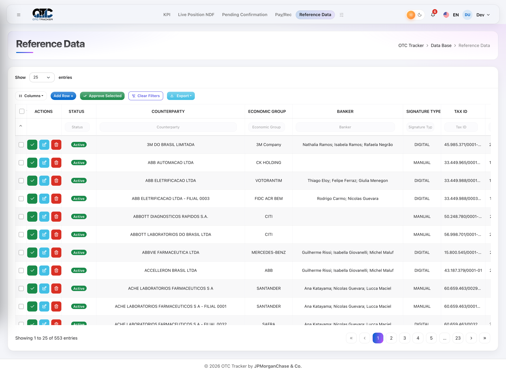

1. Localize a contraparte pelo **SPN** ou pelo nome.
2. Dê **duplo clique na linha** para abrir o editor de detalhes: conta CETIP, dados bancários e contatos.
3. Para uma contraparte nova, cadastre-a com o **accronym exatamente igual ao que a API envia** no campo *End Counterparty*.

> **Este é o ponto mais importante do cadastro.** O sistema identifica a contraparte pelo **accronym**, e não pelo SPN que a API envia. Accronym errado ou ausente resulta em linha marcada como **Missing Counterparty**.

---

### 3.13. Mapping — cadastrar de-para

Caminho no menu: **Data Base → Mapping**.

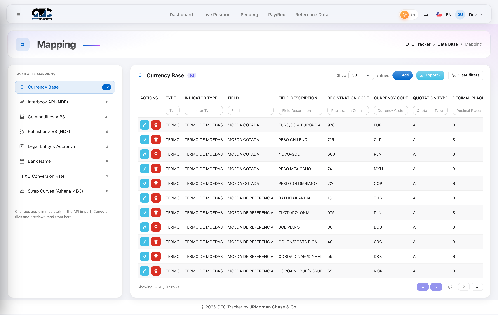

Esta é a tela onde se cadastra qualquer tradução entre o código de um sistema e o de outro. **Nada disso fica no código** — tudo é cadastrável aqui.

1. Escolha o **tipo de mapeamento** nas abas do topo.
2. Clique em **Add** para cadastrar um novo registro, ou no botão de edição para alterar um existente.
3. Preencha os campos e salve.

Tipos disponíveis:

| Tipo | Para que serve |
|---|---|
| Currency Base | Códigos e características das moedas |
| Interbook API (NDF) | Pares de books internos que não são negócio de cliente |
| Commodities × B3 | Código da mercadoria no sistema e na B3 |
| Publisher × B3 (NDF) | Fonte de informação e tela de consulta |
| Legal Entity × Accronym | Entidade legal de cada accronym e settlement location |
| Bank Name | Nome dos bancos |
| FXO Conversion Rate | Taxa de conversão por moeda base |
| Swap Curves (Athena × B3) | Curvas de swap |
| Quotes — Equities | Código do ativo subjacente → símbolo de mercado (item 3.18) |
| Quotes — Commodities | Código da mercadoria → símbolo de mercado (item 3.18) |

> **Mapping não exige reinício do sistema.** A alteração vale já na próxima tela que você abrir.

---

### 3.14. Index B3 — cadastrar ativos

Caminho no menu: **Data Base → Index B3**.

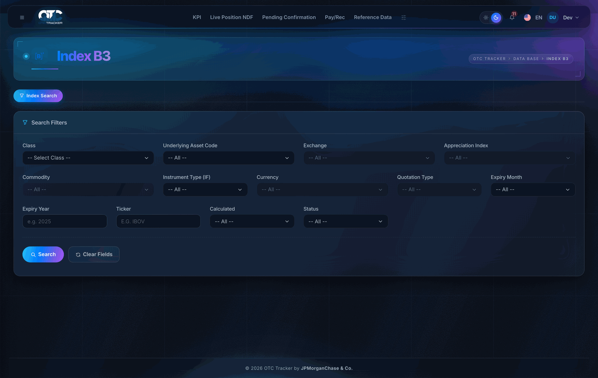

Aqui ficam os ativos subjacentes aceitos pela B3. Um ativo não cadastrado impede a aprovação da operação que o utiliza.

---

### 3.15. Control Panel — rotinas e destinatários de e-mail

Caminho no menu: **Apps → Control Panel**.

Cada card é uma rotina automática. Para configurar:

1. Preencha os campos **To** e **Cc**. Separe vários endereços por ponto e vírgula.
2. Saia do campo — o sistema salva automaticamente.
3. Use o botão **Run** para disparar a rotina na hora, sem esperar o horário automático.

Rotinas disponíveis:

- Save CETIP Files
- Save Daily Settlement Files
- Settlement Forecast
- Update Contacts
- Daily Metric — Outstanding Confirmation Brazil OTC
- Pending Confirmation — Weekly Escalation
- Pending Signature Confirmations — Collection
- Deals Monitor — Pending Action
- Pending Confirmations Spreadsheet Metrics
- Confirmations Escalation

#### Save CETIP Files — três destinos, e o do BACC vai recortado

Este card manda os arquivos da CETIP para **Sales Support**, **CEM Latam** e **BACC**. Os dois primeiros recebem os arquivos como saem; o **BACC recebe só as operações entre contas de casa** (Lawton `00041.00-7`, Banco `73760.00-9` e Atacama `85398.00-5`) nos quatro arquivos que interessam: DFLUXO swap, posição swap, posição OPC e posição TER.

1. Preencha as três listas de **To** — cada uma é um e-mail diferente.
2. O anexo do BACC **mantém o nome original do arquivo e ganha `.txt` no fim** — `73760_260817_DPOSICAO-SWAP.CETIP21.txt`. O nome inteiro fica porque é por ele que o outro lado reconhece qual dos quatro arquivos é aquele; o `.txt` é o que faz o anexo abrir com um duplo clique (as extensões da CETIP não são associadas a programa nenhum). O conteúdo é o mesmo texto de sempre. Quem diz que é um recorte é o corpo do e-mail, que traz a contagem em cada linha da tabela (*"— 12 of 480 line(s)"*).

> **Sem endereço no To do BACC, o e-mail simplesmente não sai** — e o card mostra isso, em vez de deixar você achando que foi enviado. É diferente dos outros dois destinos, que têm endereço padrão.
>
> Se alguma linha aparecer como **"Not found"**, o sistema não conseguiu localizar no arquivo as colunas de parte e contraparte — e nesse caso ele **não anexa** aquele arquivo. Mandar o arquivo cheio com o nome de um recorte seria pior. Avise o time de tecnologia.

> **Nem todo card envia e-mail.** O *Daily Metric*, a *Weekly Escalation* e a *Collection* geram um **rascunho** — o navegador baixa um arquivo `.eml` que abre no Outlook já endereçado, para você revisar e enviar. O *Pending Confirmations Spreadsheet Metrics* não envia e-mail: ele **grava a planilha** "PENDING - Outstanding Confirmation OTC.xlsx" no share, todo dia útil às 10:45. Os demais mandam direto.

#### Confirmations Escalation — cobrar as validações paradas

Este card manda por e-mail as confirmações que estão **pendentes de validação** na esteira do *Confirmations Monitor* (item 3.11). São **sete listas de destinatários**, uma por e-mail, porque quem recebe a fila de um produto não é quem recebe a de outro:

| Lista | O que vai no e-mail | Quando sai |
|---|---|---|
| **TO — OTC Ops** | tudo em *Pending OTC* | segunda e quinta, 17h00 |
| **TO — Sales Support** | tudo em *Pending MO* | segunda e quinta, 17h00 |
| **ESCALATION — Sales Support** | só o que está **no último dia do prazo ou vencido** | **todo dia útil**, 17h00 |
| **TO — FO · CEM Swap** | Swap da LOB CEM | segunda e quinta, 17h00 |
| **TO — FO · EDG Swap** | Swap da LOB EDG | segunda e quinta, 17h00 |
| **TO — FO · EDG Corporate Swap** | Swap Corporate da LOB EDG | segunda e quinta, 17h00 |
| **TO — FO · EDG Option** | Opção de câmbio (FXO) da LOB EDG | segunda e quinta, 17h00 |

1. Preencha as listas e saia do campo — salva sozinho, como nos demais cards.
2. Cada linha da lista do card tem o **seu próprio Run**: reenviar o e-mail do EDG Swap não dispara os outros. O **Run all** do rodapé manda o pacote da rotina.
3. O e-mail traz uma tabela com **Trade Date, Cliente, Produto, LOB, Trade ID, Ativo e a data em que a confirmação entrou para validação**, com a linha vencida marcada em vermelho, e um botão que abre o *Confirmations Monitor*.

> **Segunda ou quinta em feriado ANBIMA sai no próximo dia útil**, não é pulada.
>
> **Sem nada pendente, o e-mail não é enviado** — e isso é diferente de *sem destinatário*, que o card mostra em amarelo: aí a cobrança deixou de sair porque a lista está vazia.
>
> Se aparecer o aviso amarelo de **produto sem grupo**, há confirmação em *Pending FO* de um produto × LOB que não está na quebra acima — ela não está sendo cobrada por ninguém. Peça a inclusão ao time de tecnologia.

**BACC EA Metrics — a planilha diária das operações manuais**

Todo dia útil (calendário ANBIMA) às **16h00**, o sistema manda um e-mail com uma planilha `.xlsx`
anexa para as listas de **TO** e **CC** do card. Assunto: *Support to OTC Derivatives - EA Metrics*.

1. Preencha TO e CC e saia do campo — salva sozinho, como nos demais cards.
2. **Run** manda agora, sem esperar as 16h00, e não consome o disparo do dia.
3. A planilha traz as operações do **Track Confirmations** que ainda estão **sem Callback Date** e
   que não estão em *Ok*, ordenadas da mais antiga para a mais nova (*Aging* do maior para o menor).
4. As colunas *Born Age* saem em branco de propósito: elas são preenchidas por quem consolida do
   outro lado. A coluna *Comments* traz o **assunto do e-mail de recap** da operação.

> **Um dia sem operação manual manda a planilha vazia mesmo assim** — a ausência é a métrica. O
> único caso em que nada é enviado é a lista de TO em branco, e o card avisa isso em âmbar.

---

### 3.16. Live Position — conferir a posição em custódia

Caminho no menu: **Live Position → NDF** (e demais produtos).

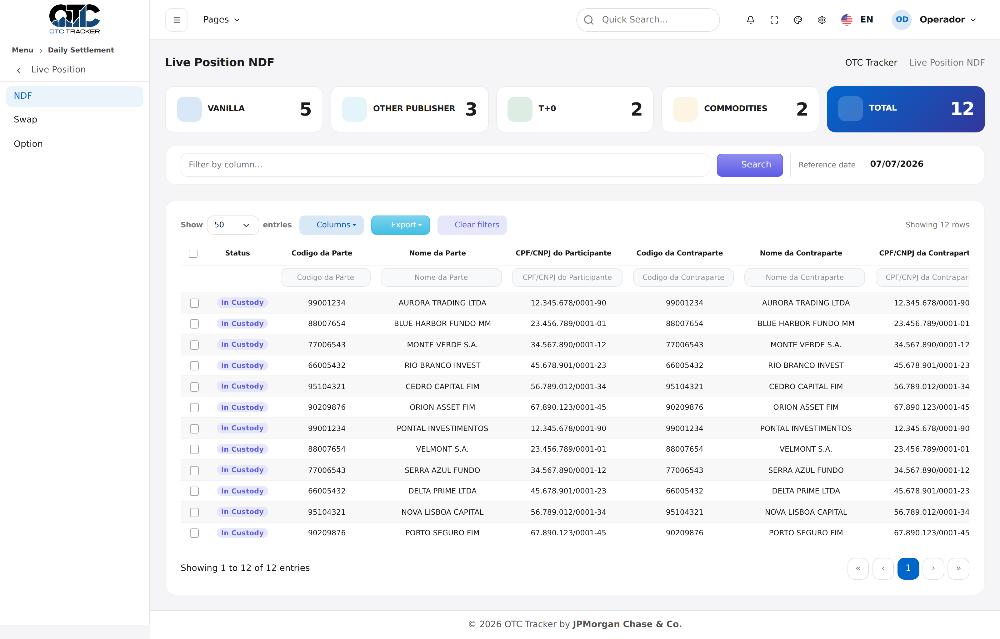

1. Escolha a **Reference date**.
2. Os cards no topo classificam a carteira por tipo de operação.
3. A tabela mostra os contratos em custódia. É uma tela **somente leitura**.

---

### 3.17. Reconciliations — conciliar

Caminho no menu: **Reconciliations**.

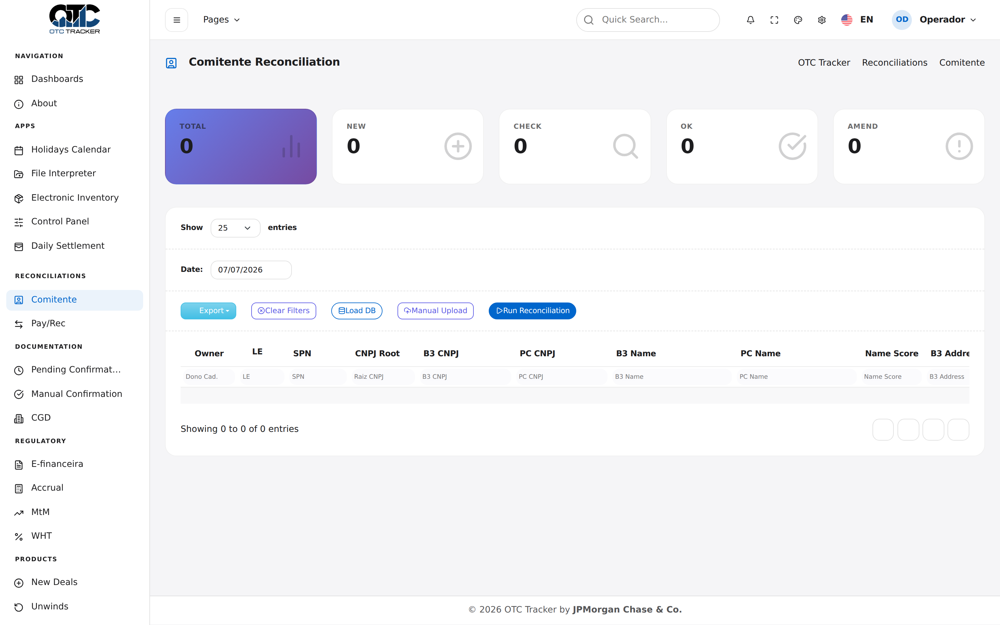

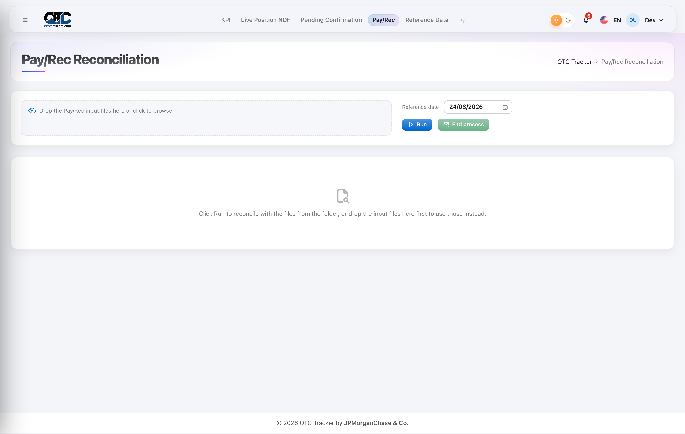

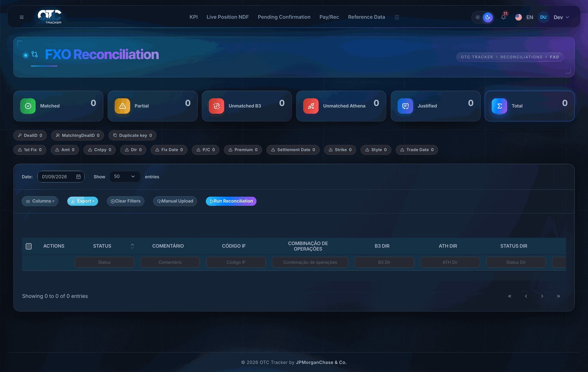

1. **Comitente** — confronta a posição por comitente.
2. **Pay/Rec** — confronta pagamentos e recebimentos.
3. **FXO** — confronta a posição da CETIP com a Athena, campo a campo. A **Reference date** abre em D-1 pelo calendário ANBIMA; os cards contam Total, OK, NOK e Sem match e filtram a tabela ao clique, e a faixa de chips diz **qual campo** está divergindo.
4. As divergências aparecem destacadas na própria tabela.

---

### 3.18. Quotes — consultar cotações

Caminho no menu: **Apps → Quotes**.

Consulta o histórico de cotações de três fontes, numa tela só:

| Tipo | Fonte | O que a tabela traz |
|---|---|---|
| **PTAX** | Banco Central (boletim de fechamento) | Data, moeda, cotação contra o real e contra o dólar |
| **Equities** | Yahoo Finance | Data, Adj Close, Close, High, Low, Open e Volume |
| **Commodities** | Yahoo Finance | as mesmas colunas de Equities |

1. Escolha o **Quote type**. O campo ao lado só é liberado depois disso.
2. Escolha o **instrumento** — na PTAX é a moeda; nos outros dois é o **ativo subjacente cadastrado no Index B3** (item 3.14). Pode digitar para filtrar a lista.
3. Ajuste **From** e **To** — a tela já abre com o último mês.
4. Clique em **Search**. A tabela sai do mais recente para o mais antigo e aceita filtro por coluna, seleção de célula para copiar e o **Export** completo (Copy · CSV · Excel · Print · PDF).

> **A lista de ativos é a do Index B3**, e só os que estão *Active*. Ativo cadastrado lá aparece aqui no mesmo dia.
>
> **Se aparecer "has no market symbol registered in Mapping"**, o ativo existe no Index B3 mas ninguém disse ainda qual é o símbolo dele no mercado — o código da B3 (`AAPL34`) não é o mesmo que a fonte de cotação usa (`AAPL34.SA`). Cadastre em **Data Base → Mapping → Quotes — Equities** (ou *Quotes — Commodities*) e refaça a busca; vale na hora, sem reiniciar nada. Na lista de instrumentos, o que já está cadastrado aparece como `AAPL34 → AAPL34.SA`.
>
> **Se a mensagem falar em proxy ou em "could not reach the source"**, a busca não conseguiu sair para a internet — ela tenta várias saídas e diz o que cada uma respondeu. Isso é rede, não cadastro: leve a mensagem inteira para o time de tecnologia.

---

## 4. Perguntas Frequentes

### 4.1. A linha está marcada como "Missing Counterparty" e não consigo aprovar

**O que está acontecendo.** O accronym enviado pela API não existe nem no **Reference Data**, nem no mapeamento **Legal Entity × Accronym**. O sistema prefere deixar os campos em branco a exibir uma contraparte errada.

**Como resolver:**

1. Abra a operação e verifique qual accronym a API enviou, no campo *End Counterparty*.
2. Se for um **cliente**, cadastre-o em **Data Base → Reference Data**, com o accronym idêntico ao da API.
3. Se for uma **perna interna JPM** (JPM, MGT ou Lawton), cadastre em **Data Base → Mapping → Legal Entity × Accronym**.
4. Volte à linha, clique no badge vermelho e escolha **Reload Data**. A marcação desaparece sem precisar recarregar a página.

---

### 4.2. Cliquei em Premium e apareceu "Nothing to Generate", mas há operação com Spot Date de hoje

Há duas causas possíveis, nesta ordem de probabilidade:

1. **A contraparte não está resolvida.** O aviso de prêmio é gerado apenas para contrapartes da conta CETIP de cliente. Se as colunas **Accronym** ou **Client** estiverem vazias, o sistema não consegue chegar até a conta. Cadastre a contraparte conforme o item 4.1.
2. **A Spot Date não é hoje de fato.** O filtro compara com o **dia corrente**, e não com a Reference Date da tela. Se você está consultando uma data passada, o prêmio daquele dia já não é D0.

---

### 4.3. Puxaram uma correção, mas a tela continua com o comportamento antigo

**O que está acontecendo.** O servidor da equipe roda sem recarga automática. Depois de uma atualização que altere código ou telas, o sistema precisa ser **reiniciado** — caso contrário continua servindo a versão anterior.

**Como resolver:**

1. Solicite o **reinício do sistema** ao responsável pela instância.
2. No seu navegador, force uma atualização sem cache (**Ctrl + Shift + R**).

> **Exceção:** alterações feitas na tela **Mapping** valem imediatamente, sem reinício.
>
> **Se o sintoma for "o e-mail das 19h não chegou"**, verifique antes se havia algo pendente no **Monitor** naquele horário. Quando está tudo resolvido, o e-mail não é enviado.

---

## 5. Suporte

| Situação | Para quem falar |
|---|---|
| Dúvida de processo operacional | Brazil OTC Operations |
| Erro de sistema ou comportamento inesperado de tela | Time de tecnologia responsável pelo OTC Tracker |
| Falta de acesso a uma página | Administrador do sistema (tela Page Access) |

---

## 6. Manutenção deste guia

Este documento é gerado a partir do arquivo `GUIA_DO_USUARIO_OTC_TRACKER.md`, que é a **fonte única**. Para atualizar:

1. Edite o Markdown.
2. Recapture as telas, se o layout tiver mudado:
   - Suba o app local com o launcher de desenvolvimento.
   - Rode `python scripts/sop-capture/capture_screens.py`.
3. Gere o Word novamente:
   - `python scripts/build_sop_docx.py GUIA_DO_USUARIO_OTC_TRACKER.md`

> **Ao trocar as telas, garanta que os dados exibidos sejam sempre fictícios.** Nenhum dado real de cliente, conta, servidor ou credencial pode aparecer nas imagens.
