# Procedimento Operacional Padrão (SOP)

## Processamento de Operações de Derivativos OTC — Sistema OTC Tracker

| Campo | Conteúdo |
|---|---|
| **Empresa** | JPMorgan Chase & Co. — Back Office de Derivativos |
| **Sistema** | OTC Tracker — Plataforma de Back Office de Derivativos OTC |
| **Documento** | SOP-OTC-001 · **Versão** 1.0 |
| **Data de emissão** | 08/07/2026 |
| **Público-alvo** | Operador / Analista de Back Office de Derivativos OTC |

> **Aviso de privacidade:** as telas são renderizações reais do OTC Tracker; os dados exibidos (contrapartes, CNPJs, contas, valores, datas) são **fictícios**. Nenhum dado real de cliente, servidor ou credencial é reproduzido.

---

<!-- ═══════════════════════════════════════════════════════════════════════
  COMO EDITAR ESTE DOCUMENTO
  Este arquivo .md é a FONTE ÚNICA do SOP. Edite aqui e regenere o Word:
      pip install python-docx           (uma vez)
      python scripts/build_sop_docx.py  (gera SOP_PROCESSAMENTO_OTC.docx)
  • Para INCLUIR um módulo novo: copie o bloco-modelo do fim do arquivo
    (secao 8), cole na seção 5 sob a seção correta do sidebar, e aponte a
    imagem para docs/sop-screenshots/<nome>.png.
  • Para RECAPTURAR as telas (após novos módulos): veja o guia na seção 8.
  • Comentarios como este (<!-- ... -->) sao ignorados no Word.
═══════════════════════════════════════════════════════════════════════ -->

> ✏️ **Documento vivo.** Ainda faltam módulos a desenvolver no código. Os módulos já prontos estão na seção 5; os pendentes estão listados na seção 5.99 (marque conforme forem entregues). Edite este `.md` e rode `python scripts/build_sop_docx.py` para regerar o Word.

---

## 1. Índice

- 2. Visão Geral
- 3. Conceitos-Chave
- 4. Passo a Passo Operacional
- 5. Referência de Módulos (ordem do sidebar)
- 6. Tratamento de Exceções
- 7. Suporte

---

## 2. Visão Geral

O **OTC Tracker** consolida, valida, registra e concilia operações de Derivativos de Balcão (OTC) — NDF, Opções (FXO e Commodities), Swap e COE — no ciclo diário de liquidação. O sistema importa os arquivos de posição, aplica as regras de negócio, gera os arquivos de registro no layout da câmara e permite a conciliação (recon) contra o retorno. Todo processamento é ancorado à **Data Base** (data de referência).

## 3. Conceitos-Chave

**Data Base** — eixo do processamento. Em branco, o sistema assume o dia útil anterior (calendário ANBIMA/câmara). Arquivos são organizados em pastas por data; reprocessar um dia sobrescreve só a porção daquele dia.

**Campos validados:** Trade Date, Maturity/Expiry, Strike, Notional, Data Base/Data de Referência MTM, Classe do Ativo Subjacente.

**Ciclo de vida:** Definir Data Base → Importar posição → Validar → Gerar registro → Conciliar (recon) → Encerrar (End Process).

## 4. Passo a Passo Operacional

### Passo 1 — Autenticar e definir a Data Base

Faça login (com verificação em duas etapas) e abra o Painel de Controle. Em cada rotina, defina a "Reference date". Deixe em branco apenas para processar automaticamente o dia útil anterior. Exemplo fictício: para reprocessar 02/03/2026 da contraparte AURORA TRADING LTDA, selecione essa data.


*Tela real do OTC Tracker — dados fictícios.*

### Passo 2 — Importar / salvar os arquivos de posição

Na tela do produto (ex.: NDF Cockpit, OTM Settlements, MtM Swap), arraste os arquivos na dropzone ou importe da pasta. O sistema reconhece o tipo pelo nome e exibe os contadores por categoria.

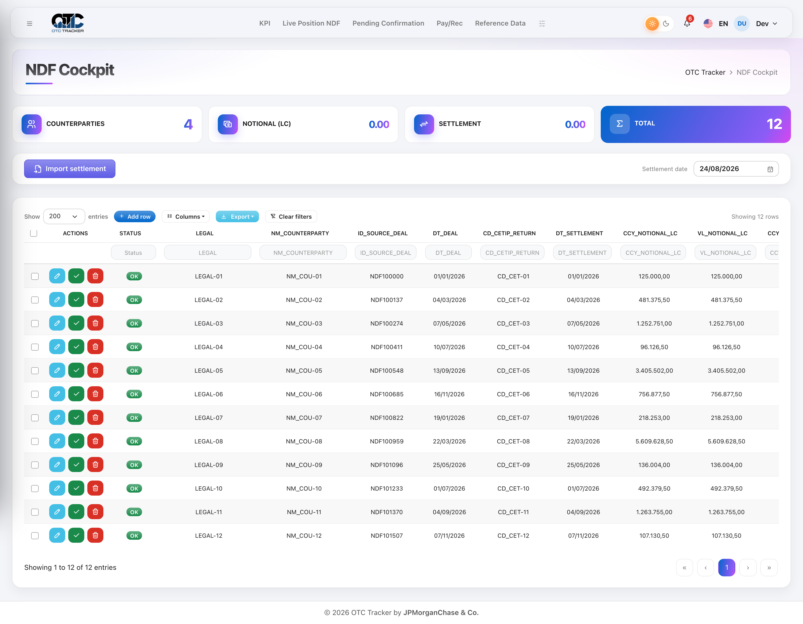

*Tela real do OTC Tracker — dados fictícios.*

### Passo 3 — Validar os campos e classificar a posição

Revise as linhas (Trade Date, Vencimento, Strike, Notional, Classe). Use Adicionar/Editar/Remover e Confirmar. Os cards (ex.: Vanilla / Other Publisher / T+0 / Total no NDF Summary) mostram a classificação.

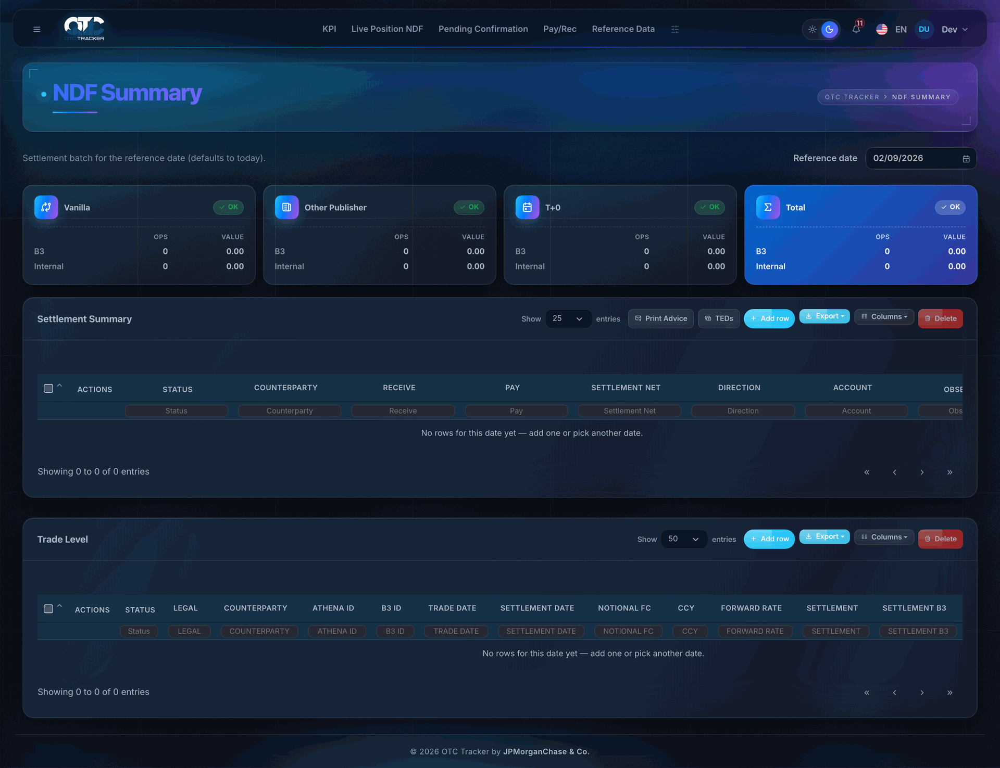

*Tela real do OTC Tracker — dados fictícios.*

### Passo 4 — Conferir a posição viva

Nas telas de Live Position (somente leitura), confira a posição em custódia na Data Base. No NDF, os widgets Vanilla / Other Publisher / T+0 / Commodities / Total resumem a carteira.


*Tela real do OTC Tracker — dados fictícios.*

### Passo 5 — Processar, conciliar e encerrar

Gere o arquivo de registro (Process / Send batch), importe o retorno da câmara e rode o Recon; trate as divergências (OK/Check) e acione End Process. No MtM Swap todo esse ciclo está em uma tela.

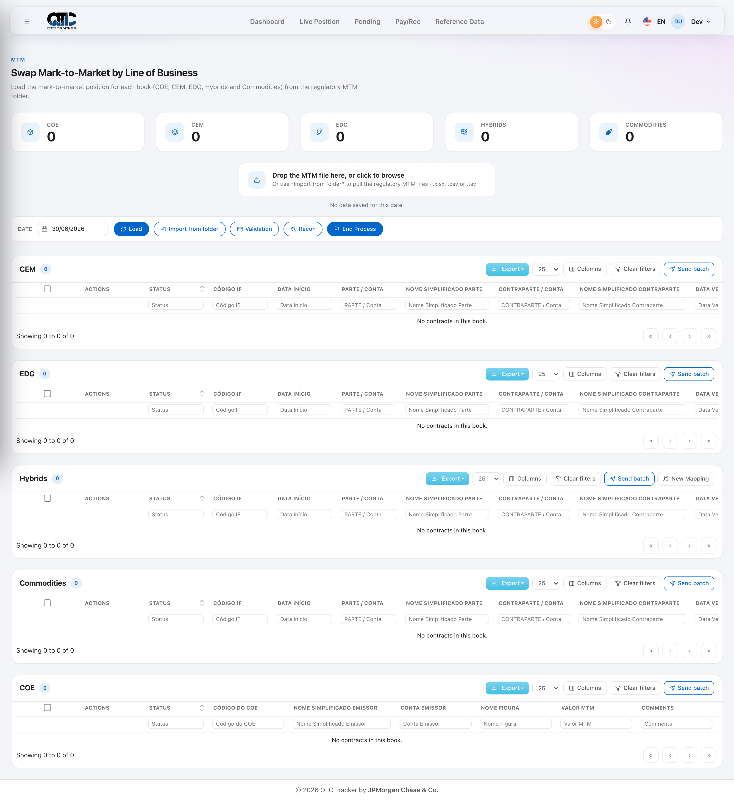

*Tela real do OTC Tracker — dados fictícios.*

## 5. Referência de Módulos (na ordem do sidebar)

> **Exportar dados vale para todas as telas com tabela.** O botão **Export** entrega
> **Copy · CSV · Excel · Print · PDF** do que está na tela — filtros e ordenação aplicados, colunas
> visíveis. O item **Advanced Export**, no fim do mesmo menu, abre a extração customizável: formato,
> nome do arquivo, escopo, filtros por coluna, escolha de colunas e o **intervalo de dias**, que lê
> um arquivo por dia útil e junta tudo numa planilha só, com a **Reference Date** por linha. Dia sem
> arquivo é pulado. A tela que não tem arquivo diário (cadastros como o Reference Data) mostra o
> intervalo desabilitado, com o motivo escrito.

### Navegação (Main)

#### Dashboard

Tela inicial do operador. Consolida os KPIs do dia — número de deals de NDF, Opções, Swap e Total — além da distribuição por produto, do fluxo mensal de negócios, dos rankings Top 5 (clientes, produtos e ativos subjacentes), da posição viva por produto e do Settlement Forecast. É somente leitura e serve como ponto de partida diário.


#### Sobre o Sistema

Página institucional com a identificação do sistema OTC Tracker e informações gerais de versão e propósito.


### Aplicações — Daily Settlement (Apps)

#### Calendário de Feriados

Calendário de feriados (base ANBIMA / câmara) que alimenta o cálculo de dias úteis. É a referência que o sistema usa para resolver automaticamente a Data Base (dia útil anterior) e para projetar liquidações. Cada calendário tem a sua cor na visão do mês.

Feriado avulso entra pelo clique na data (ou pelo botão *Create New Holiday*), e o calendário da barra lateral também pode ser arrastado direto para o dia. **Calendário inteiro entra por planilha**, pelo botão *Create New Calendar*: nome + `.xlsx` de **uma aba**, com a data em `aaaa-mm-dd` na **coluna A** e a descrição na **coluna B** (a terceira coluna, *Holiday Type*, não é importada). A linha de cabeçalho, a linha em branco do fim e um eventual rodapé de total são descartados por não serem data; datas repetidas entram uma vez só. A cor do calendário novo é sorteada entre as que ainda não estão em uso, e a partir daí ele é um calendário como os outros — inclusive como *holiday schedule* nas telas que pedem um.

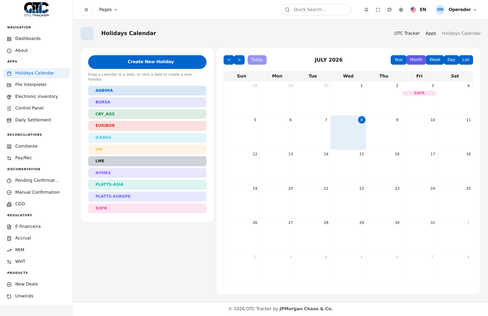

#### File Interpreter (Interpretador de Arquivos)

Catálogo dos layouts dos arquivos que o sistema monta — os de registro na B3 (Termo, Opção, Swap, MID, DCE) e os de instrução da Intrag —, campo a campo: ordem, largura e a ORIGEM de cada valor (fixo, coluna da tela, cadastro do Mapping ou cálculo). É cadastro, não consulta: mudar um valor fixo, cadastrar um cálculo (dias úteis entre duas datas, de-para em linha) ou criar uma **versão** do layout — por par de entidades ou por produto — vale no próximo arquivo gerado e no próximo preview, sem release. O preview das telas de New Deals lê daqui.

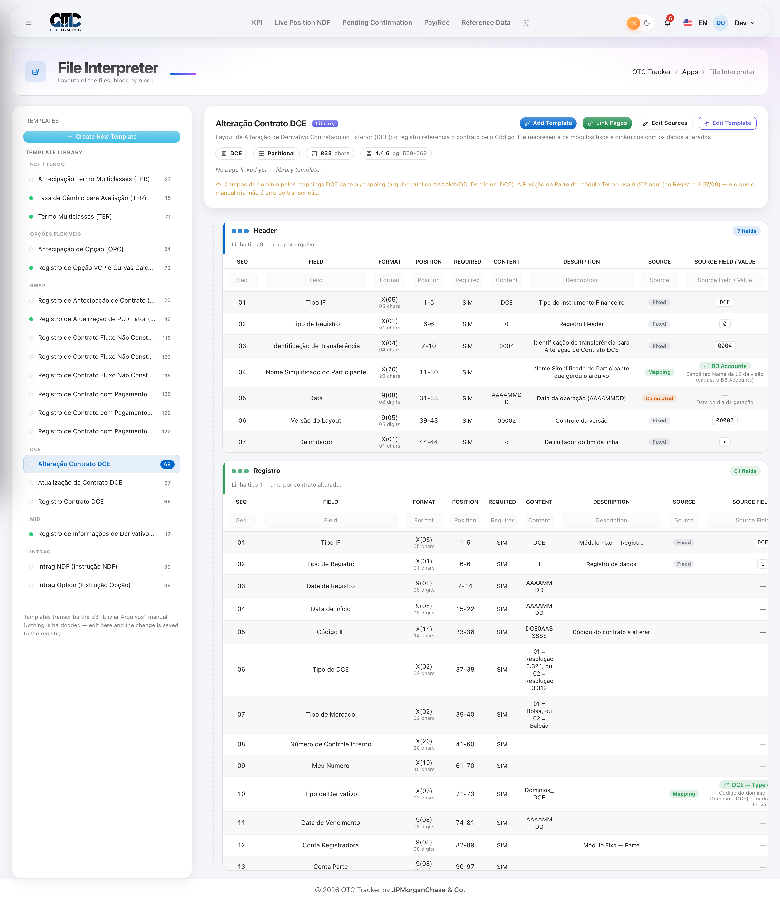

#### Painel de Controle

Hub das rotinas operacionais diárias, dividido em **cinco seções** — e o que agrupa não é o que a rotina faz e sim *quando* ela acontece e sobre o que responde:

| Seção | Rotinas |
|---|---|
| **Intraday Routines** | Save CETIP Files (lê os arquivos brutos da B3, renomeia no padrão e salva nas pastas de liquidação) · Deals Monitor — Pending Action · Confirmations Escalation |
| **Settlement Reporting** | Save Daily Settlement Files (dropzone que processa todos os arquivos do dia em JSON) · Settlement Forecast (projeta as liquidações dos próximos dias úteis e envia por e-mail) |
| **Pending Confirmation Routines** | Daily Metric — Outstanding Confirmation Brazil OTC · Pending Confirmations Spreadsheet Metrics · Pending Confirmation — Weekly Escalation (CEM/EDG) · Pending Signature Confirmations — Collection |
| **Economic Affirmation Routines** | Manual Deals EA · BACC EA Metrics · MT300 |
| **Reference Data Routines** | Update Contacts |

Em cada cartão o operador define a Reference date (Data Base), as listas de **To**/**Cc**, e pode disparar a rotina na hora pelo **Run**. O acesso é concedido **por cartão** (tokens `/control-panel#<id>` no *Page Access*): quem não tem um cartão não o vê, e o cabeçalho da seção só aparece se houver ao menos um cartão visível nela.


#### NDF — Summary

Batch de liquidação de NDF do dia. Os cards Vanilla / Other Publisher / T+0 / Total classificam a posição. As grades editáveis "Settlement Summary" e "Trade Level" permitem adicionar, editar, remover e confirmar linhas antes de gerar o batch.


#### NDF — Cockpit

Cockpit operacional do NDF. Importa o arquivo do dia e permite adicionar, editar, remover e confirmar linhas da posição, consolidando o registro antes do envio.


#### Other Products — Summary

Resumo consolidado dos demais produtos (COE, NDF, Option, Swap) com widgets de total, vencimentos (maturity), prêmio e fluxo por produto.

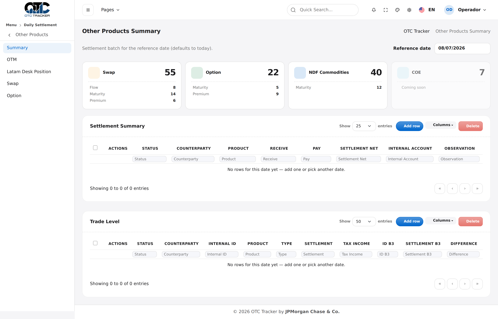

#### OTM Settlements

Liquidações OTM (cashflows). Importa o arquivo de liquidação e permite adicionar, editar, remover e confirmar cada linha antes do fechamento.

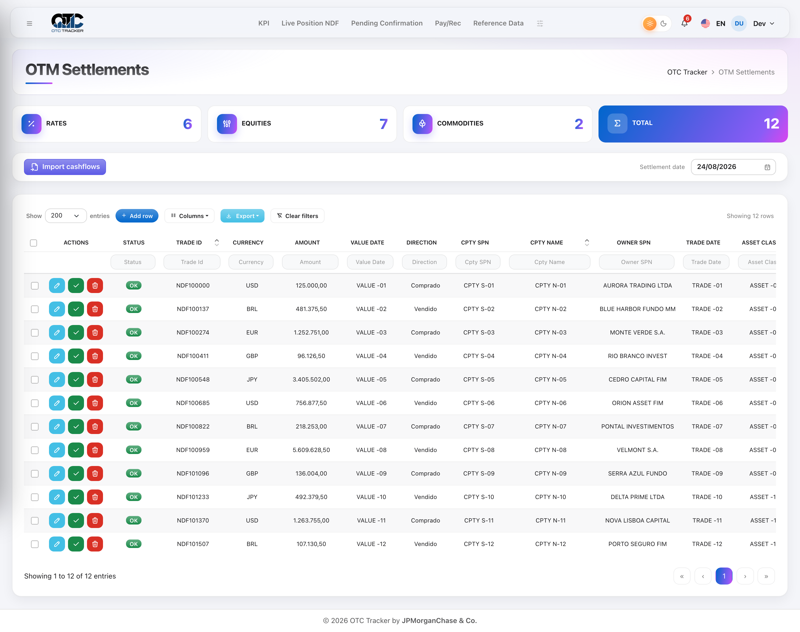

#### Cognos (FXO Detail)

Visão de detalhe das operações de Opção FX (FXO), com as datas e parâmetros do contrato (strike, vencimento, prêmio) para conferência.

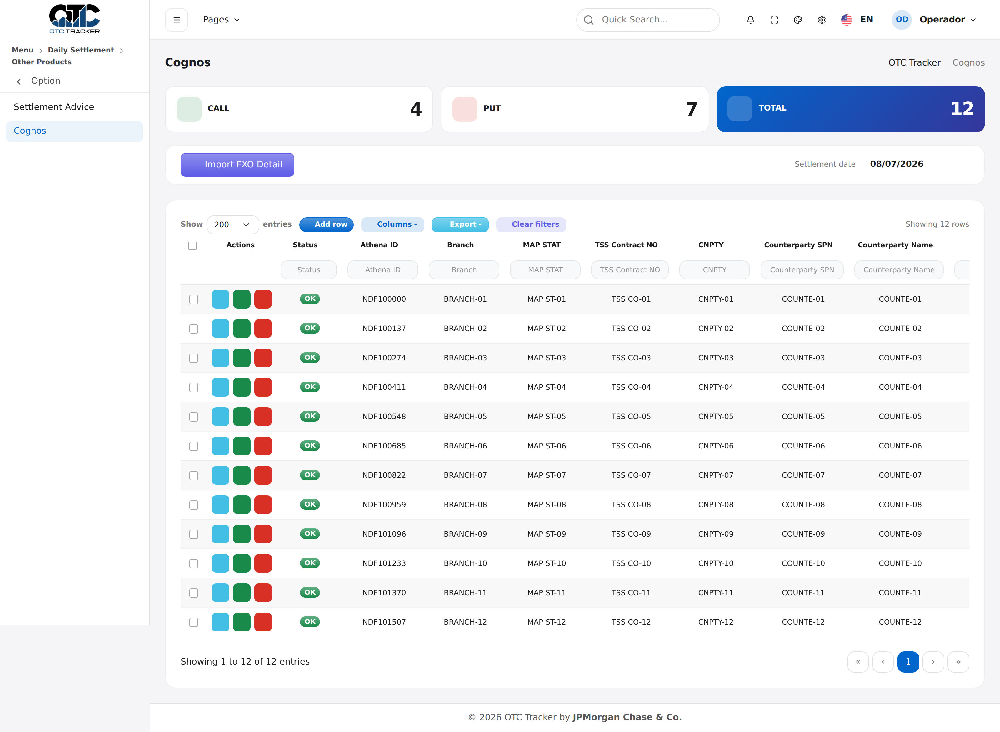

#### Live Position — NDF

Posição viva de NDF (somente leitura), com os widgets Vanilla / Other Publisher / T+0 / Commodities / Total e a tabela dos contratos em custódia na Data Base. Descarta o filtro de vencimento — conta a posição viva.

> A coluna de **CPF/CNPJ da contraparte** mostra o **nome** dela, resolvido no Reference Data pelo documento. A célula só volta com o número quando aquele CPF/CNPJ **não está cadastrado** — o número fica de propósito, porque apagá-lo esconderia a contraparte que falta cadastrar. A coluna da Parte continua com o documento: ela é a nossa perna, e o nome está na coluna ao lado.


#### Live Position — Swap (Características)

Posição viva de Swap com as características de cada contrato em custódia na Data Base.

> A coluna de **CPF/CNPJ da contraparte** mostra o **nome** dela, resolvido no Reference Data pelo documento. A célula só volta com o número quando aquele CPF/CNPJ **não está cadastrado** — o número fica de propósito, porque apagá-lo esconderia a contraparte que falta cadastrar. A coluna da Parte continua com o documento: ela é a nossa perna, e o nome está na coluna ao lado.

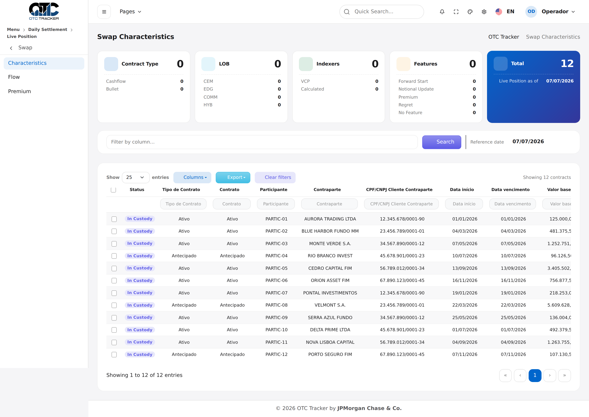

#### Live Position — Option

Posição viva das Opções em custódia na Data Base, com strike, barreiras, prêmio e situação do contrato.

> A coluna de **CPF/CNPJ da contraparte** mostra o **nome** dela, resolvido no Reference Data pelo documento. A célula só volta com o número quando aquele CPF/CNPJ **não está cadastrado** — o número fica de propósito, porque apagá-lo esconderia a contraparte que falta cadastrar. A coluna da Parte continua com o documento: ela é a nossa perna, e o nome está na coluna ao lado.

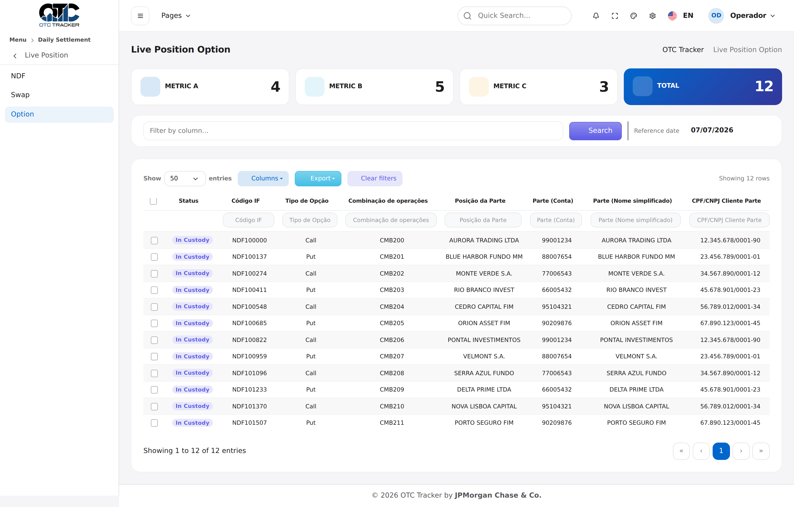

#### Operations — B3

Operações registradas na B3. Importa o retorno, permite adicionar/editar/remover e confirmar linhas e consolida as métricas de operações do dia.

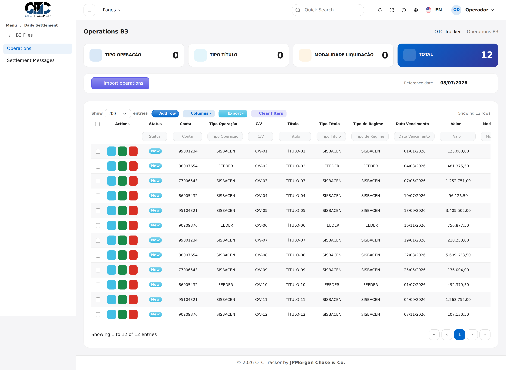

### Conciliações (Reconciliations)

#### Conciliação — Comitente

Concilia as posições por comitente entre a base interna e o retorno da câmara, sinalizando divergências.


#### Conciliação — Pay/Rec

Concilia os valores a pagar e a receber (Pay/Rec), apontando as diferenças a tratar antes do encerramento.


#### Conciliação — FXO

Concilia a posição de opções de câmbio registrada na CETIP (DPOSICAO) com a base interna (Athena), campo a campo: direção, Put/Call, contraparte, quantidade, prêmio, strike, datas de negociação e vencimento, fixings e estilo (Asian/European). A **Reference date** abre em D-1 pelo calendário ANBIMA. Os cards contam Total / OK / NOK / Sem match e filtram a tabela, e a faixa de chips indica qual campo está divergindo. A célula em divergência vem destacada.


### Documentação (Documentation)

#### Pending Confirmation

Fila das operações com confirmação pendente, para o operador acompanhar e tratar o que ainda não foi confirmado pela contraparte/câmara.


#### Manual Confirmation — Confirmations Monitor

Fila da confirmação manual, na ordem **(Pending Legal) → Pending OTC → Pending MO e/ou FO → Pending FepWeb → Ok** (quem valida cada produto sai do cadastro *Manual Confirmations — Validation Trail*, em Mapping; MO e FO correm em paralelo). Cada item é **uma confirmação** — contraparte × produto × LOB × data de negociação —, e não uma operação: o botão *Abrir* mostra o PDF gravado no Electronic Inventory, *Validar* carimba a etapa com data, hora e SPN, e *Rejeitar* (MO/FO) pede comentário, avisa o Brazil OTC Ops e devolve a confirmação ao OTC.

**A confirmação também é GERADA aqui.** Enquanto não há documento na pasta da contraparte, o botão do item de *Pending OTC* aparece como **Generate**: ele abre o editor da confirmação em aba nova, onde o único botão é *Salvar Word + PDF no Inventory*; gravado o documento, a tela de validação abre na sequência. Fechando sem validar, a confirmação continua em *Pending OTC* e o botão volta a ser *Validate*. As telas de New Deals não têm mais o botão *Confirmation* — gerar e validar são o mesmo trabalho e moram no mesmo lugar. Nas etapas de MO e FO, sem documento na pasta o botão continua riscado: essas mesas conferem o papel, não o produzem.

As duas pontas não são de validação: **Pending Legal** é hold manual (o card tem o botão de soltar para o OTC) e **Pending FepWeb** é derivado — validações feitas, faltando o envio ao cliente, que é o que o botão desse card marca.

**Cada etapa é assinada pela mesa dela**, pelo papel do usuário: Pending OTC é do Back Office, Pending MO do MO e Pending FO do FO. Quem não é da mesa abre a confirmação e lê o documento, mas não assina — o botão do card aparece como *View*. O **prazo** de cada mesa, em dias úteis contados da data da operação, é cadastrável em *Mapping → Manual Confirmations — SLA* (OTC D+3, MO D+4, FO D+6 de fábrica); validar fora do prazo exige justificativa, gravada na coluna daquela mesa.


#### Manual Confirmation — Track Confirmations

Base completa das confirmações manuais, com filtro por coluna, atualização em massa por coluna, inclusão manual de linha e exportação do que está na tela. Os cards do topo filtram por etapa da esteira, e a tabela abre ordenada pelo *Aging*, do menor para o maior.

Os títulos das colunas seguem o idioma da aplicação (*Settlement Date*, *Trade Date*, *Underlying Asset*, *Notional/Qty*, *Counterparty*). A coluna **Notional Amount CCY** traz a moeda do notional junto com o valor e é preenchida sozinha no mapeamento — ela é diferente do *Underlying Asset* ao lado, que em mercadoria guarda a commodity. Nos campos de filtro, **`blank`** lista as linhas em que aquela coluna está vazia.


### Regulatório (Regulatory)

#### Accrual — Swap (EOM)

Processamento de accrual de Swap no fim de mês (EOM). Importa/calcula os fatores, roda a Validação (que bloqueia com "missing_accrual" se houver contratos sem fator), gera os arquivos de validação, concilia (recon) contra o retorno e encerra o processo.

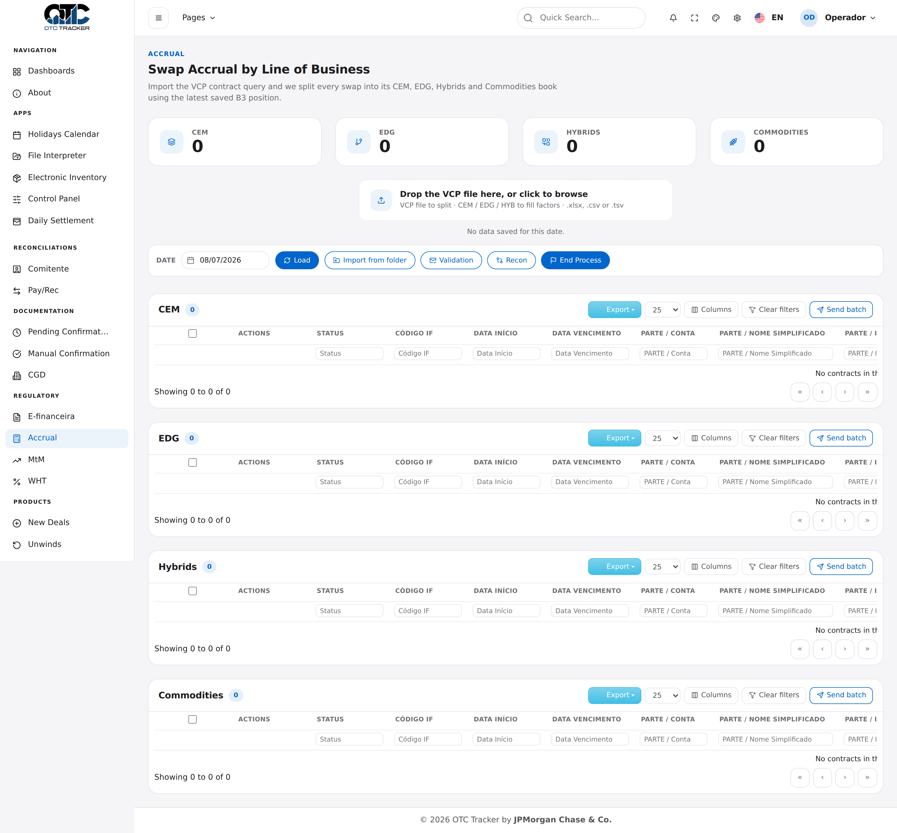

#### MtM — Swap

Marcação a mercado (MtM) de Swap e COE. Importa o arquivo de posição e os arquivos de valores de MtM (o sistema reconhece o tipo pelo nome), gera o batch no layout da câmara, concilia (recon) e encerra o processo.


### Produtos — New Deals (Products)

#### New Deals — NDF Vanilla

Registro de novos negócios de NDF de moeda (vanilla). Mantém o cache de deals, gera o arquivo Conecta e o mapeamento do retorno da B3 — o envio passou a valer nesta página, que antes só exibia porque o registro era feito por outra ferramenta.


#### New Deals — NDF Forward Start

Registro de novos negócios de NDF do tipo Forward Start.


#### New Deals — NDF Other Publisher

Registro de novos negócios de NDF do tipo Other Publisher (feeder).

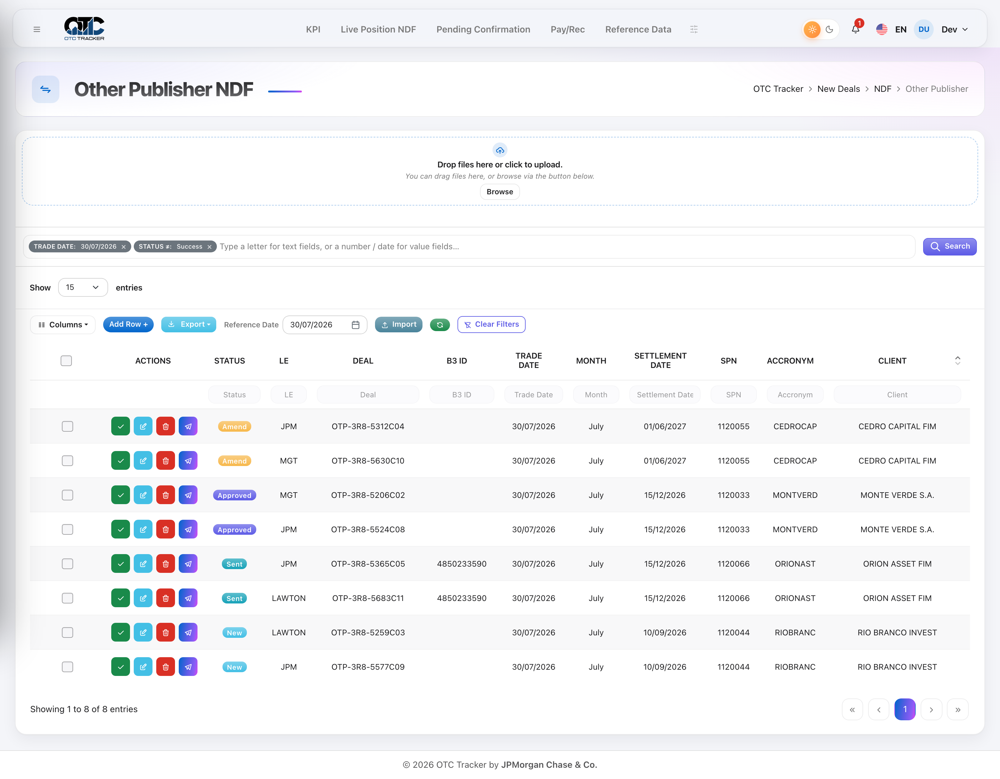

#### New Deals — NDF Commodities

Registro de novos negócios de NDF de Commodities. Mantém o cache de deals, gera o arquivo Conecta e o mapeamento para a B3.

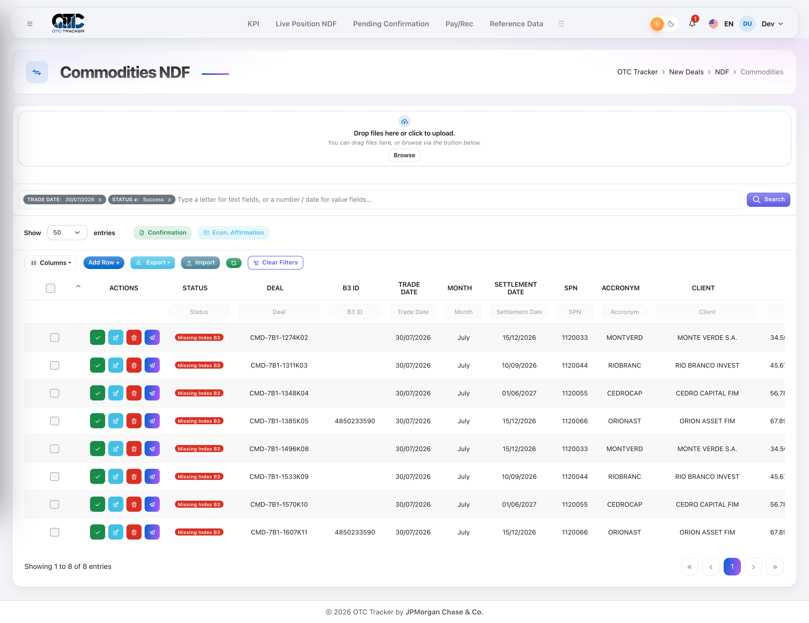

#### New Deals — Opção FXO

Registro de novos negócios de Opção FX (FXO). Importa a planilha, mantém o cache, gera o arquivo Conecta e o mapeamento B3 (strike, notional, vencimento, fixing).


#### New Deals — Opção Commodities

Registro de novos negócios de Opção de Commodities, com cache, geração Conecta e mapeamento B3.


### Base de Dados & Administração (Data Base)

#### Reference Data

Dados de referência e tabelas de apoio usados pelas demais telas (contrapartes, contas, mapeamentos). O **duplo clique na linha** abre o detalhe da contraparte — CGD, tipo de liquidação (net), contas bancárias com os defaults de pagamento/recebimento e contatos —, tudo sob maker/checker. Esse detalhe **vai no export** em seis colunas próprias, que nascem ocultas e podem ser exibidas pelo botão *Columns*.


#### Index B3

Consulta de índices e resultados da B3 usados nas apurações.


#### Intragrupo — NDF

Operações intragrupo de NDF. Permite enviar o arquivo, editar e aprovar as operações entre entidades do grupo. O ciclo fecha com o **Intrag ID**: preenchido pelo **Mapping Intrag ID** (CSV de retorno, casado pelo B3 ID) ou digitado no **Edit** da linha, a operação vai a `Success`; edição de dado sem Intrag ID novo vai a `Pending` e exige aprovação de um segundo usuário.

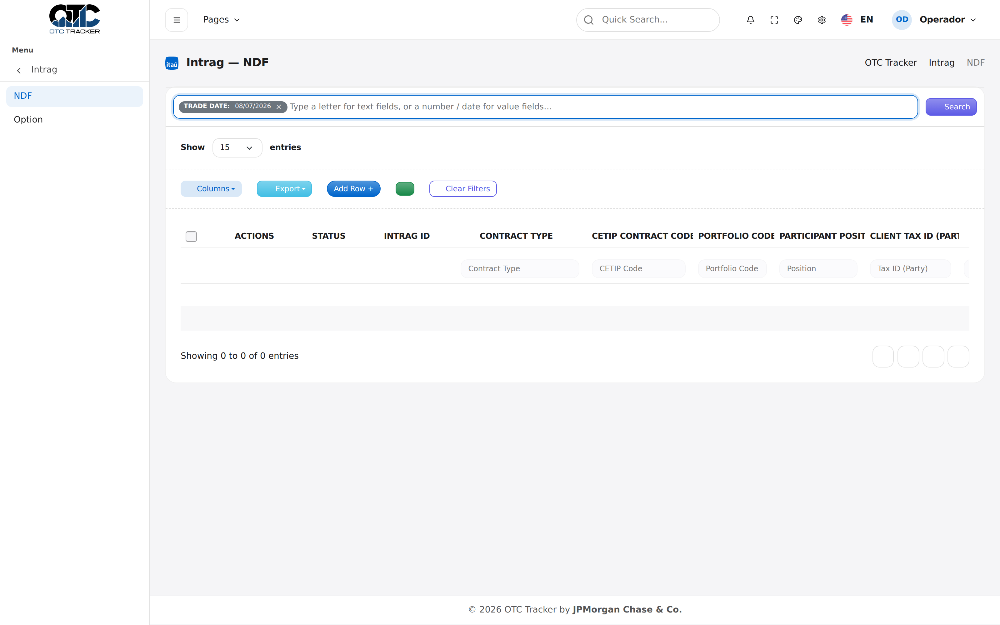

#### Intragrupo — Opção

Operações intragrupo de Opção. Permite enviar o arquivo, editar e aprovar as operações entre entidades do grupo. O ciclo do **Intrag ID** é o mesmo da tela de NDF: Mapping pelo retorno ou digitado no Edit → `Success`; edição de dado → `Pending` com aprovação de um segundo usuário.

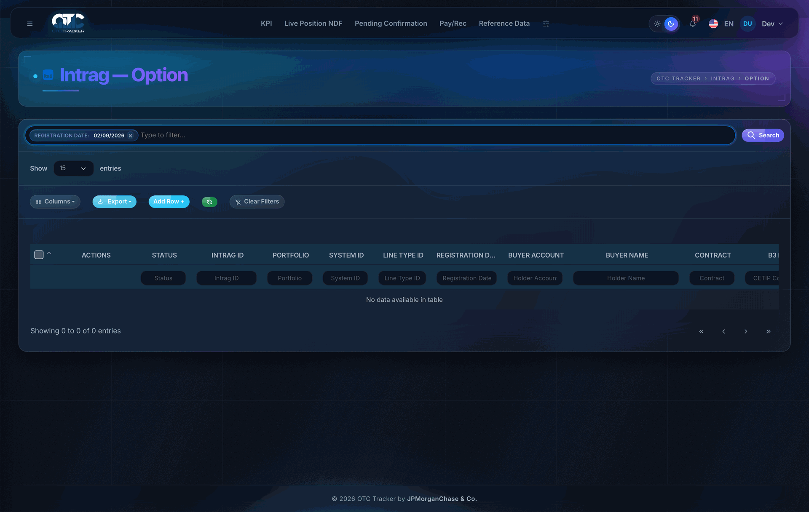

#### Usuários & Papéis

Administração de usuários e papéis (perfis de acesso) do sistema.

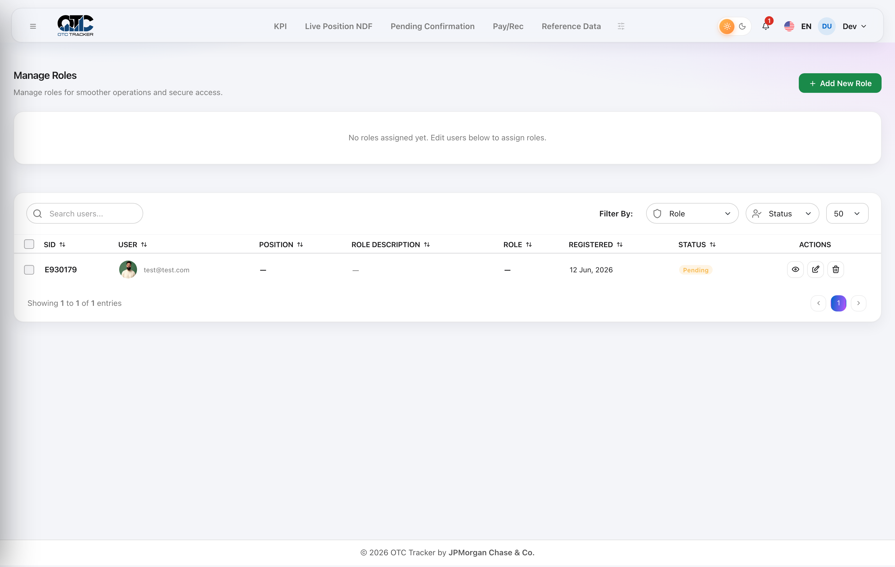

#### Central de Chamados — Lista

Lista dos chamados de suporte interno registrados no sistema.

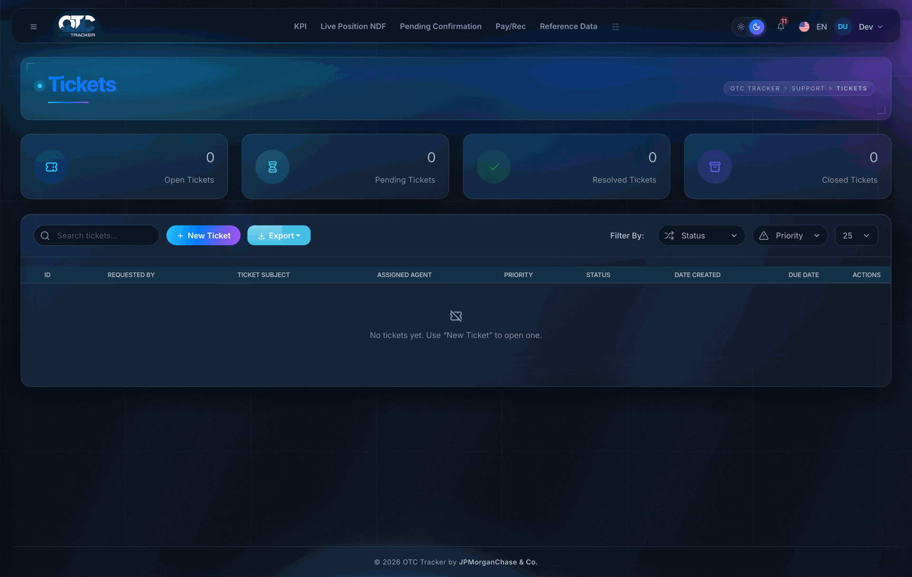

#### Central de Chamados — Detalhe

Detalhe de um chamado de suporte, com histórico e status.

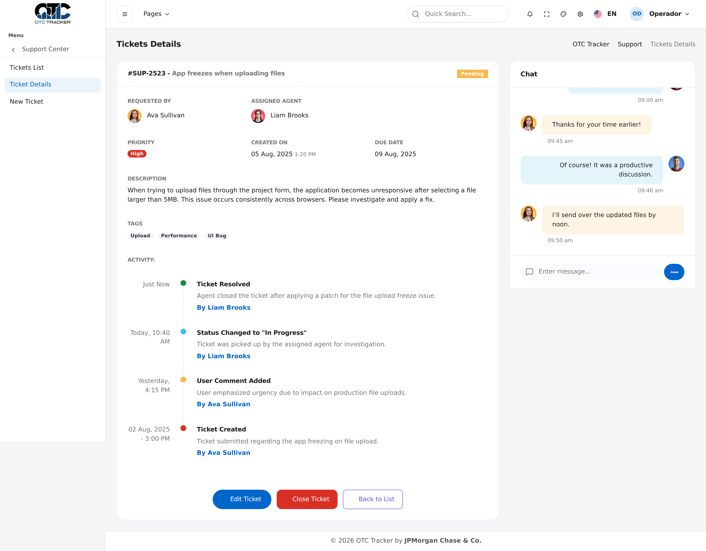

#### Central de Chamados — Novo

Abertura de um novo chamado de suporte interno.

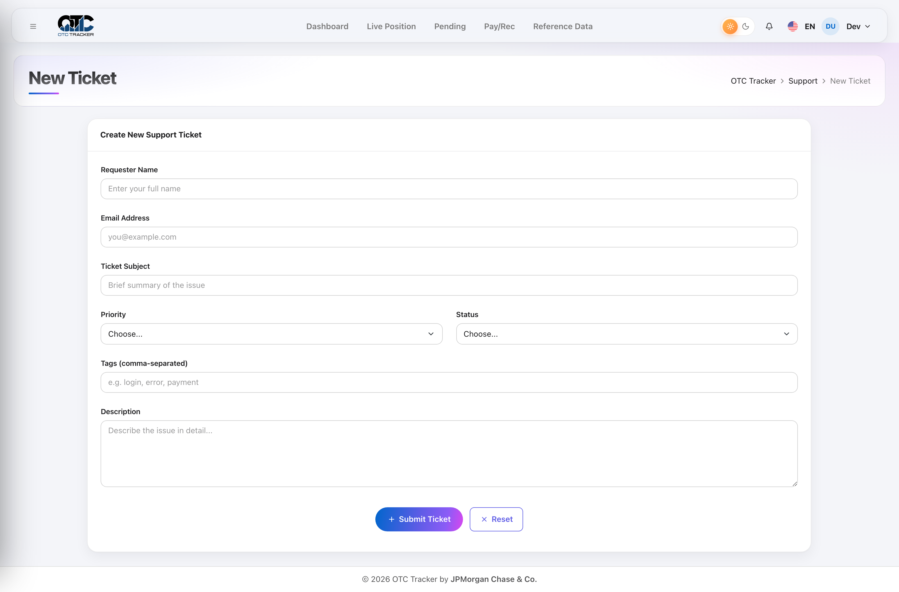

### 5.99. Módulos pendentes (a desenvolver) 🔧

Os módulos abaixo estão previstos no menu lateral mas **ainda não foram desenvolvidos** no código (as rotas retornam 404). Conforme cada um for entregue: (1) recapture a tela — veja a seção 8; (2) marque o item como concluído `- [x]`; (3) mova-o para a seção 5 correspondente usando o bloco-modelo da seção 8.

**Aplicações — Daily Settlement (Apps)**

- [ ] **Electronic Inventory** — `/electronic-inventory`
- [ ] **Latam Desk Position** — `/other-products-swap-latamdeskposition`
- [x] **Athena** — `/other-products-swap-athena` — *implementado* (view read-only do JSON `br-onshore-settlements`; falta só recapturar a tela e mover para a seção 5)
- [x] **VCP** — `/other-products-swap-vcp` — *implementado* (cross-join Operations B3 × Events; falta recaptura/mover)
- [x] **Events** — `/other-products-swap-events` — *implementado* (view read-only do JSON `eventos-swap-jpm`, 63 colunas; falta recaptura/mover)
- [x] **Kapital Hybrids** — `/other-products-swap-kapital-hybrids` — *implementado* (importa `BANCO_UPCOMING_PAYMENTS.csv`, filtra Settlement Date = hoje, agrega por Kapital ID: Owner curve = Σ positivos, Counterparty curve = Σ negativos, BRL Net Amount = Owner + Counterparty; Cetip ID via `mapping_swap-hyb.json`; falta recaptura/mover)

**Documentação (Documentation)**

- [ ] **Metrics** — `/metrics`
- [ ] **CGD** — `/cgd`

**Regulatório (Regulatory)**

- [ ] **KAPITAL** — `/regulatory/e-financeira/kapital`
- [ ] **ATHENA-NDF** — `/regulatory/e-financeira/athena-ndf`
- [ ] **ATHENA-FXO** — `/regulatory/e-financeira/athena-fxo`
- [ ] **PYRAMID** — `/regulatory/e-financeira/pyramid`
- [ ] **WHT** — `/regulatory/wht`

**Produtos — New Deals (Products)**

- [ ] **Deliverable Forward** — `/new-deals/dce/deliverable-forward`
- [ ] **NDF** — `/new-deals/dce/ndf`
- [ ] **Option** — `/new-deals/dce/option`
- [ ] **Swap** — `/new_deals-dce-swap`
- [ ] **CEM** — `/unwinds/swap/cem`
- [ ] **EDG** — `/unwinds/swap/edg`
- [ ] **FX** — `/unwinds/ndf/fx`
- [ ] **Commodities** — `/unwinds/ndf/commodities`
- [ ] **FXO** — `/unwinds/options/fxo`
- [ ] **Commodities** — `/unwinds/options/commodities`
- [ ] **EDG** — `/unwinds/options/edg`
- [ ] **COE** — `/unwinds/coe`
- [ ] **Deliverable Forward** — `/unwinds/dce/deliverable-forward`
- [ ] **NDF** — `/unwinds/dce/ndf`
- [ ] **Option** — `/unwinds/dce/option`
- [ ] **Swap** — `/unwinds/dce/swap`

## 6. Tratamento de Exceções

| Código / Mensagem | Quando ocorre | Ação do operador |
|---|---|---|
| HTTP 401 — Not authenticated | Sessão expirou/não autenticada. | Refaça login + 2FA. |
| HTTP 400 — No file provided | Nenhum arquivo enviado. | Selecione/arraste o arquivo. |
| HTTP 400 — Invalid date | Data em formato inválido. | Use o datepicker. |
| HTTP 400 — Unrecognized file | Nome do arquivo fora do padrão. | Envie o arquivo correto; renomeie. |
| HTTP 400 — No files in source folder | Pasta da Data Base vazia. | Confirme os arquivos do dia / ajuste a data. |
| HTTP 400 — No CEM/EDG rows loaded | Valores de MtM antes da posição. | Importe a posição primeiro. |
| HTTP 400 — missing_accrual | Contratos sem fator (EOM). | Preencha os fatores e revalide. |
| HTTP 404 — No saved data for this date | Sem conjunto salvo para a data. | Rode a importação antes de validar/recon. |
| HTTP 500 — Failed to read/save/write | Falha interna (log/traceback). | Tente de novo; se persistir, Suporte. |
| Validação de formulário | Campo vazio/inválido (ex.: Strike). | Corrija (Editar) e reconfirme. |
| Advanced Export — "não consegui ler N dias" (`HTTP 404`) | O intervalo pede um endereço que só existe na versão nova; o sistema ainda serve a anterior. | Peça o **reinício** da instância e repita. |
| Advanced Export — "N dias sem arquivo" | Não é erro: dia sem arquivo gravado (feriado, ou anterior ao início da guarda). | Nenhuma — a planilha sai com os dias que existem. |

> Erros 400/404 são corrigíveis pelo operador; erros 500 vão para o Suporte de TI.

## 7. Suporte

> Contatos fictícios — modelo para preenchimento.

| Nível | Canal / Contato | Horário |
|---|---|---|
| 1 — Central de TI | portal.suporte.exemplo · +55 (11) 4000-0000 | 24x7 |
| 2 — Aplicação (OTC Tracker) | suporte.otctracker@exemplo | Dias úteis 07–20h |
| 3 — Plantão Back Office OTC | plantao.otc@exemplo · +55 (11) 4000-0099 | Dias úteis 06–22h |

Ao abrir chamado, informe: rotina/tela, Data Base, mensagem de erro + horário, nome do arquivo.

---

## 8. Manutenção do documento

### 8.1. Regerar o Word a partir deste `.md`

```bash
pip install python-docx          # apenas na primeira vez
python scripts/build_sop_docx.py  # gera SOP_PROCESSAMENTO_OTC.docx
```

O conversor entende títulos, tabelas, listas, checkboxes, citações, `código`, imagens `` e ignora comentários `<!-- ... -->`. Os caminhos de imagem são relativos à raiz do repositório.

Sem argumentos ele gera o SOP. Com argumento, converte **qualquer** Markdown do repositório — é assim que o Guia do Usuário é gerado, sem precisar de um segundo conversor:

```bash
python scripts/build_sop_docx.py GUIA_DO_USUARIO_OTC_TRACKER.md
```

### 8.2. Recapturar as telas (quando um módulo novo ficar pronto)

As telas foram capturadas com um runner local de desenvolvimento (Flask + Chromium headless) que injeta dados **fictícios** via mock. O runner e os scripts de captura **não ficam no repositório** (contêm um stub de login de desenvolvimento que nunca deve ser commitado). Fluxo resumido:

1. Suba o app localmente em modo dev e autentique com o bypass local.
2. Rode o capturador (Playwright/Chromium) apontando para a nova rota; ele intercepta as chamadas `/api/**` e injeta linhas fictícias reaproveitando as colunas reais.
3. Salve o PNG em `docs/sop-screenshots/<rota-com-hifens>.png`.

**Duas armadilhas conhecidas (30/07/2026):**

- **As telas de New Deals saem vazias.** O mock não cobre os endpoints dessas páginas — elas carregam por `POST /api/new-deals/<produto>/cache/search`. Para capturá-las com conteúdo, popule o **cache do dia** com operações fictícias e deixe a página carregar sozinha; o Monitor se popula junto, porque lê os mesmos arquivos. Com dados fictícios, as linhas aparecem marcadas como **Missing Counterparty** — é preciso cadastrar as contrapartes fictícias no `RefData.json` **temporariamente** e restaurar o arquivo depois (conferir por `md5` **e** `git status`, pois ele é versionado).
- **`Docs/` × `docs/`.** O repositório tem as duas grafias. Os prints ficam em **`docs/` minúsculo**, mas o diretório em disco chama-se `Docs`, então o `git add` grava com maiúscula e as imagens somem do documento fora do macOS. Use `git -c core.ignorecase=false add docs/sop-screenshots/` e confira o casing no índice antes de commitar.
4. Inclua o módulo na seção 5 (bloco-modelo abaixo) e regere o Word.

### 8.3. Bloco-modelo para incluir um módulo

Copie o trecho abaixo, cole na subseção correta da seção 5 e preencha:

```markdown
#### <Título do Módulo>

<Descrição operacional: o que a tela faz, o que o operador preenche/importa/valida, e o que o botão principal gera.>


```

> Ao trocar/incluir telas, garanta que os dados exibidos sejam **fictícios** — nenhum dado real de cliente, servidor, conta ou credencial pode aparecer nas imagens.
